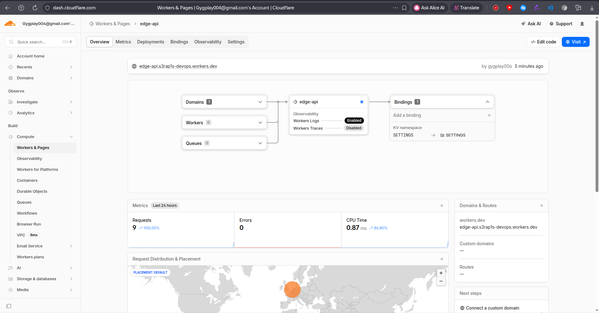
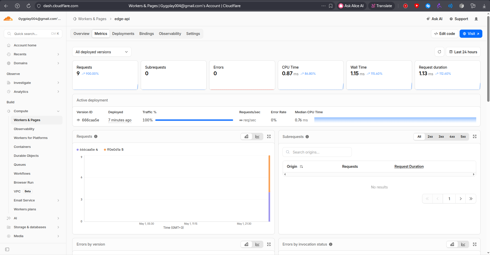
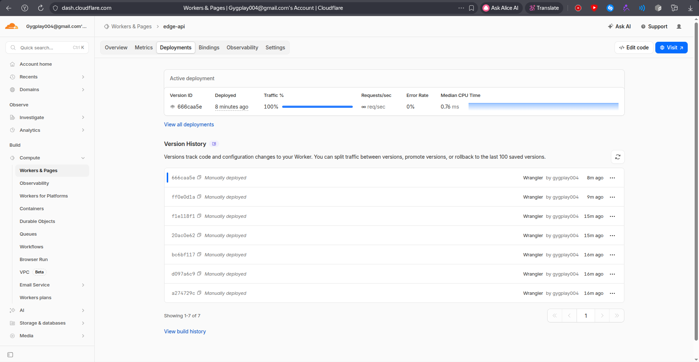

# Lab 17: Cloudflare Workers Edge Deployment

## 1. Cloudflare Setup

### Project

The Workers project was created with C3 in `edge-api`.

```bash
s3rap1s in ~/devops/DevOps-Core-Course on lab17 λ npm create cloudflare@latest -- edge-api --category=hello-world --type=hello-world --lang=ts --no-deploy --git --accept-defaults
...
🎉  SUCCESS  Application created successfully!
```

The generated project contains:

- `edge-api/src/index.ts` - Worker source code
- `edge-api/wrangler.jsonc` - Wrangler configuration
- `edge-api/package.json` - npm scripts and dependencies

Wrangler is installed and authenticated.

```bash
s3rap1s in ~/devops/DevOps-Core-Course on lab17 λ wrangler --version
4.87.0
```

```bash
s3rap1s in ~/devops/DevOps-Core-Course/edge-api on lab17 λ wrangler whoami
👋 You are logged in with an OAuth Token, associated with the email gygplay004@gmail.com.
Account Name                   Account ID
Gygplay004@gmail.com's Account d41171f20bd0c0769bc04320159e9a07
```

### Platform Concepts

Cloudflare Workers runs code in a serverless runtime on Cloudflare's global network. The deployment is not a Docker container and there are no user-managed VMs.

The public `workers.dev` URL used for this lab:

```text
https://edge-api.s3rap1s-devops.workers.dev
```

Bindings are used to attach configuration and state to a Worker:

- plaintext vars for non-sensitive configuration
- secrets for sensitive values
- KV namespaces for persisted key-value state


## 2. Worker API

### Routes

The Worker implements these HTTP endpoints:

| Route | Purpose |
|-------|---------|
| `/` | service metadata and route list |
| `/health` | health check |
| `/edge` | Cloudflare edge request metadata |
| `/config` | plaintext vars and secret presence |
| `/counter` | KV-backed persisted visits counter |

Unknown routes return JSON with HTTP `404`.

### Local Development

The Worker was tested locally with Wrangler.

```bash
s3rap1s in ~/devops/DevOps-Core-Course/edge-api on lab17 λ wrangler dev --local --port 8787
Ready on http://localhost:8787
```

Local health check:

```bash
s3rap1s in ~/devops/DevOps-Core-Course on lab17 λ curl -s http://127.0.0.1:8787/health
{"status":"ok","app":"edge-api","timestamp":"2026-05-01T18:23:47.846Z"}
```

Local edge metadata:

```bash
s3rap1s in ~/devops/DevOps-Core-Course on lab17 λ curl -s http://127.0.0.1:8787/edge
{"app":"edge-api","deployment":{"platform":"cloudflare-workers","environment":"production","workersDev":true},"edge":{"colo":"AMS","country":"DE","city":"Aachen","asn":202147,"httpProtocol":"HTTP/1.1","tlsVersion":"TLSv1.3"},"request":{"method":"GET","path":"/edge","userAgent":"curl/8.19.0"}}
```

Local KV counter:

```bash
s3rap1s in ~/devops/DevOps-Core-Course on lab17 λ curl -s http://127.0.0.1:8787/counter
{"key":"visits","visits":1,"persistedIn":"Workers KV"}
```

### Tests

```bash
s3rap1s in ~/devops/DevOps-Core-Course/edge-api on lab17 λ npm test
✓ test/index.spec.ts (2 tests) 20ms
Test Files  1 passed (1)
Tests  2 passed (2)
```


## 3. Configuration, Secrets, and KV

### Wrangler Configuration

`edge-api/wrangler.jsonc` configures the Worker:

```jsonc
{
	"name": "edge-api",
	"main": "src/index.ts",
	"compatibility_date": "2026-05-01",
	"workers_dev": true,
	"preview_urls": true,
	"observability": {
		"enabled": true
	},
	"vars": {
		"APP_NAME": "edge-api",
		"COURSE_NAME": "devops-core",
		"ENVIRONMENT": "production"
	},
	"kv_namespaces": [
		{
			"binding": "SETTINGS",
			"id": "d1434a1bf2e5471598ecbcd86fa64596"
		}
	],
	"secrets": {
		"required": [
			"API_TOKEN",
			"ADMIN_EMAIL"
		]
	}
}
```

Plaintext vars are committed because they are not sensitive. Secret values are not committed; they are stored in Cloudflare and injected through `env`.

### KV Namespace

The `SETTINGS` namespace was created and bound to the Worker.

```bash
s3rap1s in ~/devops/DevOps-Core-Course/edge-api on lab17 λ wrangler kv namespace create SETTINGS
✨ Success!
"binding": "SETTINGS",
"id": "d1434a1bf2e5471598ecbcd86fa64596"
```

Verification:

```bash
s3rap1s in ~/devops/DevOps-Core-Course/edge-api on lab17 λ wrangler kv namespace list
[
  {
    "id": "d1434a1bf2e5471598ecbcd86fa64596",
    "title": "SETTINGS",
    "supports_url_encoding": true
  }
]
```

### Secrets

Two secrets were created with Wrangler:

```bash
wrangler secret put API_TOKEN
wrangler secret put ADMIN_EMAIL
```

Only secret names are visible:

```bash
s3rap1s in ~/devops/DevOps-Core-Course/edge-api on lab17 λ wrangler secret list
[
  {
    "name": "ADMIN_EMAIL",
    "type": "secret_text"
  },
  {
    "name": "API_TOKEN",
    "type": "secret_text"
  }
]
```

The deployed `/config` endpoint confirms the bindings are present without exposing values:

```bash
s3rap1s in ~/devops/DevOps-Core-Course on lab17 λ curl -s https://edge-api.s3rap1s-devops.workers.dev/config
{"app":"edge-api","course":"devops-core","environment":"production","secrets":{"apiTokenConfigured":true,"adminEmailConfigured":true,"adminEmailDomain":"gmail.com"},"note":"Plaintext vars are safe for non-sensitive values only. Secrets are injected by Wrangler and are not committed."}
```


## 4. Deployment

The Worker was deployed to `workers.dev`.

```bash
s3rap1s in ~/devops/DevOps-Core-Course/edge-api on lab17 λ wrangler deploy
Uploaded edge-api (11.67 sec)
Deployed edge-api triggers (5.94 sec)
  https://edge-api.s3rap1s-devops.workers.dev
Current Version ID: 2f7e48ae-a604-41b1-859f-25b8368c8a06
```

Production health check:

```bash
s3rap1s in ~/devops/DevOps-Core-Course on lab17 λ curl -s https://edge-api.s3rap1s-devops.workers.dev/health
{"status":"ok","app":"edge-api","timestamp":"2026-05-01T18:45:35.408Z"}
```

Production root endpoint:

```bash
s3rap1s in ~/devops/DevOps-Core-Course on lab17 λ curl -s https://edge-api.s3rap1s-devops.workers.dev/
{"app":"edge-api","course":"devops-core","message":"Hello from Cloudflare Workers edge API","environment":"production","timestamp":"2026-05-01T18:33:41.233Z","durationMs":0,"routes":[{"path":"/","method":"GET","description":"Service metadata"},{"path":"/health","method":"GET","description":"Health check"},{"path":"/edge","method":"GET","description":"Cloudflare edge request metadata"},{"path":"/config","method":"GET","description":"Vars and secret presence"},{"path":"/counter","method":"GET","description":"KV-backed persisted counter"}]}
```

### Dashboard Screenshot




## 5. Edge Behavior

The `/edge` endpoint returns metadata from `request.cf`.

```bash
s3rap1s in ~/devops/DevOps-Core-Course on lab17 λ curl -s https://edge-api.s3rap1s-devops.workers.dev/edge
{"app":"edge-api","deployment":{"platform":"cloudflare-workers","environment":"production","workersDev":true},"edge":{"colo":"AMS","country":"DE","city":"Aachen","asn":202147,"httpProtocol":"HTTP/2","tlsVersion":"TLSv1.3"},"request":{"method":"GET","path":"/edge","userAgent":"curl/8.19.0"}}
```

Observed edge fields:

- `colo`: `AMS`
- `country`: `DE`
- `city`: `Aachen`
- `asn`: `202147`
- `httpProtocol`: `HTTP/2`
- `tlsVersion`: `TLSv1.3`

Workers are globally distributed by Cloudflare automatically. There is no explicit "deploy to 3 regions" step because Cloudflare routes requests to its edge network and runs the Worker near the request path. This differs from VM or PaaS platforms where regions are selected manually.

Routing concepts:

- `workers.dev`: Cloudflare-provided public URL for quick Worker access
- Routes: attach a Worker to paths on an existing Cloudflare-managed zone
- Custom Domains: expose a Worker through a dedicated domain or subdomain

This lab uses `workers.dev`.


## 6. Persistence

The `/counter` endpoint stores the `visits` key in Workers KV.

Before redeploy:

```bash
s3rap1s in ~/devops/DevOps-Core-Course on lab17 λ curl -s https://edge-api.s3rap1s-devops.workers.dev/counter
{"key":"visits","visits":1,"persistedIn":"Workers KV"}
```

After redeploy:

```bash
s3rap1s in ~/devops/DevOps-Core-Course/edge-api on lab17 λ wrangler deploy
Current Version ID: 666caa5e-f195-4305-a268-91cd9f27e856
```

```bash
s3rap1s in ~/devops/DevOps-Core-Course on lab17 λ curl -s https://edge-api.s3rap1s-devops.workers.dev/counter
{"key":"visits","visits":2,"persistedIn":"Workers KV"}
```

The value remained available after the Worker was redeployed, confirming that the counter is stored outside the Worker code.


## 7. Observability and Operations

### Logs

The Worker logs request path and edge location with `console.log()`.

```bash
s3rap1s in ~/devops/DevOps-Core-Course/edge-api on lab17 λ wrangler tail --format pretty
Connected to edge-api, waiting for logs...
GET https://edge-api.s3rap1s-devops.workers.dev/edge - Ok @ 5/1/2026, 9:35:08 PM
  (log) {"message":"request","path":"/edge","method":"GET","colo":"AMS","country":"DE"}
```

### Metrics

Cloudflare dashboard metrics were checked for the Worker. The metrics page shows production traffic and status over time.



### Deployments

Several deployments and secret-change versions are visible in deployment history.

```bash
s3rap1s in ~/devops/DevOps-Core-Course/edge-api on lab17 λ wrangler deployments list
Created:     2026-05-01T18:33:06.968Z
Version(s):  (100%) ff0e0d1a-6fc0-4178-8a8f-49476e62acc5

Created:     2026-05-01T18:34:03.139Z
Version(s):  (100%) 666caa5e-f195-4305-a268-91cd9f27e856

Created:     2026-05-01T18:45:15.665Z
Version(s):  (100%) 2f7e48ae-a604-41b1-859f-25b8368c8a06
```



A rollback can be performed with:

```bash
wrangler rollback
```

I did not execute rollback because the latest deployment is the desired final version. In a real incident, the previous known-good version from `wrangler deployments list` would be selected and rolled back through Wrangler or the Cloudflare dashboard.


## 8. Kubernetes vs Cloudflare Workers

| Aspect | Kubernetes | Cloudflare Workers |
|--------|------------|--------------------|
| Setup complexity | Requires cluster, nodes, services, ingress, controllers, storage | Requires account, Wrangler project, and bindings |
| Deployment speed | Slower for small apps because infrastructure is explicit | Fast deploys through `wrangler deploy` |
| Global distribution | Requires multi-cluster, geo routing, or external traffic management | Global edge distribution is built in |
| Cost for small apps | Cluster baseline cost can be high | Good fit for small APIs with low operational overhead |
| State/persistence model | PVCs, databases, StatefulSets, external storage | Bindings such as KV, D1, R2, Durable Objects |
| Control/flexibility | High control over runtime, networking, sidecars, operators | More constrained serverless runtime, no arbitrary container host |
| Best use case | Long-running services, complex platforms, custom networking | Lightweight APIs, request routing, edge logic, low-latency global access |

Use Kubernetes when the workload needs custom runtime control, long-running containers, service mesh, operators, or complex internal networking.

Use Cloudflare Workers when the workload is an HTTP API, middleware, edge routing layer, or small globally distributed service that benefits from serverless operations.

For this lab, Workers is simpler for public global access and deployment. The main constraint is that the Worker is not a Docker host, so the Lab 2 Docker image cannot be deployed directly. 
