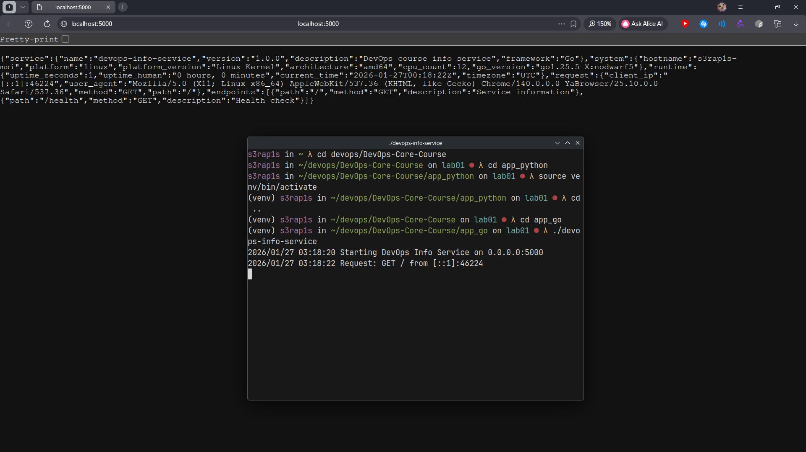
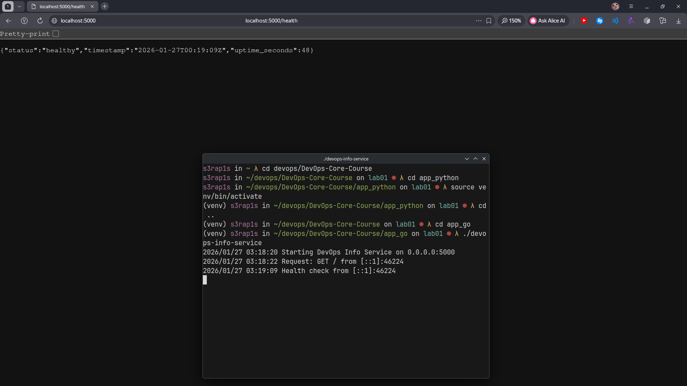
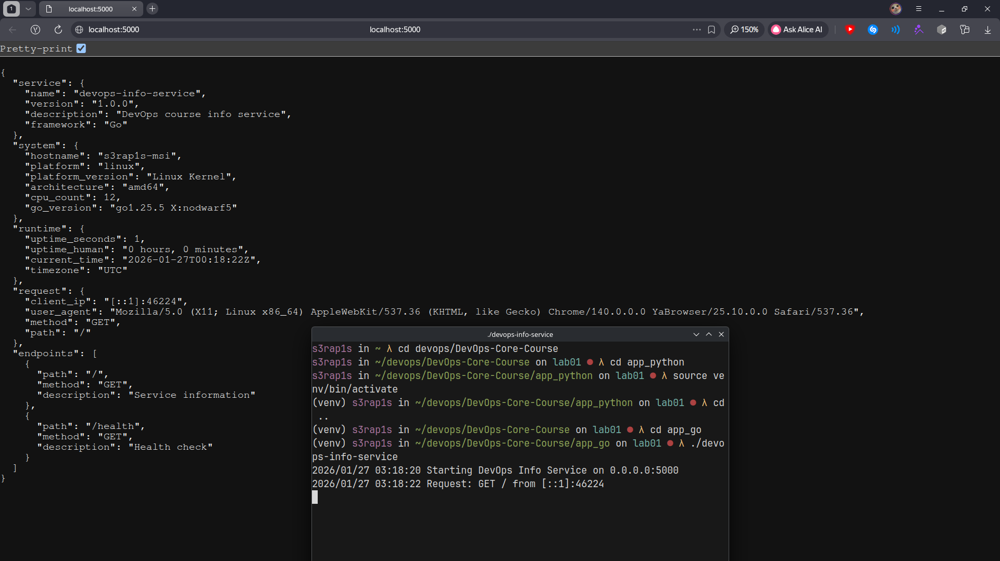

# Lab 1 — DevOps Info Service: Web Application Development on Go
## Language Selection
### My Choice: Go
I selected **Go** as the compiled language for the bonus task implementation. Here's why:

**Comparison Table:**

| Criteria | Go	| Rust | Java | C# |
|----------|----|------|------|----|
|Learning Curve | Low | High | Medium | Medium |
|Development Speed | High | Low | Medium | Medium |
|Standard Library | Excellent | Good | Extensive | Extensive |
|Performance | Excellent | Outstanding | Good | Good |
|Binary Size | ~7 MB | ~3 MB | ~40 MB | ~30 MB |
|Memory Safety | GC | Compile-time | GC | GC |
| **Choice for Bonus** | **✓** | | | |			

**Justification:**
Go offers the perfect balance for a DevOps service: it compiles to a single static binary with no runtime dependencies, has excellent concurrency support, and provides a rich standard library including HTTP server functionality. Its simplicity and fast compilation make it ideal for the iterative development required in this course. Go is also widely used in the DevOps ecosystem (Docker, Kubernetes, Prometheus), making it a relevant choice.

## Best Practices Applied
### 1. Clean Code Organization
```go
// Clear imports grouping
import (
    "encoding/json"
    "fmt"
    "log"
    "net/http"
    "os"
    "runtime"
    "time"
)

// Descriptive function names
func getSystemInfo() System {
    hostname, err := os.Hostname()
    if err != nil {
        hostname = "unknown"
    }

    return System{
        Hostname:        hostname,
        Platform:        runtime.GOOS,
        PlatformVersion: getOSVersion(),
        Architecture:    runtime.GOARCH,
        CPUCount:        runtime.NumCPU(),
        GoVersion:       runtime.Version(),
    }
}
```
**Importance:** Clean organization with clear separation of concerns makes the code maintainable and testable. Following Go conventions (camelCase, exported/unexported identifiers) ensures consistency.

### 2. Comprehensive Error Handling
```go
func notFoundHandler(w http.ResponseWriter, r *http.Request) {
    w.Header().Set("Content-Type", "application/json")
    w.WriteHeader(http.StatusNotFound)
    json.NewEncoder(w).Encode(map[string]string{
        "error":   "Not Found",
        "message": "Endpoint does not exist",
    })
    
    log.Printf("404 Not Found: %s", r.URL.Path)
}
```
**Importance:** Proper error handling prevents application crashes and provides meaningful feedback to API consumers. Each error type returns appropriate HTTP status codes and structured JSON responses.

### 3. Structured Logging
```go
func main() {
    // Read environment variables
    port := os.Getenv("PORT")
    if port == "" {
        port = "8080"
    }
    
    host := os.Getenv("HOST")
    if host == "" {
        host = "0.0.0.0"
    }
    
    log.Printf("Starting DevOps Info Service on %s:%s", host, port)
    log.Fatal(http.ListenAndServe(fmt.Sprintf("%s:%s", host, port), nil))
}
```
**Importance:** Logging provides visibility into application behavior and startup configuration. The standard log package is sufficient for this simple service, though larger applications might use structured logging libraries.

### 4. Configuration via Environment Variables
```go
port := os.Getenv("PORT")
if port == "" {
    port = "5000"
}
```
**Importance:** Following the 12-factor app methodology, configuration via environment variables makes the application portable across different environments without recompilation.

### 5. Minimal Dependencies
```go
// go.mod - only Go standard library is used
module devops-info-service

go 1.21
```
**Importance:** Using only the standard library eliminates dependency management overhead and reduces security vulnerabilities. The resulting binary is self-contained.

### 6. Static Typing and Compile-Time Safety
```go
type ServiceInfo struct {
    Service  Service    `json:"service"`
    System   System     `json:"system"`
    Runtime  Runtime    `json:"runtime"`
    Request  Request    `json:"request"`
    Endpoints []Endpoint `json:"endpoints"`
}
```
**Importance:** Static typing catches many errors at compile time rather than runtime, improving reliability. Struct tags provide clear mapping between Go structs and JSON output.

## API Documentation
### Endpoint 1: GET /
**Description:** Returns comprehensive service information, system details, runtime data, and request metadata.

**Request:**
```bash
curl http://localhost:8080/
```
**Response (example):**
```json
{
  "service": {
    "name": "devops-info-service",
    "version": "1.0.0",
    "description": "DevOps course info service",
    "framework": "Go"
  },
  "system": {
    "hostname": "ubuntu-dev",
    "platform": "linux",
    "platform_version": "Linux Kernel",
    "architecture": "amd64",
    "cpu_count": 8,
    "go_version": "go1.21.4"
  },
  "runtime": {
    "uptime_seconds": 125,
    "uptime_human": "0 hours, 2 minutes",
    "current_time": "2026-01-27T10:30:00.000Z",
    "timezone": "UTC"
  },
  "request": {
    "client_ip": "127.0.0.1:54321",
    "user_agent": "curl/7.88.1",
    "method": "GET",
    "path": "/"
  },
  "endpoints": [
    {"path": "/", "method": "GET", "description": "Service information"},
    {"path": "/health", "method": "GET", "description": "Health check"}
  ]
}
```
### Endpoint 2: GET /health
**Description:** Health check endpoint for monitoring system. Always returns HTTP 200 with service status.

**Request:**
```bash
curl http://localhost:8080/health
```
**Response:**
```json
{
  "status": "healthy",
  "timestamp": "2026-01-27T10:30:00.000Z",
  "uptime_seconds": 125
}
```
### Testing Commands
1. **Basic endpoint test:**

```bash
curl http://localhost:8080/
```

2. **Health check test:**
```bash
curl http://localhost:8080/health
```
3. **Pretty-printed output:**
```bash
curl http://localhost:8080/ | jq .
```
4. **Custom configuration:**
```bash
PORT=8080 ./devops-info-service
curl http://localhost:8080/health
```

5. **Error simulation:**
```bash
curl -v http://localhost:8080/nonexistent
# Should return 404 error
```
## Build Process
### Compilation
```bash
# Initialize Go module
go mod init devops-info-service

# Build standard binary
go build -o devops-info-service
```
###Running
```bash
# Run the compiled binary
./devops-info-service

# Run with custom configuration
HOST=127.0.0.1 PORT=3000 ./devops-info-service

# Run directly (without building)
go run main.go
```
## Testing Evidence
### Main endpoint:


### Health check:


### Formatted output:


## Challenges & Solutions
### Challenge 1: HTTP Handler Registration
**Problem:** Go's http.HandleFunc doesn't allow multiple registrations for the same path, unlike Flask's decorator pattern.

**Solution:** Implemented a routing check within the main handler:
```go
func mainHandler(w http.ResponseWriter, r *http.Request) {
    // Handle only root path
    if r.URL.Path != "/" {
        notFoundHandler(w, r)
        return
    }
    // ... rest of handler
}
```
### Challenge 2: Platform Version Detection
**Problem:** Go's standard library doesn't provide detailed OS version information like Python's platform.release().

**Solution:** Created a simple mapping function:
```go
func getOSVersion() string {
    switch runtime.GOOS {
    case "linux":
        return "Linux Kernel"
    case "darwin":
        return "macOS"
    case "windows":
        return "Windows"
    default:
        return runtime.GOOS
    }
}
```
### Challenge 3: Uptime Formatting
**Problem:** Converting seconds to human-readable format required manual calculation.

**Solution:** Implemented a reusable function:
```go
func getUptime() (int, string) {
    duration := time.Since(startTime)
    seconds := int(duration.Seconds())
    
    hours := seconds / 3600
    minutes := (seconds % 3600) / 60
    
    return seconds, fmt.Sprintf("%d hours, %d minutes", hours, minutes)
}
```
### Challenge 4: JSON Serialization
**Problem:** Ensuring proper JSON field naming and null handling.

**Solution:** Used struct tags and proper initialization:
```go
type System struct {
    Hostname        string `json:"hostname"`
    Platform        string `json:"platform"`
    PlatformVersion string `json:"platform_version"`
    // ... other fields
}
```

