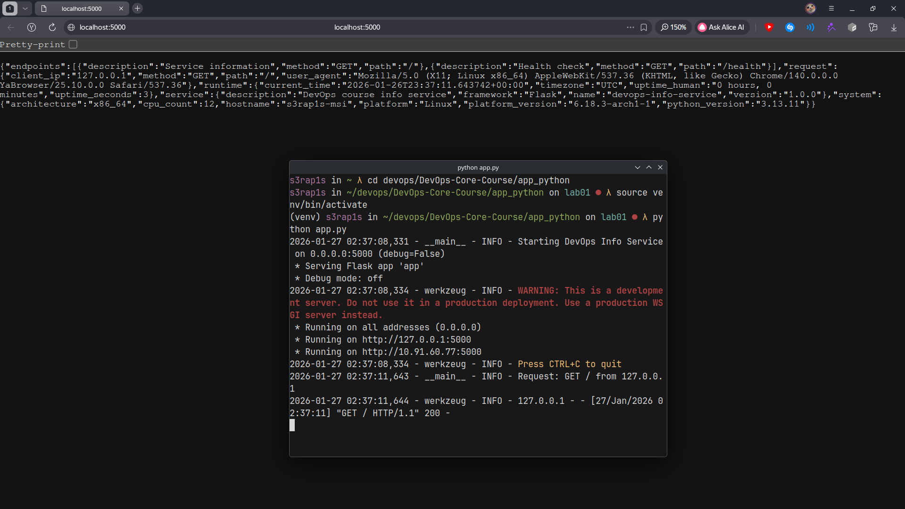
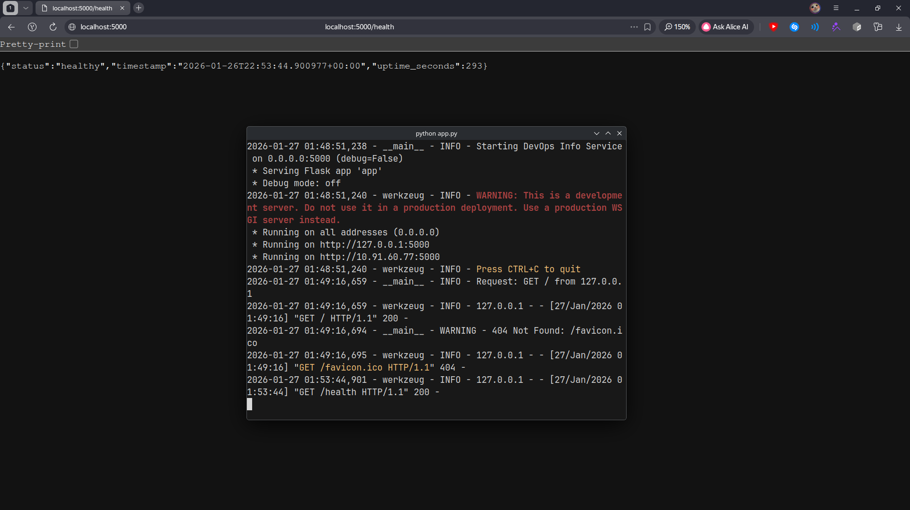
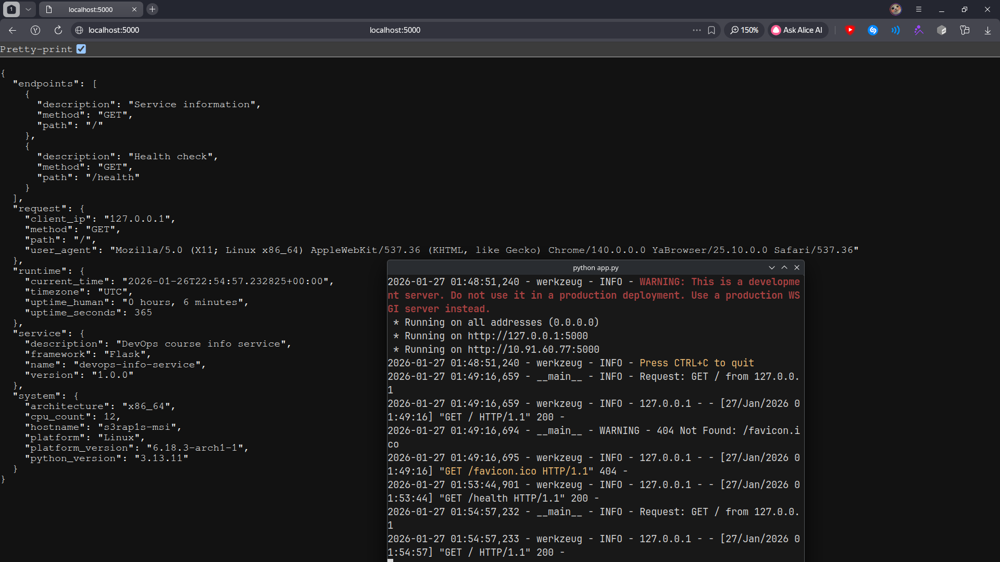

# Lab 1 — DevOps Info Service: Web Application Development

## Framework Selection

### My Choice: Flask

I selected **Flask** as the web framework for this DevOps Info Service. Here's why:

**Comparison Table:**
| Criteria | Flask | FastAPI | Django |
|----------|-------|---------|--------|
| Learning Curve | Very low | Moderate | Steep |
| Development Speed | High | High | Medium |
| Built-in Features | Minimal | Moderate | Extensive |
| Auto-documentation | Requires extensions | Built-in (OpenAPI) | Requires extensions |
| Performance | Good | Excellent (async) | Good |
| Complexity | Low | Medium | High |
| **Choice for Lab 1** | **✓** | | |

**Justification:**
Flask is a lightweight, minimalistic framework that perfectly suits our simple service with only two endpoints. For a DevOps monitoring tool foundation, we don't need the complexity of Django or the async capabilities of FastAPI yet. Flask allows rapid development with clean, understandable code, making it ideal for this educational project. Its simplicity aligns with the Unix philosophy of "do one thing well" - in this case, serve system information via HTTP.

## Best Practices Applied

### 1. Clean Code Organization
```python
# Clear imports grouping
import os
import socket
import platform
import logging
from datetime import datetime, timezone
from flask import Flask, jsonify, request

# Descriptive function names with docstrings
def get_system_info():
    """Collecting information about the system.
    Returns:
        dict: System configuration
    """
    return {
        'hostname': socket.gethostname(),
        'platform': platform.system(),
        # ... more fields
    }
```

**Importance:** Clean organization makes code maintainable, readable, and easier to debug. Following PEP 8 ensures consistency across Python projects.

### 2. Comprehensive Error Handling
```python
@app.errorhandler(404)
def not_found(error):
    """Error handler 404."""
    logger.warning(f"404 Not Found: {request.path}")
    return jsonify({
        'error': 'Not Found',
        'message': 'Endpoint does not exist'
    }), 404

@app.errorhandler(500)
def internal_error(error):
    """Error handler 500."""
    logger.error(f"500 Internal Server Error: {str(error)}")
    return jsonify({
        'error': 'Internal Server Error',
        'message': 'An unexpected error occurred'
    }), 500
```

**Importance:** Proper error handling prevents application crashes and provides meaningful feedback to API consumers. Each error type returns appropriate HTTP status codes and structured JSON responses.

### 3. Structured Logging
```python
logging.basicConfig(
    level=logging.INFO,
    format='%(asctime)s - %(name)s - %(levelname)s - %(message)s'
)
logger = logging.getLogger(__name__)

logger.info(f'Starting DevOps Info Service on {HOST}:{PORT} (debug={DEBUG})')
logger.info(f"Request: {request.method} {request.path} from {client_ip}")
```

**Importance:** Logging provides visibility into application behavior, helps with debugging in production, and allows monitoring of API usage patterns.

### 4. Configuration via Environment Variables
```python
HOST = os.getenv('HOST', '0.0.0.0')
PORT = int(os.getenv('PORT', 5000))
DEBUG = os.getenv('DEBUG', 'False').lower() == 'true'
```

**Importance:** Following the 12-factor app methodology, configuration via environment variables makes the application portable across different environments (development, testing, production) without code changes.

### 5. Version-Pinned Dependencies
```txt
# Web framework
Flask==3.1.0

# Virtual environment for python
python-dotenv==1.0.1
```

**Importance:** Pinning exact versions ensures consistent behavior across all deployments and prevents "works on my machine" issues due to dependency version mismatches.

### 6. Git Ignore for Development Artifacts
```gitignore
# Python
__pycache__/
*.py[cod]
venv/
*.log

# IDE
.vscode/
.idea/

# OS
.DS_Store
```

**Importance:** Prevents accidental commits of generated files, virtual environments, and sensitive data, keeping the repository clean and focused on source code.

## API Documentation

### Endpoint 1: `GET /`

**Description:** Returns comprehensive service information, system details, runtime data, and request metadata.

**Request:**
```bash
curl http://localhost:5000/
```

**Response (example):**
```json
{
  "service": {
    "name": "devops-info-service",
    "version": "1.0.0",
    "description": "DevOps course info service",
    "framework": "Flask"
  },
  "system": {
    "hostname": "my-laptop",
    "platform": "Linux",
    "platform_version": "Ubuntu 24.04",
    "architecture": "x86_64",
    "cpu_count": 8,
    "python_version": "3.13.1"
  },
  "runtime": {
    "uptime_seconds": 3600,
    "uptime_human": "1 hour, 0 minutes",
    "current_time": "2026-01-07T14:30:00.000Z",
    "timezone": "UTC"
  },
  "request": {
    "client_ip": "127.0.0.1",
    "user_agent": "curl/7.81.0",
    "method": "GET",
    "path": "/"
  },
  "endpoints": [
    {"path": "/", "method": "GET", "description": "Service information"},
    {"path": "/health", "method": "GET", "description": "Health check"}
  ]
}
```

### Endpoint 2: `GET /health`

**Description:** Health check endpoint for monitoring system. Always returns HTTP 200 with service status.

**Request:**
```bash
curl http://localhost:5000/health
```

**Response (example):**
```json
{
  "status": "healthy",
  "timestamp": "2024-01-15T14:30:00.000Z",
  "uptime_seconds": 3600
}
```

### Testing Commands

1. **Basic endpoint test:**
   ```bash
   curl http://localhost:5000/
   ```

2. **Health check test:**
   ```bash
   curl http://localhost:5000/health
   ```

3. **Pretty-printed output:**
   ```bash
   curl http://localhost:5000/ | jq .
   ```

4. **Custom configuration:**
   ```bash
   PORT=8080 python app.py
   curl http://localhost:8080/health
   ```

5. **Error simulation:**
   ```bash
   curl http://localhost:5000/nonexistent
   # Should return 404 error
   ```

## Testing Evidence

### Main endpoint:


### Health check:


### Formatted output:



## Challenges & Solutions

### Challenge 1: Timezone-Aware Timestamps
**Problem:** `datetime.now()` without timezone creates naive datetime objects, which can cause issues with serialization and timezone calculations.

**Solution:** Used `timezone.utc` consistently:
```python
from datetime import datetime, timezone
START_TIME = datetime.now(timezone.utc)
# ...
datetime.now(timezone.utc).isoformat()
```

### Challenge 2: Logging Configuration
**Problem:** Determining the appropriate log level and format for different types of messages.

**Solution:** Configured logging with INFO level for normal operations, DEBUG for health checks, and WARNING/ERROR for error handlers:
```python
logging.basicConfig(
    level=logging.INFO,
    format='%(asctime)s - %(name)s - %(levelname)s - %(message)s'
)
logger.info(f"Request: {request.method} {request.path} from {client_ip}")
logger.debug(f"Health check: {response}")
logger.warning(f"404 Not Found: {request.path}")
```

### Challenge 3: CPU Count Handling
**Problem:** `os.cpu_count()` can return None on some systems or when the count cannot be determined.

**Solution:** Added a fallback value:
```python
'cpu_count': os.cpu_count() or 0
```

## GitHub Community
### Why starring repositories matters in open source:
Starring repositories serves as both a bookmarking tool for personal reference and a public endorsement that helps projects gain visibility, attracting more contributors and showing appreciation to maintainers for their work.

### How following developers helps in team projects and professional growth:
Following developers enables you to stay updated on their projects and insights, fostering collaboration and knowledge sharing that accelerates team productivity and your own skill development in the tech community.