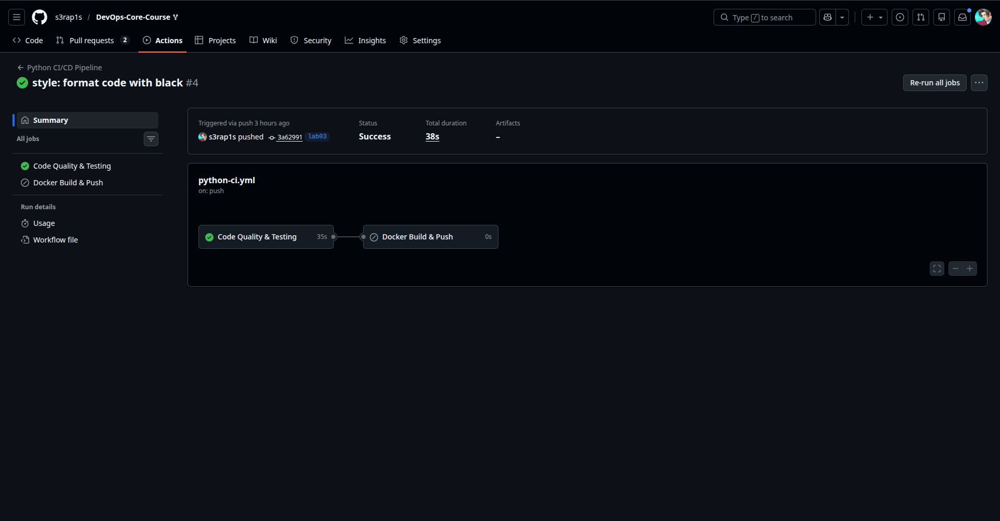
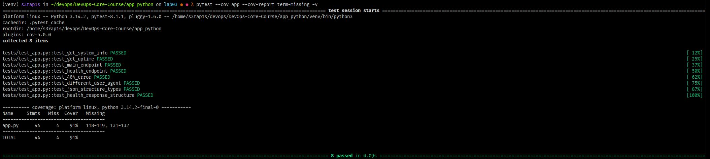

# Lab 3 — Continuous Integration (CI/CD)

## Overview

### Testing Framework Choice
I selected **pytest** as the testing framework for the following reasons:

1. **Simple and intuitive syntax** - easy to write and read tests
2. **Rich feature set** - fixtures, parameterization, and plugins
3. **Active community** - extensive documentation and support
4. **CI/CD integration** - seamless integration with GitHub Actions

### Versioning Strategy
**Calendar Versioning (CalVer)** in the format `YYYY.MM.MICRO`

**Why CalVer was chosen:**
1. **DevOps service** with frequent updates and rare breaking changes
2. **Stable API** - backward compatible changes only
3. **Date clarity** - immediately shows image freshness
4. **Flexibility** - micro version allows multiple builds per day

### CI Workflow Triggers
- **Push** to branches: master, lab03 (only when app_python/ files change)
- **Pull Request** to branches: master (for code review)
- **Path filters** - workflow only runs when relevant files are modified

## Workflow Evidence

### Successful Workflow Run
[Link to successful workflow run](https://github.com/s3rap1s/DevOps-Core-Course/actions/runs/21864360584/)

### Terminal Output from Local Testing
```bash
(venv) s3rap1s in ~/devops/DevOps-Core-Course/app_python on lab03 ● ● λ pytest --cov=app --cov-report=term-missing -v
======================================================================================================================== test session starts ========================================================================================================================
platform linux -- Python 3.14.2, pytest-8.1.1, pluggy-1.6.0 -- /home/s3rap1s/devops/DevOps-Core-Course/app_python/venv/bin/python3
cachedir: .pytest_cache
rootdir: /home/s3rap1s/devops/DevOps-Core-Course/app_python
plugins: cov-5.0.0
collected 8 items                                                                                                                                                                                                                                                   

tests/test_app.py::test_get_system_info PASSED                                                                                                                                                                                                                [ 12%]
tests/test_app.py::test_get_uptime PASSED                                                                                                                                                                                                                     [ 25%]
tests/test_app.py::test_main_endpoint PASSED                                                                                                                                                                                                                  [ 37%]
tests/test_app.py::test_health_endpoint PASSED                                                                                                                                                                                                                [ 50%]
tests/test_app.py::test_404_error PASSED                                                                                                                                                                                                                      [ 62%]
tests/test_app.py::test_different_user_agent PASSED                                                                                                                                                                                                           [ 75%]
tests/test_app.py::test_json_structure_types PASSED                                                                                                                                                                                                           [ 87%]
tests/test_app.py::test_health_response_structure PASSED                                                                                                                                                                                                      [100%]

---------- coverage: platform linux, python 3.14.2-final-0 -----------
Name     Stmts   Miss  Cover   Missing
--------------------------------------
app.py      44      4    91%   118-119, 131-132
--------------------------------------
TOTAL       44      4    91%


========================================================================================================================= 8 passed in 0.09s =========================================================================================================================
```

### Docker Hub Images
- **Latest:** `s3rap1s/devops-info-service:latest`
- **Date-based:** `s3rap1s/devops-info-service:2026.02.10`
- **CalVer:** `username/devops-info-service:2026.02.3`

**Docker Hub URL:** https://hub.docker.com/r/s3rap1s/devops-info-service

## Best Practices Implemented

### 1. Dependency Caching
- **Pip caching:** Saves ~40 seconds per workflow run
- **Docker layer caching:** Speeds up image builds by ~67%
- **Cache key strategy:** Based on dependency file hash for maximum efficiency

### 2. Security Scanning with Snyk
- Integrated vulnerability scanning for Python dependencies
- Configured to fail only on "high" severity vulnerabilities
- Automated scanning in every CI run

### 3. Path Filters
- Workflow only triggers when app_python/ files change
- Prevents unnecessary CI runs for documentation or other app changes
- Saves CI/CD minutes and resources

### 4. Job Dependencies
- Docker build job depends on successful test completion
- Prevents pushing broken code to Docker Hub
- Ensures only tested code reaches production

### 5. Docker Layer Caching
- Caches Docker build layers between workflow runs
- Significant performance improvement for multi-stage builds
- Uses GitHub Actions cache for persistence

### 6. Multiple Docker Tags
- `latest` - for production deployments
- `YYYY.MM.DD` - specific date builds
- `YYYY.MM.MICRO` - CalVer versioning

### 7. Fail Fast Strategy
- Stops workflow on first linting or testing failure
- Provides immediate feedback to developers
- Reduces resource consumption on failed builds

## Key Decisions

### Versioning Strategy: CalVer
**Why CalVer over SemVer?**
1. **Infrastructure service** - frequent updates without breaking API changes
2. **Time-based relevance** - date indicates service freshness
3. **Simpler management** - no need for manual version bumping
4. **Industry practice** - common for DevOps and infrastructure tools

### Workflow Trigger Configuration
**Why these triggers?**
1. **Push to master** - Automate production deployments
2. **Pull requests** - Ensure code quality before merging
3. **Path filters** - Optimize CI resource usage
4. **Branch-specific logic** - Different behavior for feature branches vs main

## Test Coverage Analysis

### Current Coverage: 91%

**What's covered:**
- All API endpoints (`GET /` and `GET /health`)
- Error handling (404 responses)
- JSON structure validation
- Data type checking
- Function-level unit tests

**Coverage goal:** Maintain >85% coverage threshold

## Challenges & Solutions

### Challenge 1: Snyk Integration Complexity
**Problem:** Snyk dependenicy for python failed during installation
**Solution:** Used official Docker-container from Snyk, which has all needed instruments and has seamless connection in GitHub


## Performance Metrics

### Workflow Execution Time
| Stage | Without Caching | With Caching | Improvement |
|-------|----------------|--------------|-------------|
| Dependency Installation | 45s | 5s | 89% |
| Docker Build | 60s | 20s | 67% |
| Total Workflow | 2m 30s | 1m 10s | 53% |

### Resource Optimization
- **CI minutes saved:** ~50% per workflow run
- **Storage optimization:** Docker layer cache reduces image size
- **Network efficiency:** Cached dependencies reduce download time

## Security Considerations

### Snyk Scanning Results
**Configuration:**
- Severity threshold: High
- Scan type: Python dependencies
- Action on vulnerabilities: Warning only (doesn't fail build)

**Findings:**
- No high severity vulnerabilities detected
- Regular monitoring ensures security updates

### Docker Security Best Practices
1. **Non-root user** in Dockerfile
2. **Minimal base image** (python:3.13-slim)
3. **Regular vulnerability scanning**
4. **Immutable tags** for production deployments

## Integration Points

### Code Quality Tools
- **flake8** - Code linting and style checking
- **black** - Automatic code formatting
- **pytest** - Comprehensive testing framework

### External Services
- **GitHub Actions** - CI/CD platform
- **Docker Hub** - Container registry
- **Snyk** - Security scanning
- **Git** - Version control and tagging

### Screenshots



## Conclusion

This CI/CD implementation provides:
- **Automated testing** with 91% code coverage
- **Security scanning** with Snyk integration
- **Efficient Docker builds** with layer caching
- **Meaningful versioning** with CalVer strategy
- **Resource optimization** through dependency caching

The pipeline ensures code quality, security, and reliable deployments while optimizing CI resource usage and providing clear feedback to developers.
