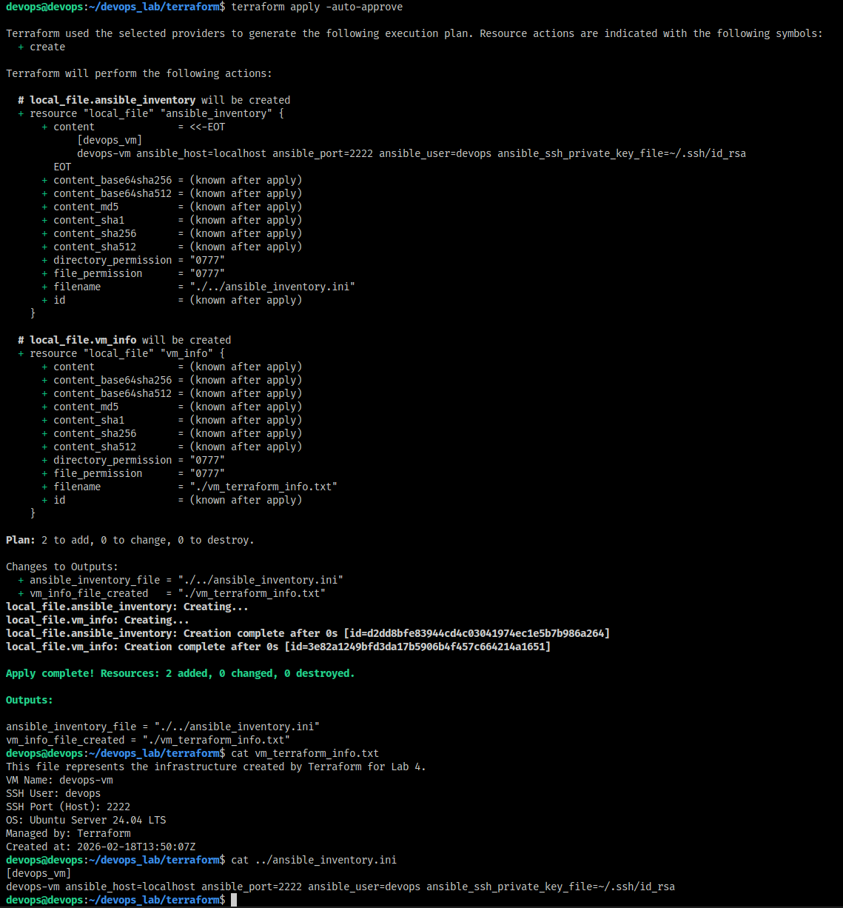
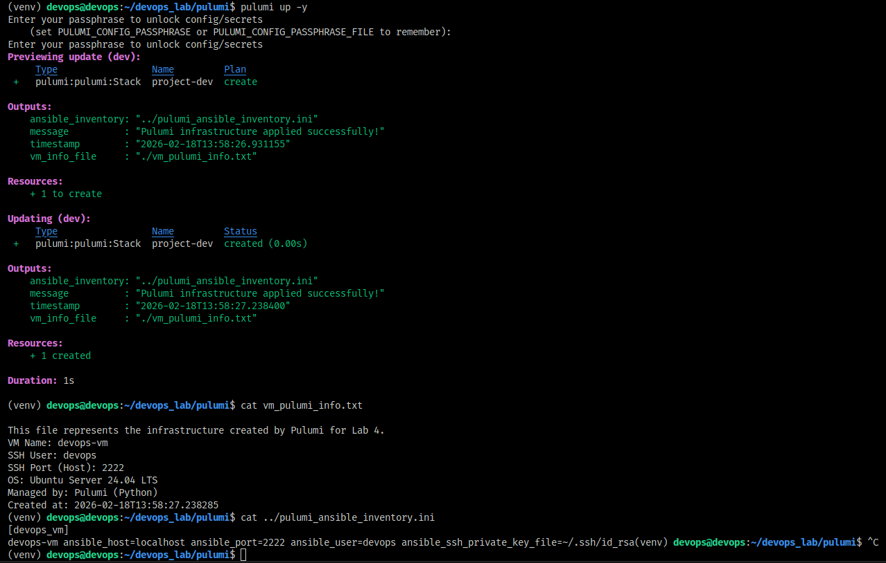

# Lab 4 — Infrastructure as Code (Terraform & Pulumi)

## Cloud Provider & Infrastructure

### Choice of Environment
I chose to use a **local virtual machine** as my "cloud provider" for this lab. The VM runs on VirtualBox on my Archlinux host. This decision was made to avoid any cloud costs, simplify the setup, and have full control over the infrastructure. The VM will also be used in Lab 5 (Ansible).

### VM Specifications
- **Virtualization Software:** VirtualBox 7.2.6
- **Guest OS:** Ubuntu Server 24.04 LTS
- **Resources:** 2 GB RAM, 25 GB dynamic disk
- **Network:** NAT with port forwarding (host port 2222 → guest port 22)
- **SSH Access:** `ssh devops@localhost -p 2222`

The VM was created manually following the lab instructions, and its configuration is documented here to represent the infrastructure managed by IaC tools.


## Terraform Implementation

### Terraform Version
```
Terraform v1.14.5 on linux_amd64
```

### Project Structure
```
terraform/
├── main.tf          # Main resources (local files)
├── variables.tf     # Input variables (empty for now)
├── outputs.tf       # Output definitions
└── .gitignore       # Ignore state files
```

### Key Configuration Decisions
Since the infrastructure is a local VM, we cannot manage it directly with Terraform's cloud providers. Instead, we used the `local` provider to create descriptive files that represent the infrastructure. This demonstrates the concept of Infrastructure as Code – defining infrastructure in code, even if the actual resources are provisioned outside of Terraform.

**main.tf**:
```hcl
resource "local_file" "vm_info" {
  content  = <<-EOT
    This file represents the infrastructure created by Terraform for Lab 4.
    VM Name: devops-vm
    SSH User: devops
    SSH Port (Host): 2222
    OS: Ubuntu Server 24.04 LTS
    Managed by: Terraform
    Created at: ${timestamp()}
  EOT
  filename = "${path.module}/vm_terraform_info.txt"
}

resource "local_file" "ansible_inventory" {
  content  = <<-EOT
    [devops_vm]
    devops-vm ansible_host=localhost ansible_port=2222 ansible_user=devops ansible_ssh_private_key_file=~/.ssh/id_rsa
  EOT
  filename = "${path.module}/../ansible_inventory.ini"
}

output "vm_info_file_created" {
  value = local_file.vm_info.filename
}

output "ansible_inventory_file" {
  value = local_file.ansible_inventory.filename
}
```

**outputs.tf**:
```hcl
output "vm_info_file" {
  value = local_file.vm_info.filename
}

output "ansible_inventory_file" {
  value = local_file.ansible_inventory.filename
}

output "creation_timestamp" {
  value = timestamp()
}
```

### Applying Infrastructure
```bash
devops@devops:~/devops_lab/terraform$ terraform init
Initializing the backend...
Initializing provider plugins...
- Finding latest version of hashicorp/local...
- Installing hashicorp/local v2.5.1...
- Installed hashicorp/local v2.5.1 (unauthenticated)
Terraform has created a lock file .terraform.lock.hcl to record the provider
selections it made above. Include this file in your version control repository
so that Terraform can guarantee to make the same selections by default when
you run "terraform init" in the future.

╷
│ Warning: Incomplete lock file information for providers
│ 
│ Due to your customized provider installation methods, Terraform was forced to calculate lock file checksums locally for the following providers:
│   - hashicorp/local
│ 
│ The current .terraform.lock.hcl file only includes checksums for linux_amd64, so Terraform running on another platform will fail to install these providers.
│ 
│ To calculate additional checksums for another platform, run:
│   terraform providers lock -platform=linux_amd64
│ (where linux_amd64 is the platform to generate)
╵
Terraform has been successfully initialized!

You may now begin working with Terraform. Try running "terraform plan" to see
any changes that are required for your infrastructure. All Terraform commands
should now work.

If you ever set or change modules or backend configuration for Terraform,
rerun this command to reinitialize your working directory. If you forget, other
commands will detect it and remind you to do so if necessary.
devops@devops:~/devops_lab/terraform$ terraform plan

Terraform used the selected providers to generate the following execution plan. Resource actions are indicated with the following symbols:
  + create

Terraform will perform the following actions:

  # local_file.ansible_inventory will be created
  + resource "local_file" "ansible_inventory" {
      + content              = <<-EOT
            [devops_vm]
            devops-vm ansible_host=localhost ansible_port=2222 ansible_user=devops ansible_ssh_private_key_file=~/.ssh/id_rsa
        EOT
      + content_base64sha256 = (known after apply)
      + content_base64sha512 = (known after apply)
      + content_md5          = (known after apply)
      + content_sha1         = (known after apply)
      + content_sha256       = (known after apply)
      + content_sha512       = (known after apply)
      + directory_permission = "0777"
      + file_permission      = "0777"
      + filename             = "./../ansible_inventory.ini"
      + id                   = (known after apply)
    }

  # local_file.vm_info will be created
  + resource "local_file" "vm_info" {
      + content              = (known after apply)
      + content_base64sha256 = (known after apply)
      + content_base64sha512 = (known after apply)
      + content_md5          = (known after apply)
      + content_sha1         = (known after apply)
      + content_sha256       = (known after apply)
      + content_sha512       = (known after apply)
      + directory_permission = "0777"
      + file_permission      = "0777"
      + filename             = "./vm_terraform_info.txt"
      + id                   = (known after apply)
    }

Plan: 2 to add, 0 to change, 0 to destroy.

Changes to Outputs:
  + ansible_inventory_file = "./../ansible_inventory.ini"
  + vm_info_file_created   = "./vm_terraform_info.txt"

────────────────────────────────────────────────────────────────────────────────────────────────────────────────────────────────────────────────────────────────────────────────────────────────────────────────────────────────────────────────────────────────

Note: You didn't use the -out option to save this plan, so Terraform can't guarantee to take exactly these actions if you run "terraform apply" now.
devops@devops:~/devops_lab/terraform$ terraform apply -auto-approve

Terraform used the selected providers to generate the following execution plan. Resource actions are indicated with the following symbols:
  + create

Terraform will perform the following actions:

  # local_file.ansible_inventory will be created
  + resource "local_file" "ansible_inventory" {
      + content              = <<-EOT
            [devops_vm]
            devops-vm ansible_host=localhost ansible_port=2222 ansible_user=devops ansible_ssh_private_key_file=~/.ssh/id_rsa
        EOT
      + content_base64sha256 = (known after apply)
      + content_base64sha512 = (known after apply)
      + content_md5          = (known after apply)
      + content_sha1         = (known after apply)
      + content_sha256       = (known after apply)
      + content_sha512       = (known after apply)
      + directory_permission = "0777"
      + file_permission      = "0777"
      + filename             = "./../ansible_inventory.ini"
      + id                   = (known after apply)
    }

  # local_file.vm_info will be created
  + resource "local_file" "vm_info" {
      + content              = (known after apply)
      + content_base64sha256 = (known after apply)
      + content_base64sha512 = (known after apply)
      + content_md5          = (known after apply)
      + content_sha1         = (known after apply)
      + content_sha256       = (known after apply)
      + content_sha512       = (known after apply)
      + directory_permission = "0777"
      + file_permission      = "0777"
      + filename             = "./vm_terraform_info.txt"
      + id                   = (known after apply)
    }

Plan: 2 to add, 0 to change, 0 to destroy.

Changes to Outputs:
  + ansible_inventory_file = "./../ansible_inventory.ini"
  + vm_info_file_created   = "./vm_terraform_info.txt"
local_file.ansible_inventory: Creating...
local_file.vm_info: Creating...
local_file.ansible_inventory: Creation complete after 0s [id=d2dd8bfe83944cd4c03041974ec1e5b7b986a264]
local_file.vm_info: Creation complete after 0s [id=3e82a1249bfd3da17b5906b4f457c664214a1651]

Apply complete! Resources: 2 added, 0 changed, 0 destroyed.

Outputs:

ansible_inventory_file = "./../ansible_inventory.ini"
vm_info_file_created = "./vm_terraform_info.txt"
```

### Verification
Both files were created successfully:
```bash
devops@devops:~/devops_lab/terraform$ cat vm_terraform_info.txt 
This file represents the infrastructure created by Terraform for Lab 4.
VM Name: devops-vm
SSH User: devops
SSH Port (Host): 2222
OS: Ubuntu Server 24.04 LTS
Managed by: Terraform
Created at: 2026-02-18T13:50:07Z
devops@devops:~/devops_lab/terraform$ cat ../ansible_inventory.ini 
[devops_vm]
devops-vm ansible_host=localhost ansible_port=2222 ansible_user=devops ansible_ssh_private_key_file=~/.ssh/id_rsa
```

## Pulumi Implementation

### Pulumi Version & Language
- **Pulumi version:** 3.221.0
- **Language:** Python 3.12.3
- **State backend:** Local (`pulumi login --local`)

### Project Structure
```
pulumi/
├── __main__.py          # Infrastructure code
├── requirements.txt     # Python dependencies
├── Pulumi.yaml          # Project metadata
└── Pulumi.dev.yaml      # Stack configuration (local)
```

### Code Implementation
The Pulumi program creates the same two files using plain Python code, demonstrating the imperative approach.

**__main__.py**:
```python
import pulumi
from datetime import datetime

vm_info_content = f"""
This file represents the infrastructure created by Pulumi for Lab 4.
VM Name: devops-vm
SSH User: devops
SSH Port (Host): 2222
OS: Ubuntu Server 24.04 LTS
Managed by: Pulumi (Python)
Created at: {datetime.now().isoformat()}
"""

with open('./vm_pulumi_info.txt', 'w') as f:
    f.write(vm_info_content)

pulumi.export('vm_info_file', './vm_pulumi_info.txt')
pulumi.export('message', 'Pulumi infrastructure applied successfully!')
pulumi.export('timestamp', datetime.now().isoformat())

inventory_lines = [
    "[devops_vm]",
    "devops-vm ansible_host=localhost ansible_port=2222 ansible_user=devops ansible_ssh_private_key_file=~/.ssh/id_rsa"
]
inventory_content = "\n".join(inventory_lines)
with open('../pulumi_ansible_inventory.ini', 'w') as f:
    f.write(inventory_content)

pulumi.export('ansible_inventory', '../pulumi_ansible_inventory.ini')
```

### Applying Infrastructure
```bash
(venv) devops@devops:~/devops_lab/pulumi$ pulumi up -y
Enter your passphrase to unlock config/secrets
    (set PULUMI_CONFIG_PASSPHRASE or PULUMI_CONFIG_PASSPHRASE_FILE to remember):  
Enter your passphrase to unlock config/secrets
Previewing update (dev):
     Type                 Name         Plan       
 +   pulumi:pulumi:Stack  project-dev  create     

Outputs:
    ansible_inventory: "../pulumi_ansible_inventory.ini"
    message          : "Pulumi infrastructure applied successfully!"
    timestamp        : "2026-02-18T13:58:26.931155"
    vm_info_file     : "./vm_pulumi_info.txt"

Resources:
    + 1 to create

Updating (dev):
     Type                 Name         Status              
 +   pulumi:pulumi:Stack  project-dev  created (0.00s)     

Outputs:
    ansible_inventory: "../pulumi_ansible_inventory.ini"
    message          : "Pulumi infrastructure applied successfully!"
    timestamp        : "2026-02-18T13:58:27.238400"
    vm_info_file     : "./vm_pulumi_info.txt"

Resources:
    + 1 created

Duration: 1s
```

### Verification
Files were created and contain the expected data:
```bash
(venv) devops@devops:~/devops_lab/pulumi$ cat vm_pulumi_info.txt 

This file represents the infrastructure created by Pulumi for Lab 4.
VM Name: devops-vm
SSH User: devops
SSH Port (Host): 2222
OS: Ubuntu Server 24.04 LTS
Managed by: Pulumi (Python)
Created at: 2026-02-18T13:58:27.238285
(venv) devops@devops:~/devops_lab/pulumi$ cat ../pulumi_ansible_inventory.ini 
[devops_vm]
devops-vm ansible_host=localhost ansible_port=2222 ansible_user=devops ansible_ssh_private_key_file=~/.ssh/id_rsa
```


## Terraform vs Pulumi Comparison

| Aspect | Terraform | Pulumi |
|--------|-----------|--------|
| **Ease of Learning** | HCL is simple and declarative, easy to pick up even without programming background | Requires knowledge of a programming language (Python/TypeScript/Go), but does not require any new language if developer already familiar with any |
| **Code Readability** | Configuration is clean and resource-focused | The code is imperative and can mix infrastructure logic with application logic. For simple resources, it's still readable, but complex logic may obscure the infrastructure intent |
| **Debugging** | Error messages are generally clear, but debugging complex interpolation can be tricky | Full language debugging makes troubleshooting much easier |
| **Documentation** | Terraform Registry has well-structured documentation | Pulumi Registry also has good docs, but often you need to know the underlying cloud provider API as well |
| **Use Case** | Best for pure infrastructure provisioning, especially in team environments where a declarative approach is preferred | Ideal when infrastructure needs to be tightly integrated with application code, or when you need complex logic (loops, conditionals, external libraries) |

**My Personal Preference:**  
For this simple task, both tools worked well. However, I found Pulumi more intuitive because I am comfortable with imperative languages


## Lab 5 Preparation & Cleanup

### Keeping the VM for Lab 5
- **I am keeping the VM running** (`devops`) for Lab 5 (Ansible).  
- The VM is accessible via `ssh devops@localhost -p 2222`.  
- All necessary files (Ansible inventory generated by both Terraform and Pulumi) are already in place.

### Cleanup Status
- I have **not destroyed** the Terraform or Pulumi resources because the VM itself is not managed by these tools.  
- The local files created by Terraform and Pulumi remain in the repository for documentation and future reference.  


## Challenges & Solutions

### Challenge 1: Pulumi requiring a backend
**Problem:** Running `pulumi new python` initially prompted for a Pulumi Cloud token.  
**Solution:** Used `pulumi login --local` to configure a local state backend, then created the project normally. This kept everything self-contained.

### Challenge 2: Simulating infrastructure without a real cloud provider
**Problem:** Both tools are designed to provision cloud resources, but I only have a local VM.  
**Solution:** I used file resources as a proxy to demonstrate IaC concepts. The files contain metadata about the VM, effectively representing the infrastructure in code.

### Challenge 3: Downloading Terraform due to geographical restrictions
**Problem:** Direct download of Terraform from the official HashiCorp website was blocked from inside the virtual machine due to regional network restrictions.  
**Solution:** I downloaded the Terraform binary on my host machine (Arch Linux) using a working connection, then transferred it to the VM via `scp` over the forwarded SSH port (`scp -P 2222 terraform-provider-local_v2.5.1_x5 devops@localhost:/home/devops/devops_lab/terraform/`). After transferring, I unzipped the archive and moved the binary to `/usr/local/bin/` inside the VM.

## Screenshots

1. **Terraform apply output**  
   

2. **Pulumi up output**  
   
