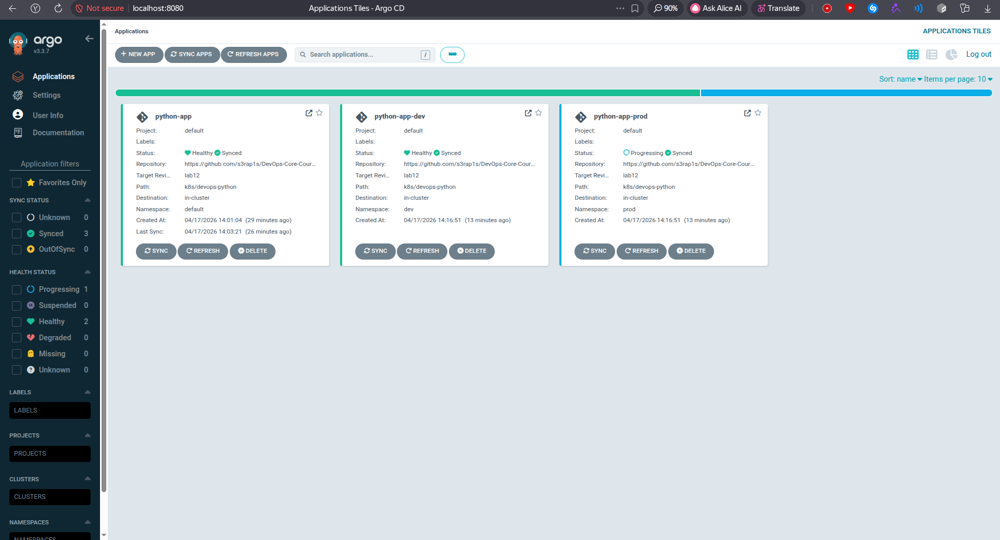
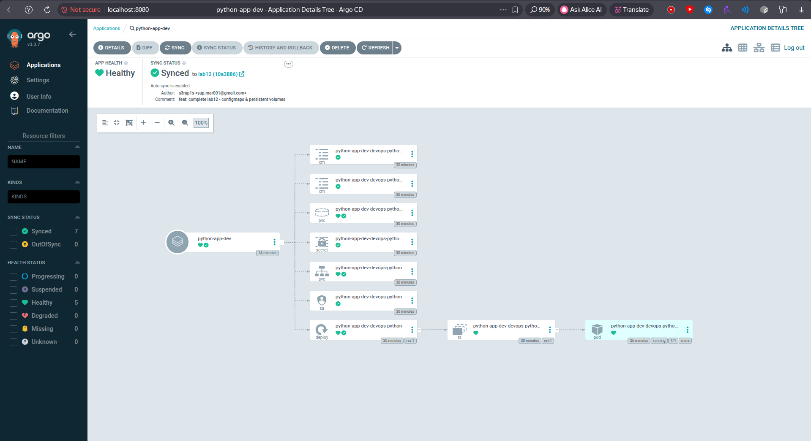
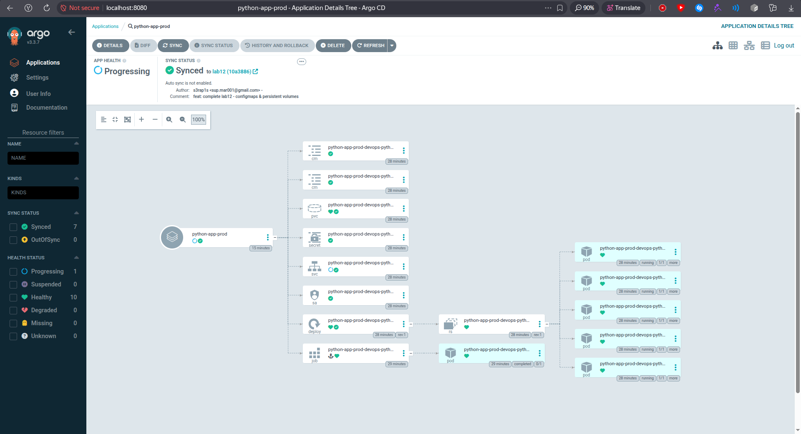

# Lab 13: GitOps with ArgoCD

## ArgoCD Setup

### Installation

ArgoCD was installed into a dedicated `argocd` namespace with the official Helm chart.

```bash
s3rap1s in ~/devops/DevOps-Core-Course on lab13 λ helm list -n argocd
NAME  	NAMESPACE	REVISION	UPDATED                                	STATUS  	CHART        	APP VERSION
argocd	argocd   	1       	2026-04-17 13:55:04.180596419 +0300 MSK	deployed	argo-cd-9.5.2	v3.3.7
```

All ArgoCD components were running after installation.

```bash
s3rap1s in ~/devops/DevOps-Core-Course on lab13 λ kubectl get pods -n argocd -o wide
NAME                                                READY   STATUS    RESTARTS   AGE     IP             NODE       NOMINATED NODE   READINESS GATES
argocd-application-controller-0                     1/1     Running   0          3m14s   10.244.0.149   minikube   <none>           <none>
argocd-applicationset-controller-59f6b7dd64-w4cvz   1/1     Running   0          3m14s   10.244.0.148   minikube   <none>           <none>
argocd-dex-server-7b9588c494-cckh4                  1/1     Running   0          3m14s   10.244.0.151   minikube   <none>           <none>
argocd-notifications-controller-8f6855454-kxdrr     1/1     Running   0          3m14s   10.244.0.152   minikube   <none>           <none>
argocd-redis-dc6b586fc-brr5r                        1/1     Running   0          3m14s   10.244.0.150   minikube   <none>           <none>
argocd-repo-server-5f4d44d9f8-rz7d2                 1/1     Running   0          3m14s   10.244.0.153   minikube   <none>           <none>
argocd-server-5f777b877f-2bl4c                      1/1     Running   0          3m14s   10.244.0.147   minikube   <none>           <none>
```

### UI and CLI Access

The UI was exposed locally through port forwarding:

```bash
kubectl port-forward svc/argocd-server -n argocd 8080:443
```

The initial admin password was read from the generated secret:

```bash
kubectl -n argocd get secret argocd-initial-admin-secret -o jsonpath='{.data.password}' | base64 -d
```

ArgoCD CLI was installed locally on the host and logged in through the port-forwarded endpoint.

```bash
s3rap1s in ~/devops/DevOps-Core-Course on lab13 λ argocd version --client
argocd: v3.3.3+unknown
  BuildDate: 2026-03-10T01:28:07Z
  GitTag: 3.3.3
  GoVersion: go1.26.1-X:nodwarf5
  Platform: linux/amd64
```

```bash
s3rap1s in ~/devops/DevOps-Core-Course on lab13 λ argocd login localhost:8080 --username admin --password <initial-password> --insecure
'admin:login' logged in successfully
Context 'localhost:8080' updated
```


## Application Configuration

### Manifests

ArgoCD manifests were added under `k8s/argocd/`:

```text
k8s/argocd/
├── application.yaml
├── application-dev.yaml
├── application-prod.yaml
└── applicationset.yaml
```

The required Application manifests use the existing Helm chart:
- target revision in the current manifests: `lab13`
- chart path: `k8s/devops-python`
- cluster destination: `https://kubernetes.default.svc`
- single app values: `values.yaml`
- dev values: `values-dev.yaml`
- prod values: `values-prod.yaml`


### Application Creation

```bash
s3rap1s in ~/devops/DevOps-Core-Course on lab13 λ kubectl apply -f k8s/argocd/application.yaml -f k8s/argocd/application-dev.yaml -f k8s/argocd/application-prod.yaml
application.argoproj.io/python-app created
application.argoproj.io/python-app-dev created
application.argoproj.io/python-app-prod created
```

Initial status showed that dev synced automatically, while the default and prod apps waited for manual sync.

```bash
s3rap1s in ~/devops/DevOps-Core-Course on lab13 λ argocd app list
NAME                    CLUSTER                         NAMESPACE  PROJECT  STATUS     HEALTH   SYNCPOLICY  CONDITIONS  REPO                                               PATH               TARGET
argocd/python-app       https://kubernetes.default.svc  default    default  OutOfSync  Missing  Manual      <none>      https://github.com/s3rap1s/DevOps-Core-Course.git  k8s/devops-python  lab13
argocd/python-app-dev   https://kubernetes.default.svc  dev        default  Synced     Healthy  Auto-Prune  <none>      https://github.com/s3rap1s/DevOps-Core-Course.git  k8s/devops-python  lab13
argocd/python-app-prod  https://kubernetes.default.svc  prod       default  OutOfSync  Missing  Manual      <none>      https://github.com/s3rap1s/DevOps-Core-Course.git  k8s/devops-python  lab13
```

Manual sync was then triggered for the default and prod applications.

```bash
s3rap1s in ~/devops/DevOps-Core-Course on lab13 λ argocd app sync python-app
Operation:          Sync
Sync Revision:      10a3886298116dce2658fe2ed76a79127c6ed8a0
Phase:              Succeeded
Start:              2026-04-17 14:02:43 +0300 MSK
Finished:           2026-04-17 14:03:21 +0300 MSK
Duration:           38s
Message:            successfully synced (no more tasks)
```

This covers the GitOps workflow mechanically: the desired state is stored in Git, ArgoCD detects when the cluster is `OutOfSync`, and a manual sync applies the Git state to the cluster. For a real branch update workflow, the next change should be committed and pushed to `lab14`, then ArgoCD will detect the new revision and sync it from Git.


## Multi-Environment Deployment

### Configuration Differences

Development uses `values-dev.yaml`:

- namespace: `dev`
- replicas: `1`
- service type: `NodePort`
- smaller CPU and memory requests/limits
- auto-sync enabled with `prune` and `selfHeal`

Production uses `values-prod.yaml`:

- namespace: `prod`
- replicas: `5`
- service type: `LoadBalancer`
- higher CPU and memory requests/limits
- manual sync only

Production remains manual because release timing should be controlled explicitly. This avoids an automatic production rollout immediately after every Git change.

### Environment Verification

Dev resources:

```bash
s3rap1s in ~/devops/DevOps-Core-Course on lab13 λ kubectl get deploy,svc,pvc -n dev -l app.kubernetes.io/instance=python-app-dev
NAME                                           READY   UP-TO-DATE   AVAILABLE   AGE
deployment.apps/python-app-dev-devops-python   1/1     1            1           3m25s

NAME                                   TYPE       CLUSTER-IP      EXTERNAL-IP   PORT(S)        AGE
service/python-app-dev-devops-python   NodePort   10.107.239.20   <none>        80:31668/TCP   3m25s

NAME                                                      STATUS   VOLUME                                     CAPACITY   ACCESS MODES   STORAGECLASS   VOLUMEATTRIBUTESCLASS   AGE
persistentvolumeclaim/python-app-dev-devops-python-data   Bound    pvc-199f741f-23cf-49c1-97ac-aad89de6c21f   100Mi      RWO            standard       <unset>                 3m25s
```

Prod resources:

```bash
s3rap1s in ~/devops/DevOps-Core-Course on lab13 λ kubectl get deploy,svc,pvc -n prod -l app.kubernetes.io/instance=python-app-prod
NAME                                            READY   UP-TO-DATE   AVAILABLE   AGE
deployment.apps/python-app-prod-devops-python   5/5     5            5           65s

NAME                                    TYPE           CLUSTER-IP     EXTERNAL-IP   PORT(S)        AGE
service/python-app-prod-devops-python   LoadBalancer   10.98.21.110   <pending>     80:30452/TCP   65s

NAME                                                       STATUS   VOLUME                                     CAPACITY   ACCESS MODES   STORAGECLASS   VOLUMEATTRIBUTESCLASS   AGE
persistentvolumeclaim/python-app-prod-devops-python-data   Bound    pvc-993a550c-3c58-470b-9cb2-77e92e1158de   100Mi      RWO            standard       <unset>                 65s
```

The prod Service has `EXTERNAL-IP: <pending>` because Minikube does not allocate LoadBalancer IPs without `minikube tunnel`. The deployment itself was healthy and the service was still reachable through the assigned NodePort.

Application health checks through Minikube:

```bash
s3rap1s in ~/devops/DevOps-Core-Course on lab13 λ curl -s http://192.168.49.2:31668/health
{"status":"healthy","timestamp":"2026-04-17T11:07:34.266765+00:00","uptime_seconds":131}
```

```bash
s3rap1s in ~/devops/DevOps-Core-Course on lab13 λ curl -s http://192.168.49.2:30452/health
{"status":"healthy","timestamp":"2026-04-17T11:07:34.278974+00:00","uptime_seconds":229}
```


## Self-Healing and Drift Tests

### Manual Scale Drift

The dev deployment is defined as `replicaCount: 1` in `values-dev.yaml`. It was manually scaled to 5 replicas.

```bash
s3rap1s in ~/devops/DevOps-Core-Course on lab13 λ kubectl get deployment python-app-dev-devops-python -n dev -o jsonpath='{.spec.replicas}{" desired, "}{.status.readyReplicas}{" ready\n"}'; kubectl scale deployment python-app-dev-devops-python -n dev --replicas=5
2026-04-17 14:04:58 MSK
1 desired, 1 ready
deployment.apps/python-app-dev-devops-python scaled
```

Immediately after the manual change:

```bash
2026-04-17 14:04:58 MSK
5 desired, 1 ready
```

ArgoCD self-healing reverted the deployment back to the Git-defined value.

```bash
s3rap1s in ~/devops/DevOps-Core-Course on lab13 λ kubectl get deployment python-app-dev-devops-python -n dev -o jsonpath='{.spec.replicas}{" desired, "}{.status.readyReplicas}{" ready\n"}'
2026-04-17 14:05:08 MSK
1 desired, 1 ready
```

### Pod Deletion

A dev pod was manually deleted.

```bash
s3rap1s in ~/devops/DevOps-Core-Course on lab13 λ kubectl get pods -n dev -l app.kubernetes.io/instance=python-app-dev; kubectl delete pod -n dev -l app.kubernetes.io/instance=python-app-dev
2026-04-17 14:05:16 MSK
NAME                                            READY   STATUS    RESTARTS   AGE
python-app-dev-devops-python-558d6b487b-8gjp4   1/1     Running   0          3m55s
pod "python-app-dev-devops-python-558d6b487b-8gjp4" deleted from dev namespace
```

Kubernetes recreated the pod through the Deployment/ReplicaSet controller.

```bash
2026-04-17 14:05:47 MSK
NAME                                            READY   STATUS    RESTARTS   AGE
python-app-dev-devops-python-558d6b487b-88bkg   1/1     Running   0          31s
```

This was Kubernetes self-healing, not ArgoCD self-healing. Kubernetes restored the missing pod because the ReplicaSet still desired one replica.

### Configuration Drift

The dev environment ConfigMap was manually changed from the Git-defined value `LOG_LEVEL=info` to `LOG_LEVEL=debug`.

```bash
s3rap1s in ~/devops/DevOps-Core-Course on lab13 λ kubectl patch configmap python-app-dev-devops-python-env -n dev --type merge -p '{"data":{"LOG_LEVEL":"debug"}}'; kubectl get configmap python-app-dev-devops-python-env -n dev -o jsonpath='{.data.LOG_LEVEL}{"\n"}'
2026-04-17 14:06:48 MSK
configmap/python-app-dev-devops-python-env patched
debug
```

ArgoCD detected and reverted the managed ConfigMap field.

```bash
s3rap1s in ~/devops/DevOps-Core-Course on lab13 λ kubectl get configmap python-app-dev-devops-python-env -n dev -o jsonpath='{.data.LOG_LEVEL}{"\n"}'
2026-04-17 14:07:13 MSK
info
```

### Behavior Analysis

ArgoCD syncs Kubernetes resources back to the desired state stored in Git. In this lab, the dev app used automated sync with `prune` and `selfHeal`, so manual changes to managed fields were reverted automatically.

Kubernetes self-healing is different: Deployment and ReplicaSet controllers recreate missing pods even when ArgoCD does nothing. Deleting a pod does not change Git-defined configuration; it only removes an instance managed by Kubernetes.

By default, ArgoCD polls Git every 3 minutes. Drift inside the cluster can also trigger self-healing for automated applications when `selfHeal` is enabled.


## UI Screenshots

Applications list with `python-app`, `python-app-dev`, and `python-app-prod`:



Dev application details:



Prod application details:




## ApplicationSet Bonus

The bonus ApplicationSet manifest is stored in `k8s/argocd/applicationset.yaml`.

It uses a List generator to define the environment-specific parameters:

- `env`
- `namespace`
- `valuesFile`
- `autoSync`

The template then generates one Application per environment with the matching Helm values file.

```yaml
generators:
  - list:
      elements:
        - env: dev
          namespace: dev
          valuesFile: values-dev.yaml
          autoSync: "true"
        - env: prod
          namespace: prod
          valuesFile: values-prod.yaml
          autoSync: "false"
```

The ApplicationSet uses `templatePatch` to keep the same sync policy behavior as the individual Application manifests:

- dev gets automated sync with `prune` and `selfHeal`
- prod stays manual

This is needed because both generated Applications share one base template, but their sync policies are different.

### Replacing Individual Applications

The individual dev/prod Applications were removed after checking that they had no finalizers, so deleting the Application CRs did not delete the already deployed workloads.

```bash
s3rap1s in ~/devops/DevOps-Core-Course on lab13 λ kubectl get application python-app-dev python-app-prod -n argocd -o jsonpath='{range .items[*]}{.metadata.name}{": finalizers="}{.metadata.finalizers}{"\n"}{end}'
python-app-dev: finalizers=
python-app-prod: finalizers=
```

Then the ApplicationSet was applied.

```bash
s3rap1s in ~/devops/DevOps-Core-Course on lab13 λ kubectl delete application python-app-dev python-app-prod -n argocd
application.argoproj.io "python-app-dev" deleted from argocd namespace
application.argoproj.io "python-app-prod" deleted from argocd namespace
```

```bash
s3rap1s in ~/devops/DevOps-Core-Course on lab13 λ kubectl apply -f k8s/argocd/applicationset.yaml
applicationset.argoproj.io/python-app-set created
```

Generated Applications:

```bash
s3rap1s in ~/devops/DevOps-Core-Course on lab13 λ kubectl get applicationsets -n argocd
NAME             AGE
python-app-set   7s
```

```bash
s3rap1s in ~/devops/DevOps-Core-Course on lab13 λ kubectl get applications -n argocd
NAME              SYNC STATUS   HEALTH STATUS
python-app        Synced        Healthy
python-app-dev    Synced        Healthy
python-app-prod   Synced        Progressing
```

Both generated Applications are owned by the ApplicationSet. Dev has automated sync enabled, while prod has no automated sync policy.

```bash
s3rap1s in ~/devops/DevOps-Core-Course on lab13 λ kubectl get applications python-app-dev python-app-prod -n argocd -o jsonpath='{range .items[*]}{.metadata.name}{" owner="}{.metadata.ownerReferences[0].kind}{"/"}{.metadata.ownerReferences[0].name}{" sync="}{.status.sync.status}{" health="}{.status.health.status}{" policy="}{.spec.syncPolicy.automated}{"\n"}{end}'
python-app-dev owner=ApplicationSet/python-app-set sync=Synced health=Healthy policy={"prune":true,"selfHeal":true}
python-app-prod owner=ApplicationSet/python-app-set sync=Synced health=Progressing policy=
```

The generated Application names are:

- `python-app-dev`
- `python-app-prod`

ApplicationSet is useful when the same application must be deployed repeatedly across environments, clusters, tenants, or directories. For a small number of environments, individual Application manifests are simpler. For many repeated deployments, ApplicationSet reduces duplication and keeps environment parameters in one generator.
