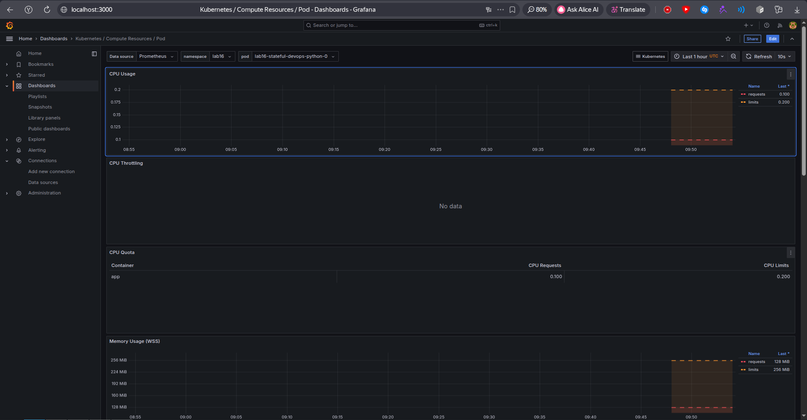
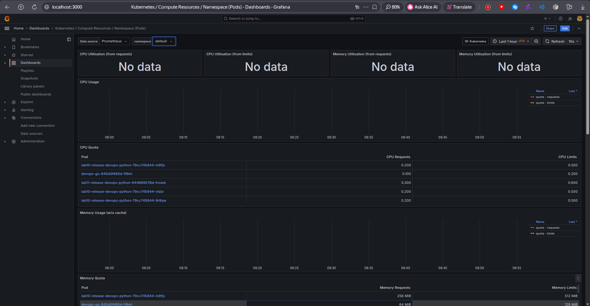
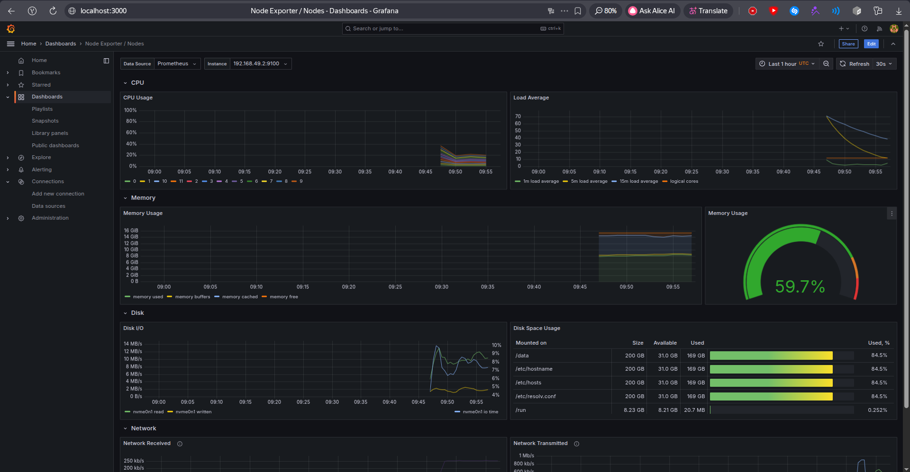
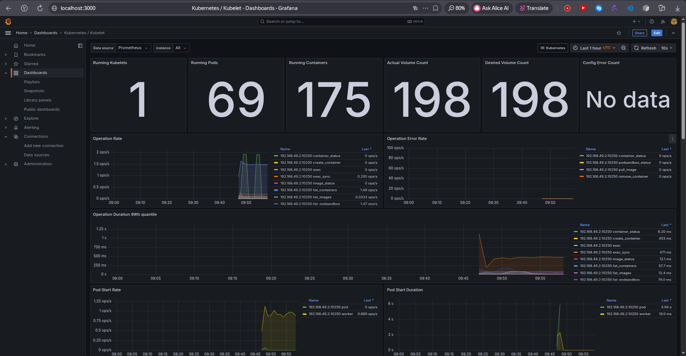
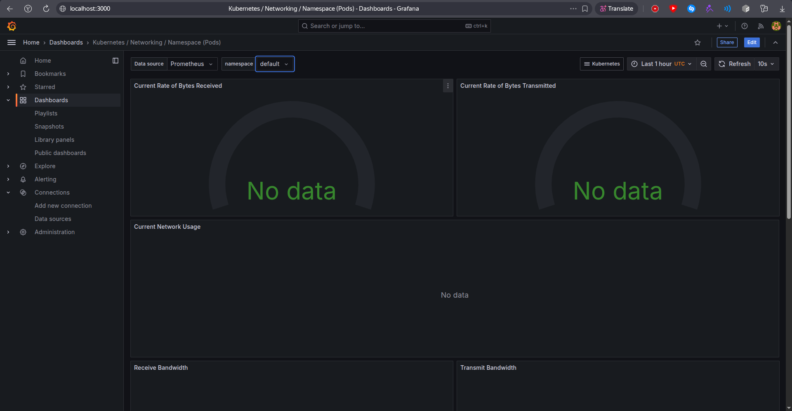
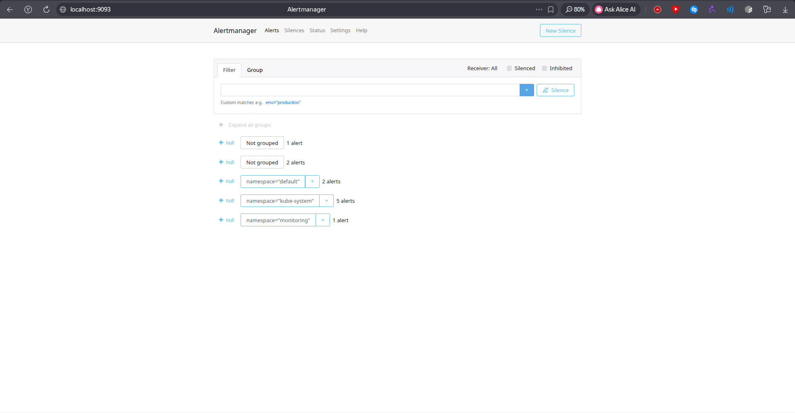
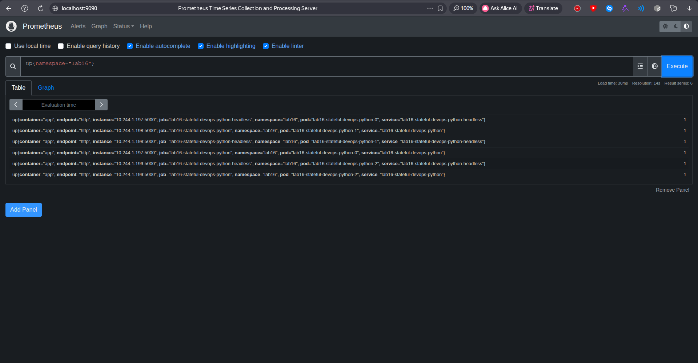

# Lab 16: Kubernetes Monitoring & Init Containers

## 1. Kube-Prometheus Stack

### Components

The monitoring stack was installed with `kube-prometheus-stack`.

- Prometheus Operator manages Prometheus, Alertmanager, ServiceMonitor, and related CRDs.
- Prometheus stores time series, scrapes Kubernetes and application metrics, and evaluates alert rules.
- Alertmanager receives firing alerts from Prometheus and groups, silences, or routes them.
- Grafana provides dashboards over Prometheus data.
- kube-state-metrics exposes Kubernetes object state, such as pods, deployments, StatefulSets, and PVCs.
- node-exporter exposes node-level CPU, memory, filesystem, and network metrics.

### Installation

The chart repository was already configured and then updated.

```bash
s3rap1s in ~/devops/DevOps-Core-Course on lab16 λ helm repo add prometheus-community https://prometheus-community.github.io/helm-charts
"prometheus-community" already exists with the same configuration, skipping
```

```bash
s3rap1s in ~/devops/DevOps-Core-Course on lab16 λ helm repo update prometheus-community
...Successfully got an update from the "prometheus-community" chart repository
Update Complete. ⎈Happy Helming!⎈
```

The admission webhook certificate generator image was loaded into Minikube before installation. This kept admission webhooks enabled while avoiding image pull timeouts from `registry.k8s.io`.

```bash
s3rap1s in ~/devops/DevOps-Core-Course on lab16 λ docker pull registry.k8s.io/ingress-nginx/kube-webhook-certgen:v20221220-controller-v1.5.1-58-g787ea74b6
Status: Downloaded newer image for registry.k8s.io/ingress-nginx/kube-webhook-certgen:v20221220-controller-v1.5.1-58-g787ea74b6
```

```bash
s3rap1s in ~/devops/DevOps-Core-Course on lab16 λ minikube image load registry.k8s.io/ingress-nginx/kube-webhook-certgen:v20221220-controller-v1.5.1-58-g787ea74b6
```

Monitoring stack values are stored in `k8s/monitoring-values.yaml`. Admission webhooks and operator TLS are enabled, while operator probe timeouts are increased for local Minikube stability.

```yaml
prometheusOperator:
  admissionWebhooks:
    enabled: true
  tls:
    enabled: true
  livenessProbe:
    timeoutSeconds: 5
  readinessProbe:
    timeoutSeconds: 5
```

The stack was installed with Helm.

```bash
s3rap1s in ~/devops/DevOps-Core-Course on lab16 λ helm upgrade --install monitoring prometheus-community/kube-prometheus-stack --version 65.8.1 --namespace monitoring --create-namespace -f k8s/monitoring-values.yaml --timeout 15m
Release "monitoring" does not exist. Installing it now.
NAME: monitoring
LAST DEPLOYED: Fri May  1 12:45:35 2026
NAMESPACE: monitoring
STATUS: deployed
REVISION: 1
DESCRIPTION: Install complete
```

All monitoring pods are running and ready.

```bash
s3rap1s in ~/devops/DevOps-Core-Course on lab16 λ kubectl get po,svc -n monitoring
NAME                                                         READY   STATUS    RESTARTS   AGE
pod/alertmanager-monitoring-kube-prometheus-alertmanager-0   2/2     Running   0          21m
pod/monitoring-grafana-69db76f9b4-lc6s2                      3/3     Running   0          22m
pod/monitoring-kube-prometheus-operator-f78b8654c-fkk4r      1/1     Running   0          22m
pod/monitoring-kube-state-metrics-75c9d8f7c7-xv8ch           1/1     Running   0          22m
pod/monitoring-prometheus-node-exporter-rxxgt                1/1     Running   0          22m
pod/prometheus-monitoring-kube-prometheus-prometheus-0       2/2     Running   0          21m

NAME                                              TYPE        CLUSTER-IP       EXTERNAL-IP   PORT(S)                      AGE
service/alertmanager-operated                     ClusterIP   None             <none>        9093/TCP,9094/TCP,9094/UDP   21m
service/monitoring-grafana                        ClusterIP   10.106.115.37    <none>        80/TCP                       22m
service/monitoring-kube-prometheus-alertmanager   ClusterIP   10.111.243.193   <none>        9093/TCP,8080/TCP            22m
service/monitoring-kube-prometheus-operator       ClusterIP   10.103.187.7     <none>        443/TCP                      22m
service/monitoring-kube-prometheus-prometheus     ClusterIP   10.107.8.88      <none>        9090/TCP,8080/TCP            22m
service/monitoring-kube-state-metrics             ClusterIP   10.98.158.78     <none>        8080/TCP                     22m
service/monitoring-prometheus-node-exporter       ClusterIP   10.100.141.3     <none>        9100/TCP                     22m
service/prometheus-operated                       ClusterIP   None             <none>        9090/TCP                     21m
```

UI access was opened with port forwarding.

```bash
kubectl port-forward svc/monitoring-grafana -n monitoring 3000:80
kubectl port-forward svc/monitoring-kube-prometheus-prometheus -n monitoring 9090:9090
kubectl port-forward svc/monitoring-kube-prometheus-alertmanager -n monitoring 9093:9093
```

The endpoints returned `HTTP/1.1 200 OK`.


## 2. Dashboard Answers

### 1. Pod Resources

Dashboard: `Kubernetes / Compute Resources / Pod`

StatefulSet namespace: `lab16`

Observed pod CPU usage:

```text
lab16-stateful-devops-python-0   0.00172 cores
lab16-stateful-devops-python-1   0.00186 cores
lab16-stateful-devops-python-2   0.00240 cores
```

Observed pod memory working set:

```text
lab16-stateful-devops-python-0   30.79 MB
lab16-stateful-devops-python-1   30.63 MB
lab16-stateful-devops-python-2   30.60 MB
```



### 2. Default Namespace Pod CPU

Dashboard: `Kubernetes / Compute Resources / Namespace (Pods)`

Namespace: `default`

Top CPU users:

```text
vault-0                                          0.02895 cores
vault-agent-injector-848dd747d7-lvs5l           0.00347 cores
lab10-release-devops-python-79cc745644-vldzr    0.00282 cores
lab10-release-devops-python-79cc745644-ccjqv    0.00277 cores
lab10-release-devops-python-79cc745644-9r8qw    0.00254 cores
```

Lowest non-zero CPU users:

```text
bonus-go-devops-go-6487688d6b-cb96v    0.00024 cores
devops-go-845d5f465d-fl9ml             0.00027 cores
devops-go-845d5f465d-xtkjg             0.00029 cores
devops-go-845d5f465d-2zkv8             0.00034 cores
bonus-go-devops-go-6487688d6b-4rjzd    0.00034 cores
```



### 3. Node Metrics

Dashboard: `Node Exporter / Nodes`

Node: `minikube`

Observed values:

```text
CPU cores:      12
CPU usage:      18.55%
Memory usage:   58.04%
Memory used:    9106.50 MB
```



### 4. Kubelet

Dashboard: `Kubernetes / Kubelet`

Observed kubelet values:

```text
Running pods:                 69
Running containers:           73
Exited containers tracked:    99
Unknown containers tracked:   2
Created containers tracked:   1
```



### 5. Network

Dashboard: `Kubernetes / Networking / Namespace (Pods)`

Namespace: `default`

The pod-level networking dashboard showed `No data`. Prometheus confirmed that `container_network_*` metrics are not present in this Minikube setup:

```bash
s3rap1s in ~/devops/DevOps-Core-Course on lab16 λ curl -sG http://127.0.0.1:9090/api/v1/query --data-urlencode 'query=count({__name__=~"container_network_.*"})'
{"status":"success","data":{"resultType":"vector","result":[]}}
```

Node-level network metrics are available from node-exporter:

```text
receive bridge   19706.09 B/s
receive eth0      2315.17 B/s
receive lo       64375.03 B/s
transmit bridge  51536.03 B/s
transmit eth0     1151.88 B/s
transmit lo      64375.03 B/s
```



### 6. Alerts

Alertmanager UI: `http://localhost:9093`

Prometheus reported 11 firing alerts during the check.

```text
Watchdog
etcdInsufficientMembers
TargetDown
TargetDown
etcdMembersDown
TargetDown
KubeControllerManagerDown
KubeSchedulerDown
KubePodNotReady
KubeDeploymentReplicasMismatch
NodeMemoryMajorPagesFaults
```




## 3. Init Containers

The Helm chart now supports optional init containers through `initContainers` values.

`k8s/devops-python/values-monitoring.yaml` enables two patterns:

- `wait-for-service`: waits until Grafana service is resolvable
- `init-download`: downloads the Grafana login page into a shared `emptyDir`

```yaml
initContainers:
  enabled: true
  sharedMountPath: /init-data
  waitForService:
    enabled: true
    image: busybox:1.36.1
    host: monitoring-grafana.monitoring.svc.cluster.local
  download:
    enabled: true
    image: busybox:1.36.1
    url: http://monitoring-grafana.monitoring.svc/login
    outputFile: grafana-login.html
```

The Lab 16 app release was installed into `lab16`.

```bash
s3rap1s in ~/devops/DevOps-Core-Course on lab16 λ kubectl create namespace lab16
namespace/lab16 created
```

```bash
s3rap1s in ~/devops/DevOps-Core-Course on lab16 λ helm upgrade --install lab16-stateful k8s/devops-python -n lab16 -f k8s/devops-python/values-monitoring.yaml --timeout 10m
Release "lab16-stateful" does not exist. Installing it now.
NAME: lab16-stateful
LAST DEPLOYED: Fri May  1 12:46:57 2026
NAMESPACE: lab16
STATUS: deployed
REVISION: 1
DESCRIPTION: Install complete
TEST SUITE: None
```

The StatefulSet became ready.

```bash
s3rap1s in ~/devops/DevOps-Core-Course on lab16 λ kubectl rollout status statefulset/lab16-stateful-devops-python -n lab16 --timeout=300s
statefulset rolling update complete 3 pods at revision lab16-stateful-devops-python-65c996cf79...
```

Resource verification:

```bash
s3rap1s in ~/devops/DevOps-Core-Course on lab16 λ kubectl get po,sts,svc,pvc,servicemonitor -n lab16 -l app.kubernetes.io/instance=lab16-stateful
NAME                                 READY   STATUS    RESTARTS   AGE
pod/lab16-stateful-devops-python-0   1/1     Running   0          50s
pod/lab16-stateful-devops-python-1   1/1     Running   0          38s
pod/lab16-stateful-devops-python-2   1/1     Running   0          27s

NAME                                            READY   AGE
statefulset.apps/lab16-stateful-devops-python   3/3     50s

NAME                                            TYPE        CLUSTER-IP     EXTERNAL-IP   PORT(S)        AGE
service/lab16-stateful-devops-python            NodePort    10.102.214.1   <none>        80:32160/TCP   50s
service/lab16-stateful-devops-python-headless   ClusterIP   None           <none>        80/TCP         50s

NAME                                                               STATUS   VOLUME                                     CAPACITY   ACCESS MODES   STORAGECLASS   VOLUMEATTRIBUTESCLASS   AGE
persistentvolumeclaim/data-volume-lab16-stateful-devops-python-0   Bound    pvc-f02d11b8-2082-4052-a24d-c3537db0a67e   100Mi      RWO            standard       <unset>                 50s
persistentvolumeclaim/data-volume-lab16-stateful-devops-python-1   Bound    pvc-be6365d6-c2c6-489f-a3f5-8c75e8ecc3f1   100Mi      RWO            standard       <unset>                 38s
persistentvolumeclaim/data-volume-lab16-stateful-devops-python-2   Bound    pvc-7fb951c1-f645-415a-9b38-96b011d6c618   100Mi      RWO            standard       <unset>                 27s

NAME                                                                AGE
servicemonitor.monitoring.coreos.com/lab16-stateful-devops-python   50s
```

The wait init container resolved the dependency service:

```bash
s3rap1s in ~/devops/DevOps-Core-Course on lab16 λ kubectl logs lab16-stateful-devops-python-0 -n lab16 -c wait-for-service
Server:		10.96.0.10
Address:	10.96.0.10:53

Name:	monitoring-grafana.monitoring.svc.cluster.local
Address: 10.106.115.37
```

The download init container saved a file into the shared volume:

```bash
s3rap1s in ~/devops/DevOps-Core-Course on lab16 λ kubectl logs lab16-stateful-devops-python-0 -n lab16 -c init-download
Connecting to monitoring-grafana.monitoring.svc (10.106.115.37:80)
saving to '/init-data/grafana-login.html'
grafana-login.html   100% |********************************| 44874  0:00:00 ETA
'/init-data/grafana-login.html' saved
```

The main container can read the downloaded file:

```bash
s3rap1s in ~/devops/DevOps-Core-Course on lab16 λ kubectl exec lab16-stateful-devops-python-0 -n lab16 -- sh -c 'ls -l /init-data/grafana-login.html && head -n 3 /init-data/grafana-login.html'
Defaulted container "app" out of: app, volume-permissions (init), wait-for-service (init), init-download (init)
-rw-r--r-- 1 root root 44874 May  1 09:47 /init-data/grafana-login.html
<!DOCTYPE html>
<html lang="en-US">
  <head>
```


## 4. Custom Metrics Bonus

The Python application already exposes `/metrics` using the Prometheus client library.

The Helm chart now renders a `ServiceMonitor` when `.Values.serviceMonitor.enabled` is true.

```yaml
serviceMonitor:
  enabled: true
  labels:
    release: monitoring
  interval: 15s
  scrapeTimeout: 10s
  path: /metrics
```

Rendered ServiceMonitor:

```yaml
apiVersion: monitoring.coreos.com/v1
kind: ServiceMonitor
metadata:
  labels:
    release: monitoring
  name: lab16-stateful-devops-python
  namespace: lab16
spec:
  endpoints:
    - interval: 15s
      path: /metrics
      port: http
      scrapeTimeout: 10s
  selector:
    matchLabels:
      app.kubernetes.io/instance: lab16-stateful
      app.kubernetes.io/name: devops-python
```

Prometheus target check:

```bash
s3rap1s in ~/devops/DevOps-Core-Course on lab16 λ curl -sG http://127.0.0.1:9090/api/v1/query --data-urlencode 'query=up{namespace="lab16"}'
lab16-stateful-devops-python-headless   lab16-stateful-devops-python-0   1
lab16-stateful-devops-python            lab16-stateful-devops-python-1   1
lab16-stateful-devops-python-headless   lab16-stateful-devops-python-1   1
lab16-stateful-devops-python            lab16-stateful-devops-python-0   1
lab16-stateful-devops-python-headless   lab16-stateful-devops-python-2   1
lab16-stateful-devops-python            lab16-stateful-devops-python-2   1
```

Custom application metric:

```bash
s3rap1s in ~/devops/DevOps-Core-Course on lab16 λ curl -sG http://127.0.0.1:9090/api/v1/query --data-urlencode 'query=sum(devops_info_endpoint_calls_total{namespace="lab16"}) by (pod, endpoint)'
lab16-stateful-devops-python-0   http   1386
lab16-stateful-devops-python-1   http   1378
lab16-stateful-devops-python-2   http   1371
```


