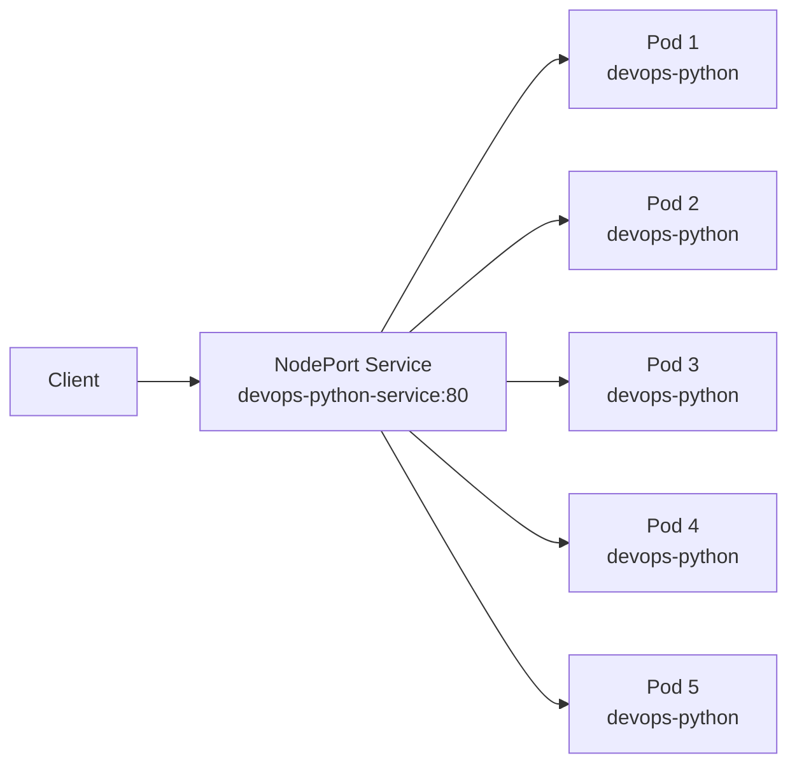

# Lab 9 - Kubernetes Fundamentals

## 1. Architecture Overview


### Networking Flow

- The client sends traffic to the `minikube` node IP and the assigned `NodePort`.
- The `devops-python-service` forwards traffic to pods with label `app=devops-python`.
- Each pod exposes the Flask application on container port `5000`.
- Health and metrics endpoints are available as `/health` and `/metrics`.

### Resource Allocation Strategy

Each application pod is configured with:

- CPU request: `100m`
- CPU limit: `200m`
- Memory request: `128Mi`
- Memory limit: `256Mi`

This keeps scheduling predictable and prevents one pod from consuming excessive node resources.

## 2. Cluster Setup

I used `minikube` because it is simple to start locally and is well suited for testing Deployments, Services, NodePort access, scaling, and rolling updates.

### `kubectl cluster-info`

```bash
s3rap1s in ~/devops/DevOps-Core-Course on lab09 λ kubectl cluster-info
Kubernetes control plane is running at https://192.168.49.2:8443
CoreDNS is running at https://192.168.49.2:8443/api/v1/namespaces/kube-system/services/kube-dns:dns/proxy

To further debug and diagnose cluster problems, use 'kubectl cluster-info dump'.
```

### `kubectl get nodes`

```bash
s3rap1s in ~/devops/DevOps-Core-Course on lab09 λ kubectl get nodes
NAME       STATUS   ROLES           AGE    VERSION
minikube   Ready    control-plane   101s   v1.35.1
```


## 3. Manifest Files

### `k8s/deployment.yml`

This manifest defines the `Deployment` for `devops-python`.

Key choices:

- `replicas`: started with 3 replicas, later scaled to 5 for Task 4
- `strategy.type: RollingUpdate`
- `maxSurge: 1`
- `maxUnavailable: 0`
- `livenessProbe` and `readinessProbe` using `/health`
- resource requests and limits for CPU and memory
- image: `s3rap1s/devops-info-service:latest`

Justification:

- 3 replicas satisfy the minimum Task 2 requirement.
- 5 replicas were used later to demonstrate scaling.
- `maxUnavailable: 0` helps preserve availability during updates.
- `/health` is the simplest reliable probe endpoint already implemented by the app.
- resource requests and limits reflect a small web service running in a local cluster.

### `k8s/service.yml`

Key choices:

- `type: NodePort`
- selector: `app: devops-python`
- service port: `80`
- target port: `5000`

Justification:

- `NodePort` is appropriate for local cluster testing.
- the selector matches the `Deployment` labels exactly
- the service exposes a simple HTTP entry point while forwarding to the Flask container port

## 4. Deployment 
### 4.1 Deploy the main application

The Deployment was created from `k8s/deployment.yml` with 3 initial replicas.

```bash
s3rap1s in ~/devops/DevOps-Core-Course on lab09 λ kubectl get deployments
NAME            READY   UP-TO-DATE   AVAILABLE   AGE
devops-python   0/3     3            0           9s
```

```bash
s3rap1s in ~/devops/DevOps-Core-Course on lab09 λ kubectl get pods
NAME                            READY   STATUS              RESTARTS   AGE
devops-python-9db5545cf-tfqwh   0/1     ContainerCreating   0          13s
devops-python-9db5545cf-vvvm2   0/1     ContainerCreating   0          13s
devops-python-9db5545cf-whgxm   0/1     ContainerCreating   0          13s
```

### 4.2 Expose the application with a NodePort Service

The Service was created from `k8s/service.yml` and exposed the app through a stable node port.

```bash
s3rap1s in ~/devops/DevOps-Core-Course on lab09 λ kubectl get services
NAME                    TYPE        CLUSTER-IP      EXTERNAL-IP   PORT(S)        AGE
devops-python-service   NodePort    10.104.34.133   <none>        80:30243/TCP   6s
kubernetes              ClusterIP   10.96.0.1       <none>        443/TCP        8m2s
```

### 4.3 Verify the application through the Service

The application was then accessed through the Minikube node IP and the assigned `NodePort`.

```bash
s3rap1s in ~/devops/DevOps-Core-Course on lab09 λ curl http://192.168.49.2:30243/health 
{"status":"healthy","timestamp":"2026-03-25T09:19:27.861595+00:00","uptime_seconds":218}
```

```bash
s3rap1s in ~/devops/DevOps-Core-Course on lab09 λ curl http://192.168.49.2:30243/metrics
# HELP python_gc_objects_collected_total Objects collected during gc
# TYPE python_gc_objects_collected_total counter
python_gc_objects_collected_total{generation="0"} 286.0
python_gc_objects_collected_total{generation="1"} 70.0
python_gc_objects_collected_total{generation="2"} 0.0
...
```


### 4.4 Re-apply the Deployment and confirm running pods

```bash
s3rap1s in ~/devops/DevOps-Core-Course on lab09 λ kubectl apply -f k8s/deployment.yml 
deployment.apps/devops-python configured
```

```bash
s3rap1s in ~/devops/DevOps-Core-Course on lab09 λ kubectl get pods
NAME                            READY   STATUS    RESTARTS   AGE
devops-python-9db5545cf-csh4w   1/1     Running   0          24s
devops-python-9db5545cf-f4f28   1/1     Running   0          24s
devops-python-9db5545cf-tfqwh   1/1     Running   0          6m5s
devops-python-9db5545cf-vvvm2   1/1     Running   0          6m5s
devops-python-9db5545cf-whgxm   1/1     Running   0          6m5s
```

### 4.5 Scale the Deployment to 5 replicas and inspect the resources

After scaling, the cluster showed five running pods for the Deployment.

```bash
s3rap1s in ~/devops/DevOps-Core-Course on lab09 λ kubectl get pods
NAME                                READY   STATUS    RESTARTS   AGE     IP            NODE       NOMINATED NODE   READINESS GATES
pod/devops-python-9db5545cf-f6jl5   1/1     Running   0          6m59s   10.244.0.16   minikube   <none>           <none>
pod/devops-python-9db5545cf-jwj65   1/1     Running   0          7m9s    10.244.0.15   minikube   <none>           <none>
pod/devops-python-9db5545cf-lm8tn   1/1     Running   0          7m31s   10.244.0.13   minikube   <none>           <none>
pod/devops-python-9db5545cf-q2n6w   1/1     Running   0          7m20s   10.244.0.14   minikube   <none>           <none>
pod/devops-python-9db5545cf-s9vnc   1/1     Running   0          6m50s   10.244.0.17   minikube   <none>           <none>
s3rap1s in ~/devops/DevOps-Core-Course on lab09 λ kubectl get services
NAME                            TYPE        CLUSTER-IP      EXTERNAL-IP   PORT(S)        AGE   SELECTOR
service/devops-python-service   NodePort    10.104.34.133   <none>        80:30243/TCP   35m   app=devops-python
service/kubernetes              ClusterIP   10.96.0.1       <none>        443/TCP        43m   <none>
```

The Deployment description confirmed the rolling strategy, probes, resource limits, and the final replica count:

```bash
Name:                   devops-python
Namespace:              default
CreationTimestamp:      Wed, 25 Mar 2026 12:15:17 +0300
Labels:                 app=devops-python
Annotations:            deployment.kubernetes.io/revision: 3
Selector:               app=devops-python
Replicas:               5 desired | 5 updated | 5 total | 5 available | 0 unavailable
StrategyType:           RollingUpdate
MinReadySeconds:        0
RollingUpdateStrategy:  0 max unavailable, 1 max surge
Pod Template:
  Labels:  app=devops-python
  Containers:
   app:
    Image:      s3rap1s/devops-info-service:latest
    Port:       5000/TCP
    Host Port:  0/TCP
    Limits:
      cpu:     200m
      memory:  256Mi
    Requests:
      cpu:      100m
      memory:   128Mi
    Liveness:   http-get http://:5000/health delay=15s timeout=1s period=10s #success=1 #failure=3
    Readiness:  http-get http://:5000/health delay=5s timeout=1s period=5s #success=1 #failure=3
    Environment:
      PORT:        5000
      HOST:        0.0.0.0
    Mounts:        <none>
  Volumes:         <none>
  Node-Selectors:  <none>
  Tolerations:     <none>
Conditions:
  Type           Status  Reason
  ----           ------  ------
  Available      True    MinimumReplicasAvailable
  Progressing    True    NewReplicaSetAvailable
OldReplicaSets:  devops-python-8cc7694d6 (0/0 replicas created)
NewReplicaSet:   devops-python-9db5545cf (5/5 replicas created)
Events:
  Type    Reason             Age                 From                   Message
  ----    ------             ----                ----                   -------
  Normal  ScalingReplicaSet  50m                 deployment-controller  Scaled up replica set devops-python-9db5545cf from 0 to 3
  Normal  ScalingReplicaSet  44m                 deployment-controller  Scaled up replica set devops-python-9db5545cf from 3 to 5
  Normal  ScalingReplicaSet  32m                 deployment-controller  Scaled up replica set devops-python-8cc7694d6 from 0 to 1
  Normal  ScalingReplicaSet  32m                 deployment-controller  Scaled down replica set devops-python-9db5545cf from 5 to 4
  Normal  ScalingReplicaSet  32m                 deployment-controller  Scaled up replica set devops-python-8cc7694d6 from 1 to 2
  Normal  ScalingReplicaSet  31m                 deployment-controller  Scaled down replica set devops-python-9db5545cf from 4 to 3
  Normal  ScalingReplicaSet  31m                 deployment-controller  Scaled up replica set devops-python-8cc7694d6 from 2 to 3
  Normal  ScalingReplicaSet  31m                 deployment-controller  Scaled down replica set devops-python-9db5545cf from 3 to 2
  Normal  ScalingReplicaSet  31m                 deployment-controller  Scaled up replica set devops-python-8cc7694d6 from 3 to 4
  Normal  ScalingReplicaSet  31m                 deployment-controller  Scaled down replica set devops-python-9db5545cf from 2 to 1
  Normal  ScalingReplicaSet  31m                 deployment-controller  Scaled up replica set devops-python-8cc7694d6 from 4 to 5
  Normal  ScalingReplicaSet  19m (x11 over 31m)  deployment-controller  (combined from similar events): Scaled down replica set devops-python-8cc7694d6 from 1 to 0
```

Full resource state:

```bash
s3rap1s in ~/devops/DevOps-Core-Course on lab09 ● λ kubectl get all
NAME                                READY   STATUS    RESTARTS   AGE
pod/devops-python-9db5545cf-f6jl5   1/1     Running   0          101s
pod/devops-python-9db5545cf-jwj65   1/1     Running   0          111s
pod/devops-python-9db5545cf-lm8tn   1/1     Running   0          2m13s
pod/devops-python-9db5545cf-q2n6w   1/1     Running   0          2m2s
pod/devops-python-9db5545cf-s9vnc   1/1     Running   0          92s

NAME                            TYPE        CLUSTER-IP      EXTERNAL-IP   PORT(S)        AGE
service/devops-python-service   NodePort    10.104.34.133   <none>        80:30243/TCP   29m
service/kubernetes              ClusterIP   10.96.0.1       <none>        443/TCP        37m

NAME                            READY   UP-TO-DATE   AVAILABLE   AGE
deployment.apps/devops-python   5/5     5            5           31m

NAME                                      DESIRED   CURRENT   READY   AGE
replicaset.apps/devops-python-8cc7694d6   0         0         0       14m
replicaset.apps/devops-python-9db5545cf   5         5         5       31m
```

### 4.6 Perform a rolling update

To initiate a rolling update, the image tag in `deployment.yml` was changed from `s3rap1s/devops-info-service:latest` to `s3rap1s/devops-info-service:v2` and the manifest was reapplied.

```bash
s3rap1s in ~/devops/DevOps-Core-Course on lab09 ● λ kubectl apply -f k8s/deployment.yml
deployment.apps/devops-python configured
s3rap1s in ~/devops/DevOps-Core-Course on lab09 ● λ kubectl describe deployment devops-python | grep Image
Image:      s3rap1s/devops-info-service:v2
```

Kubernetes then rolled out the update gradually:

```bash
s3rap1s in ~/devops/DevOps-Core-Course on lab09 ● λ kubectl rollout status deployment devops-python
Waiting for deployment "devops-python" rollout to finish: 1 out of 5 new replicas have been updated...
Waiting for deployment "devops-python" rollout to finish: 1 out of 5 new replicas have been updated...
Waiting for deployment "devops-python" rollout to finish: 1 out of 5 new replicas have been updated...
Waiting for deployment "devops-python" rollout to finish: 2 out of 5 new replicas have been updated...
Waiting for deployment "devops-python" rollout to finish: 2 out of 5 new replicas have been updated...
Waiting for deployment "devops-python" rollout to finish: 2 out of 5 new replicas have been updated...
Waiting for deployment "devops-python" rollout to finish: 3 out of 5 new replicas have been updated...
Waiting for deployment "devops-python" rollout to finish: 3 out of 5 new replicas have been updated...
Waiting for deployment "devops-python" rollout to finish: 3 out of 5 new replicas have been updated...
Waiting for deployment "devops-python" rollout to finish: 4 out of 5 new replicas have been updated...
Waiting for deployment "devops-python" rollout to finish: 4 out of 5 new replicas have been updated...
Waiting for deployment "devops-python" rollout to finish: 4 out of 5 new replicas have been updated...
Waiting for deployment "devops-python" rollout to finish: 4 out of 5 new replicas have been updated...
Waiting for deployment "devops-python" rollout to finish: 1 old replicas are pending termination...
Waiting for deployment "devops-python" rollout to finish: 1 old replicas are pending termination...
Waiting for deployment "devops-python" rollout to finish: 1 old replicas are pending termination...
deployment "devops-python" successfully rolled out
```

During replacement, old and new pods coexisted:

```bash
s3rap1s in ~/devops/DevOps-Core-Course on lab09 ● λ kubectl get pods
NAME                            READY   STATUS        RESTARTS   AGE
devops-python-8cc7694d6-2dwc2   1/1     Terminating   0          12m
devops-python-8cc7694d6-7545c   1/1     Terminating   0          12m
devops-python-8cc7694d6-hsn2j   1/1     Terminating   0          12m
devops-python-9db5545cf-f6jl5   1/1     Running       0          30s
devops-python-9db5545cf-jwj65   1/1     Running       0          40s
devops-python-9db5545cf-lm8tn   1/1     Running       0          62s
devops-python-9db5545cf-q2n6w   1/1     Running       0          51s
devops-python-9db5545cf-s9vnc   1/1     Running       0          21s
```


### 4.7 Demonstrate rollback capability

The rollout history showed multiple revisions:

```bash
s3rap1s in ~/devops/DevOps-Core-Course on lab09 ● λ kubectl rollout history deployment devops-python
deployment.apps/devops-python 
REVISION  CHANGE-CAUSE
1         <none>
2         <none>
```

The rollback was then executed:

```bash
s3rap1s in ~/devops/DevOps-Core-Course on lab09 ● λ kubectl rollout undo deployment devops-python
deployment.apps/devops-python rolled back
```

Rollback progress:

```bash
s3rap1s in ~/devops/DevOps-Core-Course on lab09 ● λ kubectl rollout status deployment devops-python
Waiting for deployment "devops-python" rollout to finish: 1 out of 5 new replicas have been updated...
Waiting for deployment "devops-python" rollout to finish: 1 out of 5 new replicas have been updated...
Waiting for deployment "devops-python" rollout to finish: 1 out of 5 new replicas have been updated...
Waiting for deployment "devops-python" rollout to finish: 2 out of 5 new replicas have been updated...
Waiting for deployment "devops-python" rollout to finish: 2 out of 5 new replicas have been updated...
Waiting for deployment "devops-python" rollout to finish: 2 out of 5 new replicas have been updated...
Waiting for deployment "devops-python" rollout to finish: 3 out of 5 new replicas have been updated...
Waiting for deployment "devops-python" rollout to finish: 3 out of 5 new replicas have been updated...
Waiting for deployment "devops-python" rollout to finish: 3 out of 5 new replicas have been updated...
Waiting for deployment "devops-python" rollout to finish: 4 out of 5 new replicas have been updated...
Waiting for deployment "devops-python" rollout to finish: 4 out of 5 new replicas have been updated...
Waiting for deployment "devops-python" rollout to finish: 4 out of 5 new replicas have been updated...
Waiting for deployment "devops-python" rollout to finish: 4 out of 5 new replicas have been updated...
Waiting for deployment "devops-python" rollout to finish: 1 old replicas are pending termination...
Waiting for deployment "devops-python" rollout to finish: 1 old replicas are pending termination...
deployment "devops-python" successfully rolled out
```

History after rollback:

```bash
s3rap1s in ~/devops/DevOps-Core-Course on lab09 ● λ kubectl rollout history deployment devops-python
deployment.apps/devops-python 
REVISION  CHANGE-CAUSE
1         <none>
2         <none>
```

This confirms that rollback capability was not only available but actually demonstrated in practice.

## 5. Production Considerations

### Health Checks

The Deployment uses:

- `readinessProbe` on `/health` - readiness ensures traffic is sent only to healthy pods
- `livenessProbe` on `/health` - liveness allows Kubernetes to restart unhealthy containers automatically

### Resource Limits

Configured values:

- requests: `100m CPU`, `128Mi memory` - requests help the scheduler place pods reliably
- limits: `200m CPU`, `256Mi memory` - limits prevent resource starvation on the node


### How This Could Be Improved for Production

- use immutable image tags instead of `latest`
- add a proper `startupProbe`
- set `imagePullPolicy` explicitly
- use Horizontal Pod Autoscaler
- use separate namespaces for environments

### Monitoring and Observability Strategy

For production, this deployment should be integrated with:

- Prometheus for metrics scraping
- Grafana for dashboards
- Loki/Promtail for centralized logs
- alerts for pod restarts, high latency, and failed readiness checks

The application already exposes `/metrics`, which makes future Kubernetes monitoring integration straightforward.

## 6. Challenges & Solutions

### Challenge 1: Verifying Rolling Update Behavior

This was debugged with:

- `kubectl rollout status deployment devops-python`
- `kubectl get pods`
- `kubectl describe deployment devops-python`

The rollout status output and Deployment events showed that Kubernetes created new pods gradually and terminated old ones only after the new pods became available.

## 7. Bonus Task: Ingress with TLS

The bonus implementation uses the existing Python application as `app1` and the Go application as `app2`.

### Bonus Manifests

- `k8s/go-deployment.yml` - Deployment for the Go application
- `k8s/go-service.yml` - Service for the Go application
- `k8s/ingress.yml` - Ingress with path-based routing and TLS

### Routing Design

- `/app1` -> `devops-python-service`
- `/app2` -> `devops-go-service`

Both applications serve content on `/`, so the Ingress uses NGINX rewrite annotations to strip `/app1` and `/app2` before forwarding the request upstream.

#### 7.1 Build and push the Go image

The second application for `/app2` is the Go version of the service, so its image was built and pushed to Docker Hub first.

#### 7.2 Enable the Ingress controller

The `ingress` addon was enabled in Minikube and the controller pods were verified in the `ingress-nginx` namespace.

```bash
s3rap1s in ~/devops/DevOps-Core-Course on lab09 ● λ minikube addons enable ingress
💡  ingress is an addon maintained by Kubernetes. For any concerns contact minikube on GitHub.
You can view the list of minikube maintainers at: https://github.com/kubernetes/minikube/blob/master/OWNERS
    ▪ Using image registry.k8s.io/ingress-nginx/kube-webhook-certgen:v1.6.7
    ▪ Using image registry.k8s.io/ingress-nginx/kube-webhook-certgen:v1.6.7
    ▪ Using image registry.k8s.io/ingress-nginx/controller:v1.14.3
🔎  Verifying ingress addon...
🌟  The 'ingress' addon is enabled
```

```bash
s3rap1s in ~/devops/DevOps-Core-Course on lab09 ● λ kubectl get pods -n ingress-nginx
NAME                                        READY   STATUS      RESTARTS   AGE
ingress-nginx-admission-create-p5mdg        0/1     Completed   0          2m56s
ingress-nginx-admission-patch-cl588         0/1     Completed   0          2m56s
ingress-nginx-controller-596f8778bc-8k48m   1/1     Running     0          2m56s
```

#### 7.3 Generate a self-signed certificate and create the TLS secret

The certificate and private key were generated locally with `openssl`, then the Kubernetes TLS secret was created from those files.

```bash
openssl req -x509 -nodes -days 365 -newkey rsa:2048 \
  -keyout tls.key -out tls.crt \
  -subj "/CN=local.example.com/O=local.example.com"
```

```bash
s3rap1s in ~/devops/DevOps-Core-Course on lab09 ● λ kubectl create secret tls tls-secret --key tls.key --cert tls.crt
secret/tls-secret created
```

```bash
s3rap1s in ~/devops/DevOps-Core-Course on lab09 ● λ kubectl get secret tls-secret
NAME         TYPE                DATA   AGE
tls-secret   kubernetes.io/tls   2      9s
```

#### 7.4 Deploy the second application and its service

The Go-based application was deployed as a separate `Deployment` and exposed internally through a `ClusterIP` service.

```bash
s3rap1s in ~/devops/DevOps-Core-Course on lab09 ● λ kubectl apply -f k8s/go-deployment.yml
deployment.apps/devops-go created
```

```bash
s3rap1s in ~/devops/DevOps-Core-Course on lab09 ● λ kubectl apply -f k8s/go-service.yml
service/devops-go-service created
```

```bash
s3rap1s in ~/devops/DevOps-Core-Course on lab09 ● λ kubectl get deployments
NAME            READY   UP-TO-DATE   AVAILABLE   AGE
devops-go       3/3     3            3           82s
devops-python   5/5     5            5           82m
```

```bash
s3rap1s in ~/devops/DevOps-Core-Course on lab09 ● λ kubectl get pods
NAME                            READY   STATUS    RESTARTS   AGE
devops-go-845d5f465d-2zkv8      1/1     Running   0          94s
devops-go-845d5f465d-fl9ml      1/1     Running   0          94s
devops-go-845d5f465d-xtkjg      1/1     Running   0          94s
devops-python-9db5545cf-f6jl5   1/1     Running   0          52m
devops-python-9db5545cf-jwj65   1/1     Running   0          52m
devops-python-9db5545cf-lm8tn   1/1     Running   0          53m
devops-python-9db5545cf-q2n6w   1/1     Running   0          52m
devops-python-9db5545cf-s9vnc   1/1     Running   0          52m
```

```bash
s3rap1s in ~/devops/DevOps-Core-Course on lab09 ● λ kubectl get services
NAME                    TYPE        CLUSTER-IP      EXTERNAL-IP   PORT(S)        AGE
devops-go-service       ClusterIP   10.102.215.65   <none>        80/TCP         34s
devops-python-service   NodePort    10.104.34.133   <none>        80:30243/TCP   80m
kubernetes              ClusterIP   10.96.0.1       <none>        443/TCP        88m
```

#### 7.5 Add the local hostname and apply the Ingress

The local hostname was mapped to the Minikube IP and the Ingress resource was applied.

```bash
s3rap1s in ~/devops/DevOps-Core-Course on lab09 ● λ echo "$(minikube ip) local.example.com" | sudo tee -a /etc/hosts
192.168.49.2 local.example.com
```

```bash
s3rap1s in ~/devops/DevOps-Core-Course on lab09 ● λ kubectl apply -f k8s/ingress.yml
ingress.networking.k8s.io/devops-apps-ingress created
```

```bash
s3rap1s in ~/devops/DevOps-Core-Course on lab09 ● λ kubectl get ingress
NAME                  CLASS   HOSTS               ADDRESS   PORTS     AGE
devops-apps-ingress   nginx   local.example.com             80, 443   11s
```

```bash
s3rap1s in ~/devops/DevOps-Core-Course on lab09 ● λ kubectl describe ingress devops-apps-ingress
Name:             devops-apps-ingress
Labels:           <none>
Namespace:        default
Address:          
Ingress Class:    nginx
Default backend:  <default>
TLS:
  tls-secret terminates local.example.com
Rules:
  Host               Path  Backends
  ----               ----  --------
  local.example.com  
                     /app1(/|$)(.*)   devops-python-service:80 (10.244.0.13:5000,10.244.0.14:5000,10.244.0.15:5000 + 2 more...)
                     /app2(/|$)(.*)   devops-go-service:80 (10.244.0.21:5000,10.244.0.22:5000,10.244.0.23:5000)
Annotations:         nginx.ingress.kubernetes.io/rewrite-target: /$2
                     nginx.ingress.kubernetes.io/use-regex: true
Events:
  Type    Reason  Age   From                      Message
  ----    ------  ----  ----                      -------
  Normal  Sync    20s   nginx-ingress-controller  Scheduled for sync
```

#### 7.6 Verify HTTP redirect and HTTPS routing

The initial HTTP requests were redirected to HTTPS by the Ingress controller, which is expected when TLS is configured.

```bash
s3rap1s in ~/devops/DevOps-Core-Course on lab09 ● λ curl http://local.example.com/app1
<html>
<head><title>308 Permanent Redirect</title></head>
<body>
<center><h1>308 Permanent Redirect</h1></center>
<hr><center>nginx</center>
</body>
</html>
```

```bash
s3rap1s in ~/devops/DevOps-Core-Course on lab09 ● λ curl http://local.example.com/app2
<html>
<head><title>308 Permanent Redirect</title></head>
<body>
<center><h1>308 Permanent Redirect</h1></center>
<hr><center>nginx</center>
</body>
</html>
```

HTTPS request to `/app1` reached the Python service:

```bash
s3rap1s in ~/devops/DevOps-Core-Course on lab09 ● λ curl -k https://local.example.com/app1
{"endpoints":[{"description":"Service information","method":"GET","path":"/"},{"description":"Health check","method":"GET","path":"/health"},{"description":"Prometheus metrics","method":"GET","path":"/metrics"}],"request":{"client_ip":"10.244.0.20","method":"GET","path":"/","user_agent":"curl/8.18.0"},"runtime":{"current_time":"2026-03-25T10:39:48.528453+00:00","timezone":"UTC","uptime_human":"0 hours, 54 minutes","uptime_seconds":3271},"service":{"description":"DevOps course info service","framework":"Flask","name":"devops-info-service","version":"1.0.0"},"system":{"architecture":"x86_64","cpu_count":12,"hostname":"devops-python-9db5545cf-f6jl5","platform":"Linux","platform_version":"6.18.9-arch1-2","python_version":"3.13.12"}}
```

HTTPS request to `/app2` reached the Go service:

```bash
s3rap1s in ~/devops/DevOps-Core-Course on lab09 ● λ curl -k https://local.example.com/app2
{"service":{"name":"devops-info-service","version":"1.0.0","description":"DevOps course info service","framework":"Go"},"system":{"hostname":"devops-go-845d5f465d-fl9ml","platform":"linux","platform_version":"Linux Kernel","architecture":"amd64","cpu_count":12,"go_version":"go1.21.13"},"runtime":{"uptime_seconds":220,"uptime_human":"0 hours, 3 minutes","current_time":"2026-03-25T10:39:53Z","timezone":"UTC"},"request":{"client_ip":"10.244.0.20:44866","user_agent":"curl/8.18.0","method":"GET","path":"/"},"endpoints":[{"path":"/","method":"GET","description":"Service information"},{"path":"/health","method":"GET","description":"Health check"}]}
```

#### 7.7 Resource state

The final state confirms that both applications, the Ingress resource, and the TLS secret exist and are operational.

```bash
s3rap1s in ~/devops/DevOps-Core-Course on lab09 ● λ kubectl get all
NAME                                READY   STATUS    RESTARTS   AGE
pod/devops-go-845d5f465d-2zkv8      1/1     Running   0          3m59s
pod/devops-go-845d5f465d-fl9ml      1/1     Running   0          3m59s
pod/devops-go-845d5f465d-xtkjg      1/1     Running   0          3m59s
pod/devops-python-9db5545cf-f6jl5   1/1     Running   0          54m
pod/devops-python-9db5545cf-jwj65   1/1     Running   0          55m
pod/devops-python-9db5545cf-lm8tn   1/1     Running   0          55m
pod/devops-python-9db5545cf-q2n6w   1/1     Running   0          55m
pod/devops-python-9db5545cf-s9vnc   1/1     Running   0          54m

NAME                            TYPE        CLUSTER-IP      EXTERNAL-IP   PORT(S)        AGE
service/devops-go-service       ClusterIP   10.102.215.65   <none>        80/TCP         2m46s
service/devops-python-service   NodePort    10.104.34.133   <none>        80:30243/TCP   83m
service/kubernetes              ClusterIP   10.96.0.1       <none>        443/TCP        91m

NAME                            READY   UP-TO-DATE   AVAILABLE   AGE
deployment.apps/devops-go       3/3     3            3           3m59s
deployment.apps/devops-python   5/5     5            5           84m

NAME                                      DESIRED   CURRENT   READY   AGE
replicaset.apps/devops-go-845d5f465d      3         3         3       3m59s
replicaset.apps/devops-python-8cc7694d6   0         0         0       67m
replicaset.apps/devops-python-9db5545cf   5         5         5       84m
```

```bash
s3rap1s in ~/devops/DevOps-Core-Course on lab09 ● λ kubectl get ingress
NAME                  CLASS   HOSTS               ADDRESS        PORTS     AGE
devops-apps-ingress   nginx   local.example.com   192.168.49.2   80, 443   102s
```

```bash
s3rap1s in ~/devops/DevOps-Core-Course on lab09 ● λ kubectl get secret tls-secret
NAME         TYPE                DATA   AGE
tls-secret   kubernetes.io/tls   2      2m8s
```
