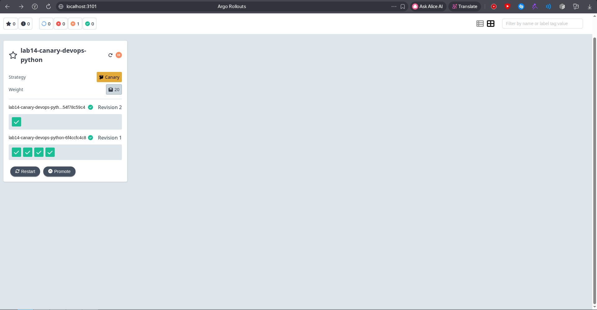
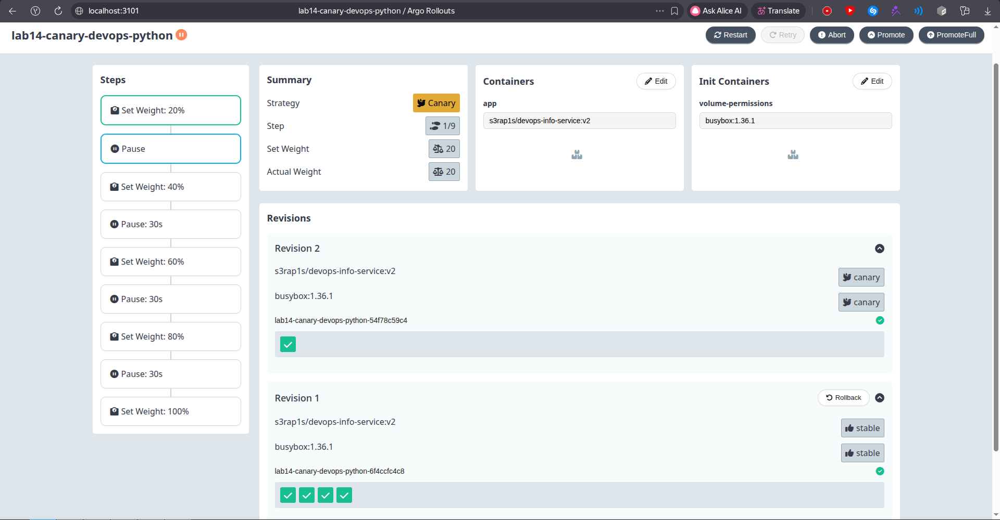
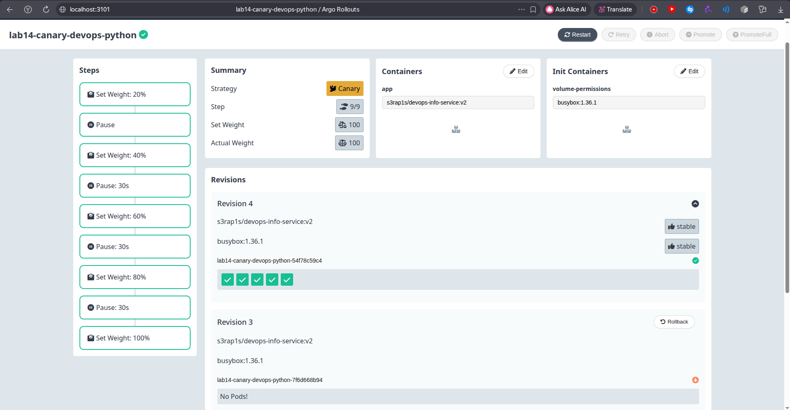
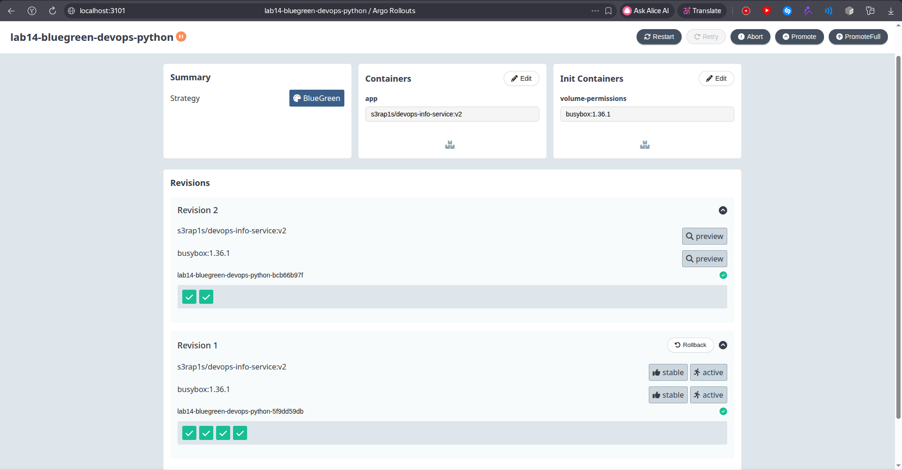
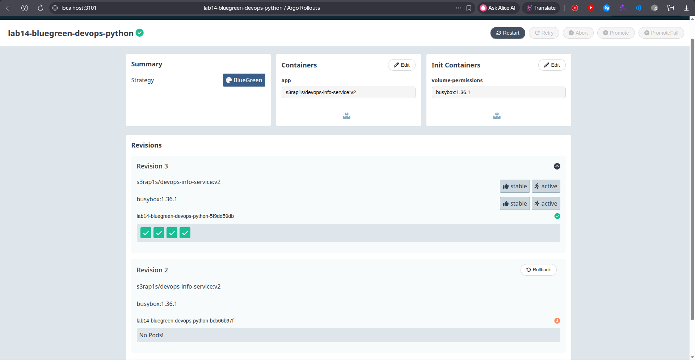

# Lab 14: Progressive Delivery with Argo Rollouts

## 1. Argo Rollouts Setup

### Installation Verification

Argo Rollouts controller and dashboard were installed into the `argo-rollouts` namespace.

```bash
s3rap1s in ~/devops/DevOps-Core-Course on lab14 λ kubectl get pods -n argo-rollouts -o wide
NAME                                      READY   STATUS    RESTARTS   AGE   IP            NODE       NOMINATED NODE   READINESS GATES
argo-rollouts-5f64f8d68-tkwj7             1/1     Running   0          24m   10.244.1.15   minikube   <none>           <none>
argo-rollouts-dashboard-b79c648c8-x4mql   1/1     Running   0          16m   10.244.1.22   minikube   <none>           <none>
```

The kubectl plugin was installed locally.

```bash
s3rap1s in ~/devops/DevOps-Core-Course on lab14 λ kubectl argo rollouts version
kubectl-argo-rollouts: v1.8.3+49fa151
  BuildDate: 2025-06-04T22:15:54Z
  GitCommit: 49fa1516cf71672b69e265267da4e1d16e1fe114
  GitTreeState: clean
  GoVersion: go1.23.9
  Compiler: gc
  Platform: linux/amd64
```

The dashboard was exposed locally with port forwarding:

```bash
kubectl port-forward svc/argo-rollouts-dashboard -n argo-rollouts 3101:3100
```

The UI is available at `http://localhost:3101/rollouts`.

### Rollout vs Deployment

The Helm chart now renders an Argo Rollouts `Rollout` instead of a Kubernetes `Deployment`.

Main differences:

- `apiVersion` changed from `apps/v1` to `argoproj.io/v1alpha1`
- `kind` changed from `Deployment` to `Rollout`
- the pod template, selector, probes, volumes, ConfigMaps, Secrets, and PVC usage stayed the same
- `spec.strategy` now supports `canary`, `blueGreen`, pauses, promotion, abort, and analysis steps


## 2. Canary Deployment

### Implementation

The deployment template was replaced with `k8s/devops-python/templates/rollout.yaml`. The default rollout strategy is canary and is configured in `k8s/devops-python/values.yaml`.

```yaml
rollout:
  strategy: canary
  canary:
    maxSurge: 25%
    maxUnavailable: 0
    steps:
      - setWeight: 20
      - pause: {}
      - setWeight: 40
      - pause:
          duration: 30s
      - setWeight: 60
      - pause:
          duration: 30s
      - setWeight: 80
      - pause:
          duration: 30s
      - setWeight: 100
```

This matches the required flow:

- 20% canary traffic with manual promotion
- 40%, 60%, and 80% with 30 second pauses
- 100% after automatic progression

The canary test values are stored in:

- `k8s/devops-python/values-canary.yaml`
- `k8s/devops-python/values-canary-update.yaml`

### Rollout Test

Initial canary release:

```bash
s3rap1s in ~/devops/DevOps-Core-Course on lab14 λ helm upgrade --install lab14-canary k8s/devops-python -n lab14 -f k8s/devops-python/values-canary.yaml --timeout 10m
Release "lab14-canary" does not exist. Installing it now.
NAME: lab14-canary
LAST DEPLOYED: Sat Apr 25 15:29:26 2026
NAMESPACE: lab14
STATUS: deployed
REVISION: 1
DESCRIPTION: Install complete
TEST SUITE: None
```

Config update that triggered a rollout:

```bash
s3rap1s in ~/devops/DevOps-Core-Course on lab14 λ helm upgrade lab14-canary k8s/devops-python -n lab14 -f k8s/devops-python/values-canary-update.yaml --timeout 10m
Release "lab14-canary" has been upgraded. Happy Helming!
NAME: lab14-canary
LAST DEPLOYED: Sat Apr 25 15:29:48 2026
NAMESPACE: lab14
STATUS: deployed
REVISION: 2
DESCRIPTION: Upgrade complete
TEST SUITE: None
```

The rollout paused at the first manual step with 20% canary traffic.

```text
Status:          Paused
Message:         CanaryPauseStep
Step:            1/9
SetWeight:       20
ActualWeight:    20
```

Manual promotion was executed with:

```bash
s3rap1s in ~/devops/DevOps-Core-Course on lab14 λ kubectl argo rollouts promote lab14-canary-devops-python -n lab14
rollout 'lab14-canary-devops-python' promoted
```

After promotion, the rollout progressed through the timed pauses and finished healthy.

```bash
s3rap1s in ~/devops/DevOps-Core-Course on lab14 λ kubectl argo rollouts get rollout lab14-canary-devops-python -n lab14
Name:            lab14-canary-devops-python
Namespace:       lab14
Status:          ✔ Healthy
Strategy:        Canary
  Step:          9/9
  SetWeight:     100
  ActualWeight:  100
Images:          s3rap1s/devops-info-service:v2 (stable)
Replicas:
  Desired:       5
  Current:       5
  Updated:       5
  Ready:         5
  Available:     5
```

### Abort Test

A new config update was started and then aborted during the rollout.

```bash
s3rap1s in ~/devops/DevOps-Core-Course on lab14 λ kubectl argo rollouts abort lab14-canary-devops-python -n lab14
rollout 'lab14-canary-devops-python' aborted
```

The aborted revision was scaled down and traffic returned to the stable ReplicaSet.

```text
Status:          Degraded
Message:         RolloutAborted: Rollout aborted update to revision 3
Step:            0/9
SetWeight:       0
ActualWeight:    0
revision 3:      ScaledDown
revision 2:      stable
```

The release was restored with Helm rollback:

```bash
s3rap1s in ~/devops/DevOps-Core-Course on lab14 λ helm rollback lab14-canary 2 -n lab14 --timeout 10m
Rollback was a success! Happy Helming!
```

### Dashboard Evidence

Canary rollout overview:



Canary rollout details during progression:



Canary rollout details after progression:




## 3. Blue-Green Deployment

### Implementation

Blue-green deployment is configured through separate values files:

- `k8s/devops-python/values-bluegreen.yaml`
- `k8s/devops-python/values-bluegreen-update.yaml`

The strategy uses an active service for current traffic and a preview service for the new version.

```yaml
rollout:
  strategy: blueGreen
  blueGreen:
    autoPromotionEnabled: false
    autoPromotionSeconds: null
    scaleDownDelaySeconds: 30
    previewReplicaCount: 2
    previewService:
      type: NodePort
      port: 80
      targetPort: 5000
      nodePort: 32091
```

Services:

- active: `lab14-bluegreen-devops-python`, NodePort `32090`
- preview: `lab14-bluegreen-devops-python-preview`, NodePort `32091`

For blue-green releases, Helm does not manage service selectors. Argo Rollouts owns those selectors and switches them between ReplicaSets during promotion and rollback.

### Blue-Green Flow

Initial active version:

```bash
s3rap1s in ~/devops/DevOps-Core-Course on lab14 λ helm upgrade --install lab14-bluegreen k8s/devops-python -n lab14 -f k8s/devops-python/values-bluegreen.yaml --timeout 10m
Release "lab14-bluegreen" does not exist. Installing it now.
NAME: lab14-bluegreen
LAST DEPLOYED: Sat Apr 25 15:45:00 2026
NAMESPACE: lab14
STATUS: deployed
REVISION: 1
DESCRIPTION: Install complete
TEST SUITE: None
```

Preview version:

```bash
s3rap1s in ~/devops/DevOps-Core-Course on lab14 λ helm upgrade lab14-bluegreen k8s/devops-python -n lab14 -f k8s/devops-python/values-bluegreen-update.yaml --timeout 10m
Release "lab14-bluegreen" has been upgraded. Happy Helming!
NAME: lab14-bluegreen
LAST DEPLOYED: Sat Apr 25 15:46:03 2026
NAMESPACE: lab14
STATUS: deployed
REVISION: 3
DESCRIPTION: Upgrade complete
TEST SUITE: None
```

The updated version was held as preview because `autoPromotionEnabled: false`.

```text
Status:       Paused
Message:      BlueGreenPause
revision 2:   preview
revision 1:   stable, active
```

Before promotion, active and preview services pointed to different ReplicaSets:

```text
active service selector:  rollouts-pod-template-hash=5f9dd59db
preview service selector: rollouts-pod-template-hash=bcb66b97f
```

Promotion switched active traffic to the preview version.

```bash
s3rap1s in ~/devops/DevOps-Core-Course on lab14 λ kubectl argo rollouts promote lab14-bluegreen-devops-python -n lab14
rollout 'lab14-bluegreen-devops-python' promoted
```

After promotion, the active service selected the new ReplicaSet.

```text
active service selector:  rollouts-pod-template-hash=bcb66b97f
preview service selector: rollouts-pod-template-hash=bcb66b97f
```

Instant rollback was tested with:

```bash
s3rap1s in ~/devops/DevOps-Core-Course on lab14 λ kubectl argo rollouts undo lab14-bluegreen-devops-python -n lab14
rollout 'lab14-bluegreen-devops-python' undo
```

```bash
s3rap1s in ~/devops/DevOps-Core-Course on lab14 λ kubectl argo rollouts promote lab14-bluegreen-devops-python -n lab14
rollout 'lab14-bluegreen-devops-python' promoted
```

After rollback promotion, both services selected the previous ReplicaSet again.

```bash
s3rap1s in ~/devops/DevOps-Core-Course on lab14 λ kubectl get svc lab14-bluegreen-devops-python lab14-bluegreen-devops-python-preview -n lab14 -o wide
NAME                                    TYPE       CLUSTER-IP       EXTERNAL-IP   PORT(S)        AGE     SELECTOR
lab14-bluegreen-devops-python           NodePort   10.107.152.135   <none>        80:32090/TCP   8m29s   app.kubernetes.io/instance=lab14-bluegreen,app.kubernetes.io/name=devops-python,rollouts-pod-template-hash=5f9dd59db
lab14-bluegreen-devops-python-preview   NodePort   10.104.130.232   <none>        80:32091/TCP   8m29s   app.kubernetes.io/instance=lab14-bluegreen,app.kubernetes.io/name=devops-python,rollouts-pod-template-hash=5f9dd59db
```

Current final state:

```bash
s3rap1s in ~/devops/DevOps-Core-Course on lab14 λ kubectl argo rollouts get rollout lab14-bluegreen-devops-python -n lab14
Name:            lab14-bluegreen-devops-python
Namespace:       lab14
Status:          ✔ Healthy
Strategy:        BlueGreen
Images:          s3rap1s/devops-info-service:v2 (stable, active)
Replicas:
  Desired:       4
  Current:       4
  Updated:       4
  Ready:         4
  Available:     4
```

### Dashboard Evidence

Blue-green rollout view:



Blue-green details after final switch:




## 4. Automated Analysis Bonus

### Implementation

`k8s/devops-python/templates/analysistemplate.yaml` renders an `AnalysisTemplate` when `.Values.rollout.analysis.enabled` is true.

The failing canary test is stored in `k8s/devops-python/values-canary-analysis-fail.yaml`.

```yaml
rollout:
  analysis:
    enabled: true
    interval: 10s
    count: 3
    failureLimit: 1
    path: /missing
  canary:
    steps:
      - setWeight: 20
      - analysis:
          templates:
            - templateName: lab14-canary-devops-python-success-rate
      - setWeight: 50
      - pause:
          duration: 30s
      - setWeight: 100
```

The final rendered analysis URL is namespace-qualified:

```yaml
url: http://lab14-canary-devops-python.lab14.svc/missing
jsonPath: "{$.status}"
successCondition: result == "healthy"
```

### Auto-Rollback Test

The failing analysis rollout was started with:

```bash
s3rap1s in ~/devops/DevOps-Core-Course on lab14 λ helm upgrade lab14-canary k8s/devops-python -n lab14 -f k8s/devops-python/values-canary-analysis-fail.yaml --timeout 10m
Release "lab14-canary" has been upgraded. Happy Helming!
NAME: lab14-canary
LAST DEPLOYED: Sat Apr 25 15:55:18 2026
NAMESPACE: lab14
STATUS: deployed
REVISION: 7
DESCRIPTION: Upgrade complete
TEST SUITE: None
```

The analysis run failed and caused Argo Rollouts to abort the canary automatically.

```bash
s3rap1s in ~/devops/DevOps-Core-Course on lab14 λ kubectl get analysisrun -n lab14
NAME                                      STATUS   AGE
lab14-canary-devops-python-f448b5d7-5-1   Error    3m22s
lab14-canary-devops-python-f448b5d7-7-1   Error    63s
```

The second analysis run used the final namespace-qualified service URL and failed because `/missing` returned 404.

```bash
s3rap1s in ~/devops/DevOps-Core-Course on lab14 λ kubectl describe analysisrun lab14-canary-devops-python-f448b5d7-7-1 -n lab14
URL:            http://lab14-canary-devops-python.lab14.svc/missing
Success Condition:  result == "healthy"
Message:        received non 2xx response code: 404
Phase:          Error
```

The rollout status reported an automatic abort:

```text
Degraded - RolloutAborted: Rollout aborted update to revision 7:
Step-based analysis phase error/failed: Metric "webcheck" assessed Error
```

This verifies behavior: a failed analysis step automatically aborts the canary and keeps the previous stable ReplicaSet serving traffic.

The canary release was restored with:

```bash
helm rollback lab14-canary 6 -n lab14 --timeout 10m
```

Final state after rollback:

```bash
s3rap1s in ~/devops/DevOps-Core-Course on lab14 λ kubectl argo rollouts get rollout lab14-canary-devops-python -n lab14
Name:            lab14-canary-devops-python
Namespace:       lab14
Status:          ✔ Healthy
Strategy:        Canary
  Step:          9/9
  SetWeight:     100
  ActualWeight:  100
Replicas:
  Desired:       5
  Current:       5
  Updated:       5
  Ready:         5
  Available:     5
```


## 5. Strategy Comparison

Canary is better when a release should be exposed gradually and monitored while traffic increases. 
It uses fewer extra resources than blue-green, but rollback is step-based and users may temporarily hit both versions.

Blue-green is better when the new version must be tested in isolation before a fast switch. 
Promotion and rollback are nearly instant because they switch service selectors, 
but the cluster needs enough capacity to run active and preview ReplicaSets at the same time.

Recommendation:

- use canary for user-facing changes where gradual exposure reduces risk
- use blue-green for releases that need a full preview environment and fast rollback
- use automated analysis with canary when there is a clear health or metrics signal that can safely decide promotion or abort


## 6. CLI Commands Reference

Useful commands from this lab:

```bash
kubectl get pods -n argo-rollouts -o wide
kubectl argo rollouts version
kubectl port-forward svc/argo-rollouts-dashboard -n argo-rollouts 3101:3100

helm upgrade --install lab14-canary k8s/devops-python -n lab14 -f k8s/devops-python/values-canary.yaml --timeout 10m
helm upgrade lab14-canary k8s/devops-python -n lab14 -f k8s/devops-python/values-canary-update.yaml --timeout 10m
kubectl argo rollouts get rollout lab14-canary-devops-python -n lab14
kubectl argo rollouts promote lab14-canary-devops-python -n lab14
kubectl argo rollouts abort lab14-canary-devops-python -n lab14

helm upgrade --install lab14-bluegreen k8s/devops-python -n lab14 -f k8s/devops-python/values-bluegreen.yaml --timeout 10m
helm upgrade lab14-bluegreen k8s/devops-python -n lab14 -f k8s/devops-python/values-bluegreen-update.yaml --timeout 10m
kubectl argo rollouts get rollout lab14-bluegreen-devops-python -n lab14
kubectl argo rollouts promote lab14-bluegreen-devops-python -n lab14
kubectl argo rollouts undo lab14-bluegreen-devops-python -n lab14

kubectl get svc -n lab14
kubectl get analysisrun -n lab14
kubectl describe analysisrun <name> -n lab14
helm rollback <release> <revision> -n lab14 --timeout 10m
```
