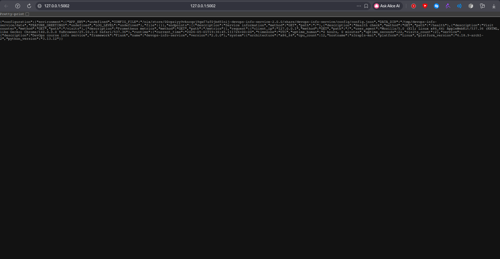
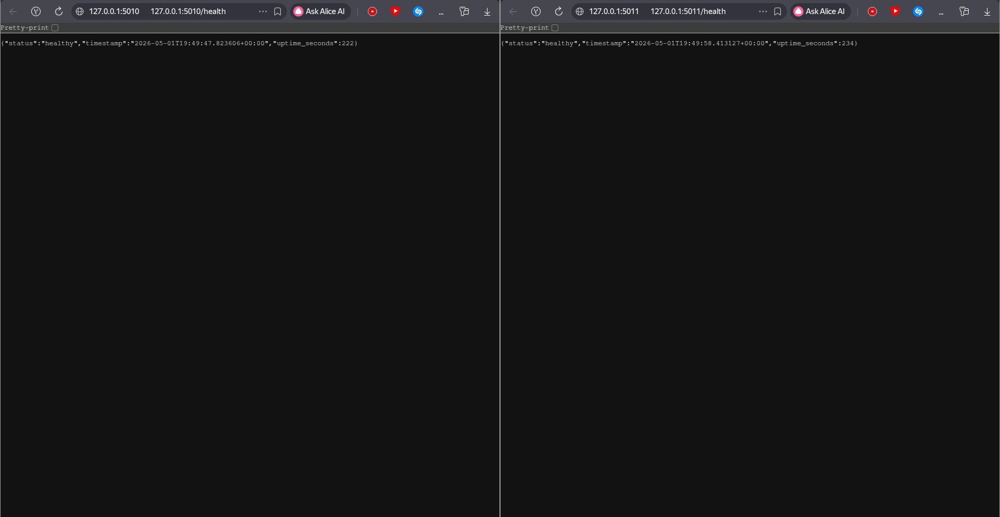

# Lab 18 - Reproducible Builds with Nix

## 1. Environment

Nix was installed with the Determinate Systems installer.

```bash
s3rap1s in ~/devops/DevOps-Core-Course on lab18 λ nix --version
nix (Determinate Nix 3.19.0) 2.34.6
```

Basic Nix execution was verified:

```bash
s3rap1s in ~/devops/DevOps-Core-Course on lab18 λ nix run nixpkgs#hello
Hello, world!
```

The Lab 1 Python application was copied into the required Lab 18 directory:

```text
labs/lab18/app_python/
├── app.py
├── requirements.txt
├── Dockerfile
├── default.nix
├── docker.nix
├── flake.nix
└── flake.lock
```

## 2. Nix Build for the Python App

The Nix derivation is stored in `labs/lab18/app_python/default.nix`.

Important fields:

| Field | Purpose |
| --- | --- |
| `pname` / `version` | Names the built package as `devops-info-service-2.0.0`. |
| `src = ./.` | Uses the copied Lab 1 app as the source input. |
| `format = "other"` | The app does not use `setup.py` or `pyproject.toml`. |
| `python313.withPackages` | Builds a fixed Python runtime with Flask, Prometheus, dotenv, requests, and JSON logging packages from nixpkgs. |
| `makeWrapper` | Creates `bin/devops-info-service`, so the app can run without relying on system Python. |
| `--set-default` env vars | Provides default runtime values while still allowing overrides such as `PORT=5002`. |

Key part of the derivation:

```nix
let
  python = pkgs.python313.withPackages (ps: with ps; [
    flask
    prometheus-client
    python-dotenv
    python-json-logger
    requests
  ]);
in
pkgs.python313Packages.buildPythonApplication {
  pname = "devops-info-service";
  version = "2.0.0";
  src = ./.;
  format = "other";
  dontBuild = true;
  doCheck = false;
  nativeBuildInputs = [ pkgs.makeWrapper ];
}
```

```bash
s3rap1s in ~/devops/DevOps-Core-Course/labs/lab18/app_python on lab18 λ nix build --print-out-paths
/nix/store/3wgpmaydm9bxq98g4sykwxybbz54fy42-devops-info-service-2.0.0
```

The wrapped executable uses Python from the Nix store:

```text
exec "/nix/store/qag75plci0xx1sfi6g9n8425brd8iizw-python3-3.13.12-env/bin/python" \
  /nix/store/3wgpmaydm9bxq98g4sykwxybbz54fy42-devops-info-service-2.0.0/share/devops-info-service/app.py
```

### Reproducibility Check

Two normal builds produced the same store path and output hash:

```bash
s3rap1s in ~/devops/DevOps-Core-Course/labs/lab18/app_python on lab18 λ rm -f result
s3rap1s in ~/devops/DevOps-Core-Course/labs/lab18/app_python on lab18 λ nix build --print-out-paths
/nix/store/3wgpmaydm9bxq98g4sykwxybbz54fy42-devops-info-service-2.0.0
s3rap1s in ~/devops/DevOps-Core-Course/labs/lab18/app_python on lab18 λ readlink result
/nix/store/3wgpmaydm9bxq98g4sykwxybbz54fy42-devops-info-service-2.0.0
s3rap1s in ~/devops/DevOps-Core-Course/labs/lab18/app_python on lab18 λ nix-hash --type sha256 result
1ab05436a298c01b861516049a798b4fc48559b8f3337727bcd153f949d5fce0

s3rap1s in ~/devops/DevOps-Core-Course/labs/lab18/app_python on lab18 λ rm -f result
s3rap1s in ~/devops/DevOps-Core-Course/labs/lab18/app_python on lab18 λ nix build --print-out-paths
/nix/store/3wgpmaydm9bxq98g4sykwxybbz54fy42-devops-info-service-2.0.0
s3rap1s in ~/devops/DevOps-Core-Course/labs/lab18/app_python on lab18 λ readlink result
/nix/store/3wgpmaydm9bxq98g4sykwxybbz54fy42-devops-info-service-2.0.0
s3rap1s in ~/devops/DevOps-Core-Course/labs/lab18/app_python on lab18 λ nix-hash --type sha256 result
1ab05436a298c01b861516049a798b4fc48559b8f3337727bcd153f949d5fce0
```

Then the output path was deleted from the Nix store and rebuilt:

```bash
s3rap1s in ~/devops/DevOps-Core-Course/labs/lab18/app_python on lab18 λ STORE_PATH=$(readlink result)
s3rap1s in ~/devops/DevOps-Core-Course/labs/lab18/app_python on lab18 λ rm -f result
s3rap1s in ~/devops/DevOps-Core-Course/labs/lab18/app_python on lab18 λ nix-store --delete "$STORE_PATH"
deleting '/nix/store/3wgpmaydm9bxq98g4sykwxybbz54fy42-devops-info-service-2.0.0'
1 store paths deleted, 10.7 KiB freed
s3rap1s in ~/devops/DevOps-Core-Course/labs/lab18/app_python on lab18 λ nix build --print-out-paths
/nix/store/3wgpmaydm9bxq98g4sykwxybbz54fy42-devops-info-service-2.0.0
s3rap1s in ~/devops/DevOps-Core-Course/labs/lab18/app_python on lab18 λ readlink result
/nix/store/3wgpmaydm9bxq98g4sykwxybbz54fy42-devops-info-service-2.0.0
s3rap1s in ~/devops/DevOps-Core-Course/labs/lab18/app_python on lab18 λ nix-hash --type sha256 result
1ab05436a298c01b861516049a798b4fc48559b8f3337727bcd153f949d5fce0
```

The same output path and hash returned after a real rebuild. This proves the build output is reproducible for the same locked inputs.

### Running the Nix-Built App

The app was started from the Nix output:

```bash
s3rap1s in ~/devops/DevOps-Core-Course/labs/lab18/app_python on lab18 λ PORT=5002 ./result/bin/devops-info-service
```

Health check:

```bash
s3rap1s in ~/devops/DevOps-Core-Course on lab18 λ curl -s http://127.0.0.1:5002/health
{"status":"healthy","timestamp":"2026-05-01T19:36:30.897663+00:00","uptime_seconds":8}
```

Screenshot:



### Store Path Format

```text
/nix/store/3wgpmaydm9bxq98g4sykwxybbz54fy42-devops-info-service-2.0.0
```

| Part | Meaning |
| --- | --- |
| `/nix/store` | Immutable Nix store location. |
| `3wgpmaydm9bxq98g4sykwxybbz54fy42` | Hash derived from all build inputs and instructions. |
| `devops-info-service` | Package name from `pname`. |
| `2.0.0` | Package version from the derivation. |

Same inputs produce the same hash prefix and store path. If source code, dependencies, build instructions, or nixpkgs revision change, the store path changes.

## 3. Lab 1 `pip` vs Nix

The Lab 1 workflow was:

```bash
s3rap1s in ~/devops/DevOps-Core-Course/app_python on lab01 λ python -m venv venv
s3rap1s in ~/devops/DevOps-Core-Course/app_python on lab01 λ source venv/bin/activate
s3rap1s in ~/devops/DevOps-Core-Course/app_python on lab01 λ pip install -r requirements.txt
s3rap1s in ~/devops/DevOps-Core-Course/app_python on lab01 λ python app.py
```

The current `requirements.txt` pins direct dependencies such as `Flask==3.1.0`, `pytest==8.1.1`, and `requests==2.31.0`, but not the full dependency closure. During the Dockerfile build, `pip` resolved transitive dependencies at build time:

```text
Werkzeug-3.1.8
Jinja2-3.1.6
click-8.3.3
certifi-2026.4.22
coverage-7.13.5
urllib3-2.6.3
```

That means future builds can change when PyPI packages or available wheels change, even if the direct requirement lines stay the same. Nix instead uses packages from the pinned `nixpkgs` revision in `flake.lock`.

| Aspect | Lab 1: pip + venv | Lab 18: Nix |
| --- | --- | --- |
| Python version | Depends on local system or base image | Pinned by nixpkgs: Python 3.13.12 |
| Dependency source | PyPI at install time | Pinned nixpkgs revision |
| Transitive dependencies | Resolved by pip during install | Locked in the Nix closure |
| Build output | No stable store path | Stable `/nix/store/...` path |
| Rebuild behavior | Can drift over time | Same inputs produce same output |

Reflection: Nix would have helped in Lab 1 by making the development and runtime environment explicit from the start. The app would not depend on whichever Python, pip, or transitive packages were available on the machine at install time.

## 4. Reproducible Docker Image with Nix

The Docker image expression is stored in `labs/lab18/app_python/docker.nix`.

Important fields:

| Field | Purpose |
| --- | --- |
| `app = import ./default.nix` | Reuses the reproducible Python derivation. |
| `buildLayeredImage` | Builds an OCI/Docker image from Nix store paths. |
| `contents = [ app pkgs.dockerTools.caCertificates ]` | Includes the app closure and CA certificates. |
| `config.Cmd` | Runs the Nix-built app inside the container. |
| `created = "1970-01-01T00:00:01Z"` | Uses a fixed timestamp to avoid timestamp-based image drift. |

```bash
s3rap1s in ~/devops/DevOps-Core-Course/labs/lab18/app_python on lab18 λ nix build .#dockerImage --print-out-paths
/nix/store/5imlckywy44nlw0nrg776rcb4h7s96is-devops-info-service-nix.tar.gz
s3rap1s in ~/devops/DevOps-Core-Course/labs/lab18/app_python on lab18 λ sha256sum result
546860039d0ea982f9a444563f5b99bc48baba68e2355387e43c278a18508566  result
```

Two builds produced the same tarball path and SHA256:

```bash
s3rap1s in ~/devops/DevOps-Core-Course/labs/lab18/app_python on lab18 λ rm -f result
s3rap1s in ~/devops/DevOps-Core-Course/labs/lab18/app_python on lab18 λ nix build .#dockerImage --print-out-paths
/nix/store/5imlckywy44nlw0nrg776rcb4h7s96is-devops-info-service-nix.tar.gz
s3rap1s in ~/devops/DevOps-Core-Course/labs/lab18/app_python on lab18 λ sha256sum result
546860039d0ea982f9a444563f5b99bc48baba68e2355387e43c278a18508566  result

s3rap1s in ~/devops/DevOps-Core-Course/labs/lab18/app_python on lab18 λ rm -f result
s3rap1s in ~/devops/DevOps-Core-Course/labs/lab18/app_python on lab18 λ nix build .#dockerImage --print-out-paths
/nix/store/5imlckywy44nlw0nrg776rcb4h7s96is-devops-info-service-nix.tar.gz
s3rap1s in ~/devops/DevOps-Core-Course/labs/lab18/app_python on lab18 λ sha256sum result
546860039d0ea982f9a444563f5b99bc48baba68e2355387e43c278a18508566  result
```

The image was loaded into Docker:

```bash
s3rap1s in ~/devops/DevOps-Core-Course/labs/lab18/app_python on lab18 λ docker load --input result
Loaded image: devops-info-service-nix:2.0.0
```

Image metadata:

```bash
s3rap1s in ~/devops/DevOps-Core-Course on lab18 λ docker image inspect devops-info-service-nix:2.0.0 --format '{{.Id}} {{.Created}} {{.Size}}'
sha256:b6b2d13f01387b396db25ab5b182e96781ca8400fb553e93ba16a8c547a37e4a 1970-01-01T00:00:01Z 203835247
```

The fixed `Created` timestamp confirms that `dockerTools` did not inject the current build time into the image metadata.

## 5. Lab 2 Dockerfile Comparison

The Lab 2 Dockerfile uses a traditional flow:

```dockerfile
FROM python:3.13-slim AS builder
RUN apt-get update && apt-get install -y --no-install-recommends gcc
RUN pip install --no-cache-dir --upgrade pip && \
    pip install --no-cache-dir -r requirements.txt
FROM python:3.13-slim
COPY --from=builder /opt/venv /opt/venv
COPY . .
CMD ["python", "app.py"]
```

The base image was pulled by tag:

```bash
s3rap1s in ~/devops/DevOps-Core-Course on lab18 λ docker pull python:3.13-slim
3.13-slim: Pulling from library/python
Digest: sha256:a0779d7c12fc20be6ec6b4ddc901a4fd7657b8a6bc9def9d3fde89ed5efe0a3d
Status: Downloaded newer image for python:3.13-slim
docker.io/library/python:3.13-slim
```

Two no-cache Dockerfile builds produced different image IDs, timestamps, sizes, and exported tarball hashes:

```bash
s3rap1s in ~/devops/DevOps-Core-Course on lab18 λ docker build --no-cache -t lab2-app:test1 ./app_python
...
Successfully installed Flask-3.1.0 Jinja2-3.1.6 MarkupSafe-3.0.3 Werkzeug-3.1.8 blinker-1.9.0 certifi-2026.4.22 charset-normalizer-3.4.7 click-8.3.3 coverage-7.13.5 idna-3.13 iniconfig-2.3.0 itsdangerous-2.2.0 packaging-26.2 pluggy-1.6.0 prometheus-client-0.23.1 pytest-8.1.1 pytest-cov-5.0.0 python-dotenv-1.0.1 python-json-logger-2.0.7 requests-2.31.0 urllib3-2.6.3
...
exporting manifest list sha256:d604541d953d8a196acb78316280884313510f24652ed54e1e33f3212306797b

s3rap1s in ~/devops/DevOps-Core-Course on lab18 λ docker build --no-cache -t lab2-app:test2 ./app_python
...
Successfully installed Flask-3.1.0 Jinja2-3.1.6 MarkupSafe-3.0.3 Werkzeug-3.1.8 blinker-1.9.0 certifi-2026.4.22 charset-normalizer-3.4.7 click-8.3.3 coverage-7.13.5 idna-3.13 iniconfig-2.3.0 itsdangerous-2.2.0 packaging-26.2 pluggy-1.6.0 prometheus-client-0.23.1 pytest-8.1.1 pytest-cov-5.0.0 python-dotenv-1.0.1 python-json-logger-2.0.7 requests-2.31.0 urllib3-2.6.3
...
exporting manifest list sha256:300999c0553b87714d9af0d8f5b35de3b28f4d421d21d200d8548f3d92fe6ad9

s3rap1s in ~/devops/DevOps-Core-Course on lab18 λ docker image inspect lab2-app:test1 --format '{{.Id}} {{.Created}} {{.Size}}'
sha256:d604541d953d8a196acb78316280884313510f24652ed54e1e33f3212306797b 2026-05-01T23:03:22.603553241+03:00 51369316
s3rap1s in ~/devops/DevOps-Core-Course on lab18 λ docker save lab2-app:test1 | sha256sum
538ac87988e453a04d9835735385eae649febd761f7687c15dcbfba1de7d9ab4  -

s3rap1s in ~/devops/DevOps-Core-Course on lab18 λ docker image inspect lab2-app:test2 --format '{{.Id}} {{.Created}} {{.Size}}'
sha256:300999c0553b87714d9af0d8f5b35de3b28f4d421d21d200d8548f3d92fe6ad9 2026-05-01T23:06:00.049443662+03:00 51369700
s3rap1s in ~/devops/DevOps-Core-Course on lab18 λ docker save lab2-app:test2 | sha256sum
a51b1fe74d813ecba93c70b515bdbf763cb4c062ce4bff47eef72e7f10d14351  -
```

The Dockerfile builds also downloaded from Debian repositories and PyPI during the build. For example, pip resolved current transitive packages such as `Werkzeug-3.1.8` and `certifi-2026.4.22`.

### Side-by-Side Containers

The traditional and Nix-built images were run at the same time:

```bash
s3rap1s in ~/devops/DevOps-Core-Course on lab18 λ docker run -d -p 5010:5000 --name lab18-lab2-container devops-info-service:python
e66241307c55af64c3b5990bfc4289fc2790c3ad575f3f47b15e10fd53c15aa4
s3rap1s in ~/devops/DevOps-Core-Course on lab18 λ docker run -d -p 5011:5000 --name lab18-nix-container devops-info-service-nix:2.0.0
b1622117c320e5ddedb95ff9cc0bac32913622a13aaeab2ef9304c35dfea3734
```

Container status:

```bash
s3rap1s in ~/devops/DevOps-Core-Course on lab18 λ docker ps --format 'table {{.Names}}\t{{.Image}}\t{{.Ports}}' | grep lab18
lab18-lab2-container   devops-info-service:python      0.0.0.0:5010->5000/tcp
lab18-nix-container    devops-info-service-nix:2.0.0   0.0.0.0:5011->5000/tcp
```

Health checks:

```bash
s3rap1s in ~/devops/DevOps-Core-Course on lab18 λ curl -s http://127.0.0.1:5010/health
{"status":"healthy","timestamp":"2026-05-01T19:52:12.866892+00:00","uptime_seconds":367}
s3rap1s in ~/devops/DevOps-Core-Course on lab18 λ curl -s http://127.0.0.1:5011/health
{"status":"healthy","timestamp":"2026-05-01T19:52:12.943136+00:00","uptime_seconds":369}
```

Screenshot:



### Image Size and History

```bash
s3rap1s in ~/devops/DevOps-Core-Course on lab18 λ docker images --format 'table {{.Repository}}:{{.Tag}}\t{{.ID}}\t{{.Size}}' | grep -E 'devops-info-service:python|devops-info-service-nix:2.0.0'
devops-info-service:python     4b08b6e2f063   199MB
devops-info-service-nix:2.0.0  b6b2d13f0138   420MB
```

The Nix image is larger in this implementation because it carries the full Python/Nix closure as store paths. The benefit is stronger reproducibility, not smaller size.

Traditional image history contains relative build timestamps:

```bash
s3rap1s in ~/devops/DevOps-Core-Course on lab18 λ docker history --format 'table {{.CreatedSince}}\t{{.Size}}\t{{.Comment}}' devops-info-service:python | head -n 4
CREATED        SIZE      COMMENT
3 months ago   0B        buildkit.dockerfile.v0
3 months ago   0B        buildkit.dockerfile.v0
3 months ago   16.4kB    buildkit.dockerfile.v0
```

Nix image history is based on store path layers:
```bash
s3rap1s in ~/devops/DevOps-Core-Course on lab18 λ docker history --format 'table {{.CreatedSince}}\t{{.Size}}\t{{.Comment}}' devops-info-service-nix:2.0.0 | head -n 4
CREATED   SIZE      COMMENT
N/A       73.7kB    store paths: ['/nix/store/f60vdjrp...-customisation-layer']
N/A       57.3kB    store paths: ['/nix/store/3wgpmayd...-devops-info-service-2.0.0']
N/A       1.22MB    store paths: ['/nix/store/qag75plc...-python3-3.13.12-env']
```

| Metric | Lab 2 Dockerfile | Lab 18 Nix dockerTools |
| --- | --- | --- |
| Build input | Dockerfile, mutable tags, Debian repos, PyPI | Nix derivations and locked nixpkgs |
| Timestamp | Current build timestamp | Fixed `1970-01-01T00:00:01Z` |
| Rebuild hash | Different tar hashes | Identical tar hash |
| Runtime result | Healthy Flask app | Healthy Flask app |
| Image size in this lab | 199MB | 420MB |

Why Dockerfile builds are not bit-for-bit reproducible:

- `python:3.13-slim` is a tag and can point to different content over time.
- `apt-get update` uses current Debian repository state.
- `pip install` resolves transitive dependencies during the build.
- Build metadata includes current timestamps.
- Docker layer cache behavior depends on local daemon state.

Reflection: If Lab 2 were redone with Nix, I would build the app once as a Nix derivation, build the container from the same derivation with `dockerTools`, and push images by digest rather than relying only on mutable tags.

## 6. Flake Bonus

The project was converted to a Nix flake in `labs/lab18/app_python/flake.nix`.

Important parts:

```nix
inputs = {
  nixpkgs.url = "github:NixOS/nixpkgs/nixos-25.11";
};

outputs = { nixpkgs, ... }:
  let
    system = "x86_64-linux";
    pkgs = nixpkgs.legacyPackages.${system};
    app = import ./default.nix { inherit pkgs; };
    dockerImage = import ./docker.nix { inherit pkgs; };
  in {
    packages.${system}.default = app;
    packages.${system}.dockerImage = dockerImage;
    devShells.${system}.default = pkgs.mkShell {
      packages = [
        (pkgs.python313.withPackages (ps: with ps; [
          flask prometheus-client pytest pytest-cov python-dotenv python-json-logger requests
        ]))
      ];
    };
  };
```

`flake.lock` pins the exact nixpkgs revision:

```json
{
  "locked": {
    "lastModified": 1777428379,
    "narHash": "sha256-ypxFOeDz+CqADEQNL72haqGjvZQdBR5Vc7pyx2JDttI=",
    "owner": "NixOS",
    "repo": "nixpkgs",
    "rev": "755f5aa91337890c432639c60b6064bb7fe67769",
    "type": "github"
  }
}
```

Flake builds:

```bash
s3rap1s in ~/devops/DevOps-Core-Course/labs/lab18/app_python on lab18 λ nix build
s3rap1s in ~/devops/DevOps-Core-Course/labs/lab18/app_python on lab18 λ nix build .#dockerImage
```

Both commands completed successfully.

### Development Shell

```bash
s3rap1s in ~/devops/DevOps-Core-Course/labs/lab18/app_python on lab18 λ nix develop --command python --version
Python 3.13.12
s3rap1s in ~/devops/DevOps-Core-Course/labs/lab18/app_python on lab18 λ nix develop --command python -c 'import importlib.metadata as m; print(m.version("flask"))'
3.1.2

s3rap1s in ~/devops/DevOps-Core-Course/labs/lab18/app_python on lab18 λ nix develop --command pytest -q
..........                                                               [100%]
10 passed, 1 warning in 0.12s
```

The dev shell replaces the Lab 1 `venv` workflow with a locked environment. Entering the shell later gives the same Python and package set as long as `flake.lock` is unchanged.

## 7. Lab 10 Helm Values vs Nix Flakes

In Lab 10, Helm values pinned the deployment image tag:

```yaml
image:
  repository: s3rap1s/devops-info-service
  tag: "v2"
  pullPolicy: IfNotPresent
```

That is useful for Kubernetes deployment, but it does not prove how the image was built. A tag can be rebuilt and repushed, and Helm does not lock Python, Debian packages, compilers, or PyPI dependencies inside the image.

| Aspect | Helm values.yaml | Nix Flake |
| --- | --- | --- |
| Locks deployment configuration | Yes | Not its main purpose |
| Locks image build inputs | No | Yes |
| Locks Python version | Only indirectly through image | Yes |
| Locks transitive dependencies | No | Yes, through nixpkgs |
| Protects against tag mutation | Only if using image digest | Yes for the build output |
| Best use | Kubernetes deployment | Reproducible build and dev environment |

The strongest practical approach is to combine both:

1. Build the image with Nix.
2. Push it to a registry.
3. Deploy with Helm using an immutable image digest instead of a mutable tag.


