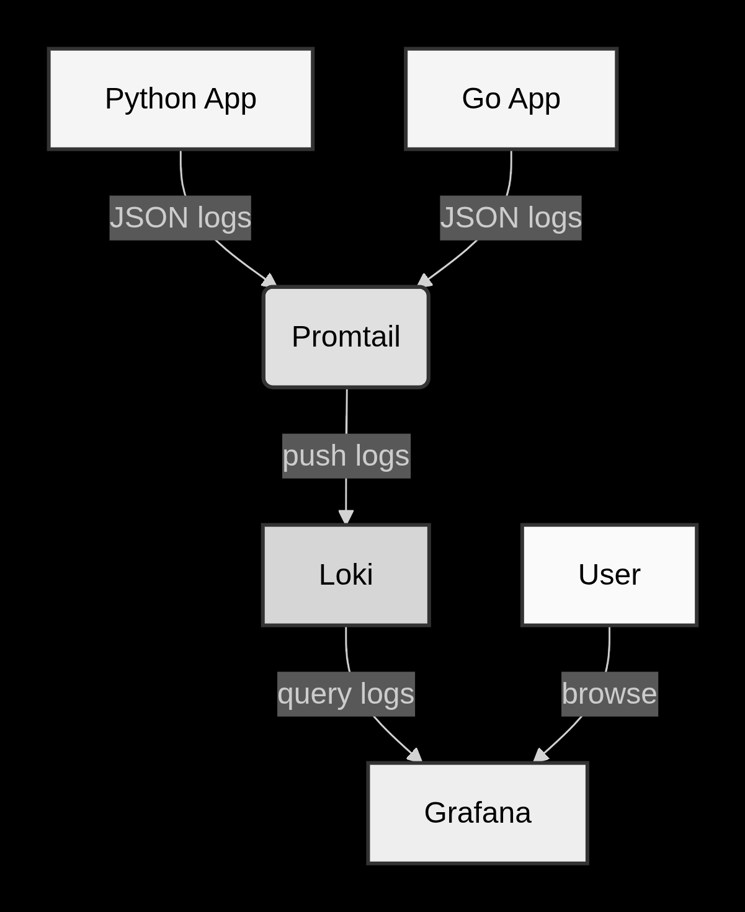
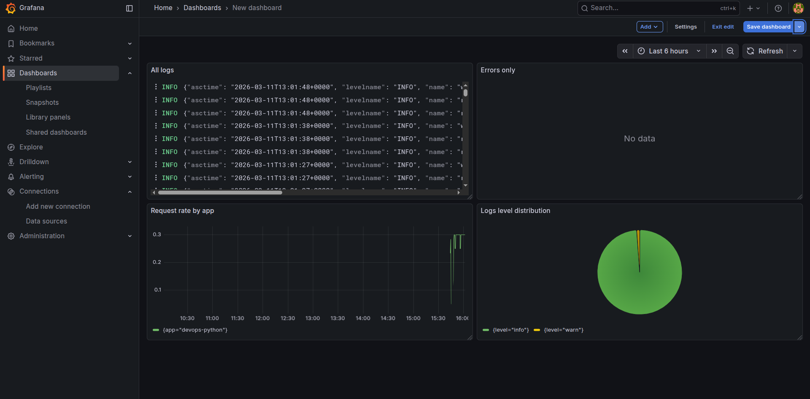
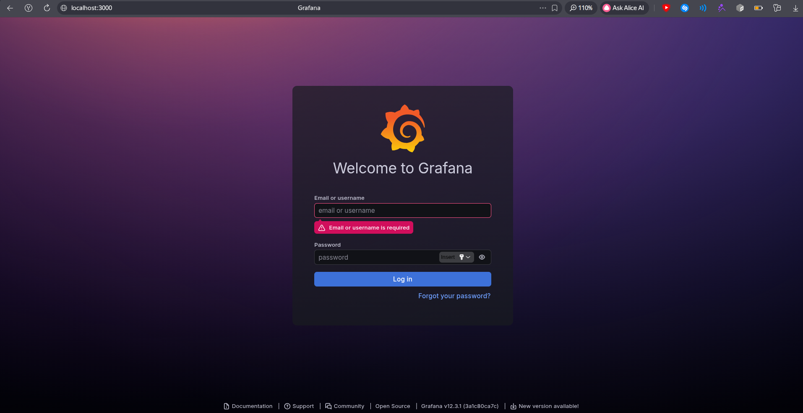
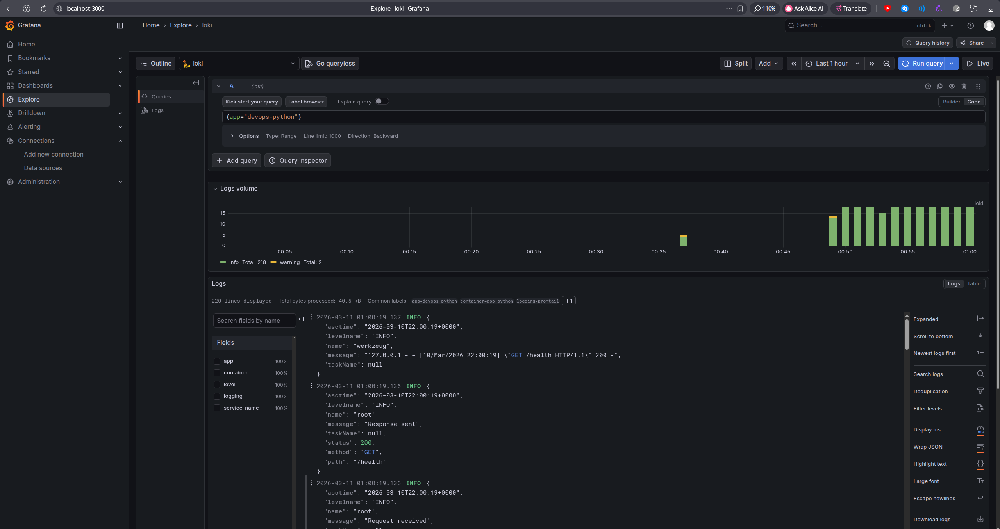
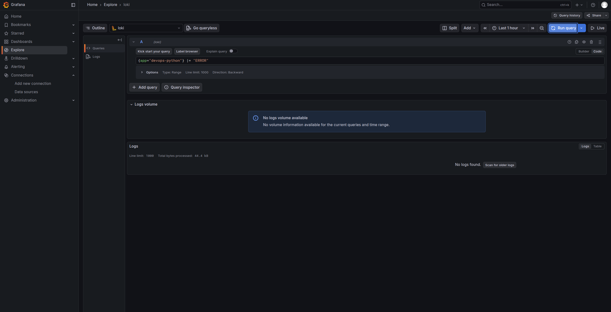
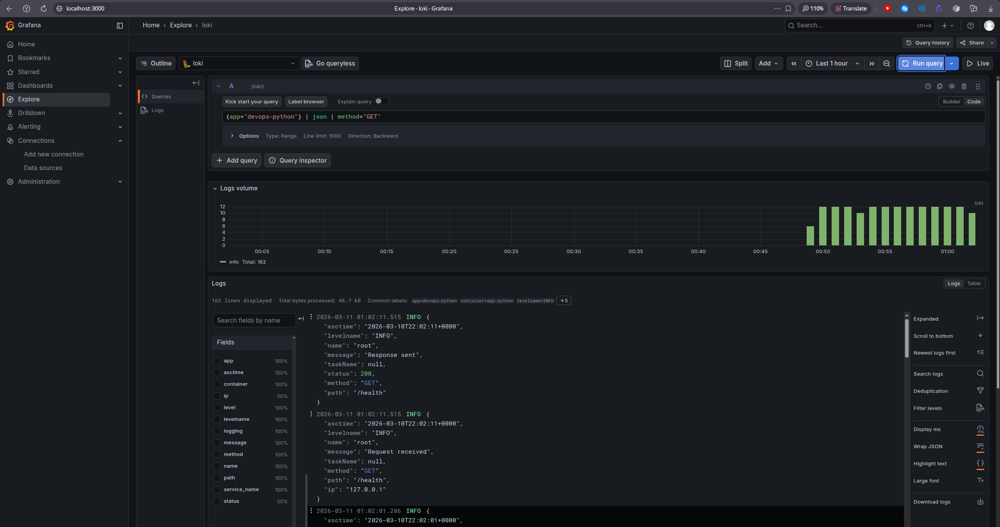

# Lab 7: Observability & Logging with Loki Stack

## 1. Architecture

The logging stack consists of three main components:

- **Loki** – log aggregation system. It stores logs and indexes them with labels.
- **Promtail** – log collector that runs on each node, reads container logs, and pushes them to Loki.
- **Grafana** – visualization frontend that queries Loki and displays logs in dashboards.

All components are deployed using Docker Compose on a single VM. The application produce structured JSON logs, which are collected by Promtail (via Docker socket) and sent to Loki. Grafana connects to Loki as a data source and provides a dashboard for log exploration.




## 2. Setup Guide

### 2.1 Prerequisites
- Docker and Docker Compose v2 installed on the target VM.
- Git repository with the `monitoring/` folder.
- Your application images pushed to Docker Hub.

### 2.2 Directory Structure
```
monitoring
├── docker-compose.yml
├── grafana
├── loki
│   └── config.yml
└── promtail
    └── config.yml
```

### 2.3 Environment Variables
Create a `.env` file in the `monitoring/` directory with:
```
GF_AUTH_ANONYMOUS_ENABLED=false
GF_SECURITY_ADMIN_PASSWORD=your_secure_password
```
This file is excluded from Git via `.gitignore`.

### 2.4 Deploy the Stack
```bash
cd monitoring
docker compose up -d
```

Verify all services are running:
```bash
docker compose ps
```
Expected output:
```
NAME         IMAGE                                COMMAND                  SERVICE      CREATED       STATUS                 PORTS
app-python   s3rap1s/devops-info-service:latest   "python app.py"          app-python   2 hours ago   Up 2 hours (healthy)   0.0.0.0:5000->5000/tcp, [::]:5000->5000/tcp
grafana      grafana/grafana:12.3.1               "/run.sh"                grafana      2 hours ago   Up 2 hours (healthy)   0.0.0.0:3000->3000/tcp, [::]:3000->3000/tcp
loki         grafana/loki:3.0.0                   "/usr/bin/loki -conf…"   loki         2 hours ago   Up 2 hours (healthy)   0.0.0.0:3100->3100/tcp, [::]:3100->3100/tcp
promtail     grafana/promtail:3.0.0               "/usr/bin/promtail -…"   promtail     2 hours ago   Up 2 hours (healthy)    
```

### 2.5 Configure Grafana Data Source
1. Open `http://<vm-ip>:3000` and log in with the password from `.env`.
2. Go to **Connections → Data sources → Add data source**.
3. Choose **Loki**.
4. Set URL to `http://loki:3100`.
5. Click **Save & Test** – should show success.


## 3. Configuration Explanation

### 3.1 Loki Configuration (`loki/config.yml`)
```yaml
auth_enabled: false

server:
  http_listen_port: 3100

common:
  path_prefix: /loki
  storage:
    filesystem:
      chunks_directory: /loki/chunks
      rules_directory: /loki/rules
  replication_factor: 1
  ring:
    kvstore:
      store: inmemory

schema_config:
  configs:
    - from: 2020-10-24
      store: tsdb
      object_store: filesystem
      schema: v13
      index:
        prefix: index_
        period: 24h

storage_config:
  tsdb_shipper:
    active_index_directory: /loki/tsdb-index
    cache_location: /loki/tsdb-cache
  filesystem:
    directory: /loki/chunks

limits_config:
  retention_period: 168h
  retention_stream: true
  max_query_lookback: 168h

compactor:
  working_directory: /loki/compactor
  shared_store: filesystem
  compaction_interval: 10m
  retention_enabled: true
```

**Key points:**
- `schema_config` uses **TSDB** (time-series database) with schema v13 – the recommended high‑performance storage for Loki 3.0+.
- `limits_config.retention_period: 168h` – logs are kept for 7 days.
- `compactor` enabled to periodically clean up old data.

### 3.2 Promtail Configuration (`promtail/config.yml`)
```yaml
server:
  http_listen_port: 9080
  grpc_listen_port: 0

positions:
  filename: /tmp/positions.yaml

clients:
  - url: http://loki:3100/loki/api/v1/push

scrape_configs:
  - job_name: docker
    docker_sd_configs:
      - host: unix:///var/run/docker.sock
        refresh_interval: 5s
        filters:
          - name: label
            values: ["logging=promtail"]
    relabel_configs:
      - source_labels: ['__meta_docker_container_name']
        regex: '/(.*)'
        target_label: 'container'
      - source_labels: ['__meta_docker_container_label_app']
        target_label: 'app'
      - source_labels: ['__meta_docker_container_label_logging']
        target_label: 'logging'
```

**Explanation:**
- Promtail discovers Docker containers via the Docker socket.
- `filters` ensure only containers with the label `logging=promtail` are scraped – prevents collecting logs from unrelated containers.
- `relabel_configs` extract container name and custom labels (`app`, `logging`) as Loki labels for efficient querying.


## 4. Application Logging

### 4.1 Python Application JSON Logging
The Python Flask app was modified to output structured JSON logs using `python-json-logger`.
**Why JSON?**  
JSON logs are easily parsable by Loki, allowing field extraction (`| json`) and filtering by log level, method, etc.

### 4.2 Container Labels
Python application was added to `docker-compose.yml` with labels:
```yaml
labels:
  logging: "promtail"
  app: "devops-python"
```
This ensures Promtail picks them up and attaches the `app` label to every log line.


## 5. Dashboard

A Grafana dashboard was created with four panels, each using LogQL queries.

### 5.1 Panel 1: All Logs (Logs Table)
- **Query:** `{app=~"devops-.*"}`
- **Visualization:** Logs
- **Purpose:** Real‑time view of all logs from both Python and Go apps.

### 5.2 Panel 2: Request Rate (Time Series)
- **Query:** `sum by (app) (rate({app=~"devops-.*"}[1m]))`
- **Visualization:** Time series
- **Purpose:** Show requests per second per application.

### 5.3 Panel 3: Error Logs (Logs Table)
- **Query:** `{app=~"devops-.*"} | json | level="ERROR"`
- **Visualization:** Logs
- **Purpose:** Display only error-level logs for quick troubleshooting.

### 5.4 Panel 4: Log Level Distribution (Pie Chart)
- **Query:** `sum by (level) (count_over_time({app=~"devops-.*"} | json [5m]))`
- **Visualization:** Pie chart
- **Purpose:** Show proportion of log levels (INFO, ERROR, etc.) over the last 5 minutes.



**Example LogQL explanation:**  
`{app=~"devops-.*"} | json | level="ERROR"` – selects logs from both apps, parses JSON, and filters to those with `level` field equal to "ERROR".


## 6. Production Configuration

### 6.1 Security
- Anonymous access disabled (`GF_AUTH_ANONYMOUS_ENABLED=false`).
- Admin password stored in `.env` file (excluded from Git).
- Grafana only accessible on port 3000 (no default credentials in code).

### 6.2 Resource Limits
Each service has CPU and memory limits defined in the Compose file to prevent resource starvation:
```yaml
deploy:
  resources:
    limits:
      cpus: '1.0'
      memory: 1G
    reservations:
      cpus: '0.5'
      memory: 512M
```

### 6.3 Health Checks
All services include `healthcheck` directives to ensure proper operation:
- Loki: `curl -f http://localhost:3100/ready`
- Promtail: `pidof promtail`
- Grafana: `curl -f http://localhost:3000/api/health`

### 6.4 Log Retention
Loki is configured to retain logs for 7 days (168h) via `limits_config.retention_period`.




## 7. Testing

### 7.1 Verify All Services Are Healthy
```bash
s3rap1s in ~/devops/DevOps-Core-Course/monitoring on lab06 ● ● λ docker compose ps
NAME         IMAGE                                COMMAND                  SERVICE      CREATED       STATUS                 PORTS
app-python   s3rap1s/devops-info-service:latest   "python app.py"          app-python   2 hours ago   Up 2 hours (healthy)   0.0.0.0:5000->5000/tcp, [::]:5000->5000/tcp
grafana      grafana/grafana:12.3.1               "/run.sh"                grafana      2 hours ago   Up 2 hours (healthy)   0.0.0.0:3000->3000/tcp, [::]:3000->3000/tcp
loki         grafana/loki:3.0.0                   "/usr/bin/loki -conf…"   loki         2 hours ago   Up 2 hours (healthy)   0.0.0.0:3100->3100/tcp, [::]:3100->3100/tcp
promtail     grafana/promtail:3.0.0               "/usr/bin/promtail -…"   promtail     2 hours ago   Up 2 hours (healthy)        
```

### 7.2 Generate Logs
```bash
for i in {1..20}; do curl -s http://localhost:8000/ > /dev/null; done
for i in {1..20}; do curl -s http://localhost:8000/health > /dev/null; done
```

### 7.3 Query Logs in Grafana Explore




Example queries and their results:
```
{app="devops-python"}
```
Returns logs of devops-python app.

```
{app="devops-python"} |= "ERROR"
```
Returns logs with only errors.

```
{app="devops-python"} | json | method="GET"
```
Return logs with HTTP method GET 


## 8. Challenges & Solutions

### Promtail health check failing
**Problem:** Promtail image did not contain `wget`, causing the healthcheck to fail.  
**Solution:** Replaced `wget` with `pidof promtail` to check that the process is running.