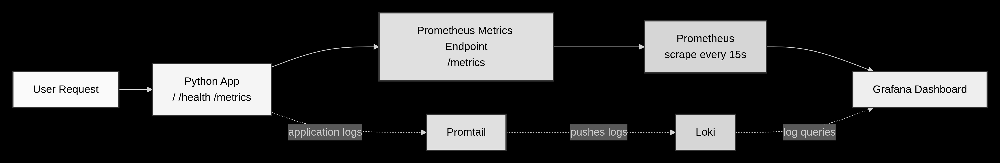
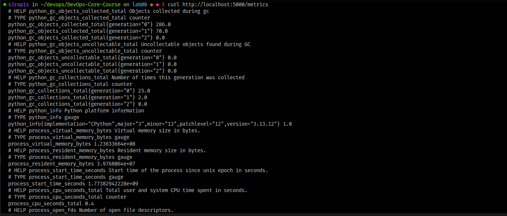
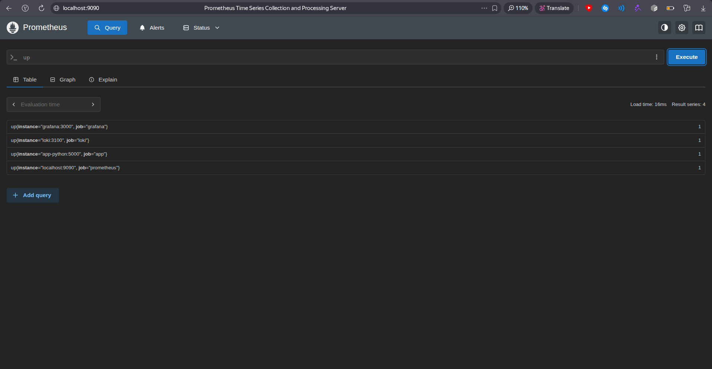
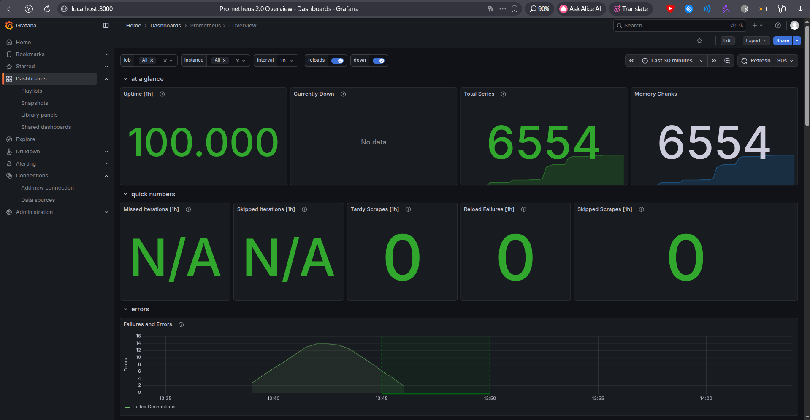
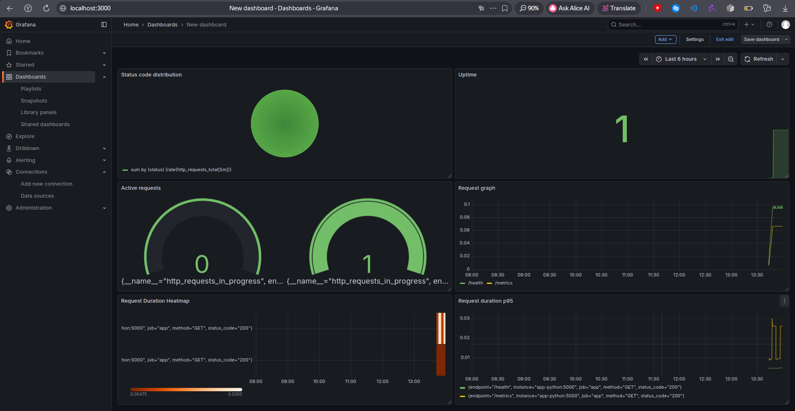
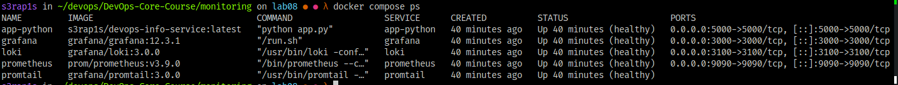
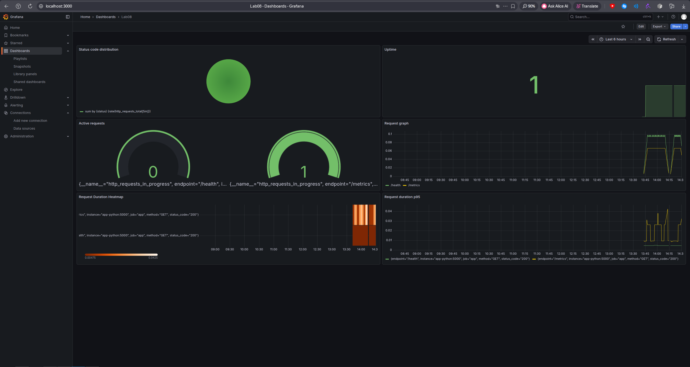

# Lab 8: Metrics & Monitoring with Prometheus

## 1. Architecture




## 2. Application Instrumentation

The Python Flask application was instrumented with `prometheus_client` and now exposes metrics on `/metrics`.

### 2.1 Added Metrics

- `http_requests_total{method, endpoint, status_code}`
  Counts total HTTP requests. This is used to measure request rate and error counts.

- `http_request_duration_seconds{method, endpoint, status_code}`
  Histogram that records request latency. This is used for p95 latency and heatmap visualizations.

- `http_requests_in_progress{method, endpoint}`
  Tracks currently active requests. This is useful for concurrency monitoring.

- `devops_info_endpoint_calls_total{endpoint}`
  Tracks endpoint usage as an application-level metric.

- `devops_info_system_info_collection_seconds`
  Measures time spent collecting system information for the main endpoint.

### 2.2 Why These Metrics Were Chosen

The metric set follows the **RED method**:

- **Rate**: `http_requests_total`
- **Errors**: `http_requests_total` filtered by `status_code`
- **Duration**: `http_request_duration_seconds`

Additional business metrics were added to go beyond raw HTTP traffic and capture endpoint usage and internal work duration.

### 2.3 Label Strategy

To avoid high-cardinality metrics, labels were limited to:

- `method`
- `endpoint`
- `status_code`

The `endpoint` label is normalized using Flask route rules. Unknown routes are grouped into `unmatched`.

### 2.4 Evidence

Metrics endpoint screenshot:



## 3. Prometheus Configuration

Prometheus was added to `monitoring/docker-compose.yml` and configured with `monitoring/prometheus/prometheus.yml`.

### 3.1 Scrape Targets

Configured jobs:

- `prometheus` -> `localhost:9090`
- `app` -> `app-python:5000/metrics`
- `loki` -> `loki:3100/metrics`
- `grafana` -> `grafana:3000/metrics`

### 3.2 Scrape Intervals

Global configuration:

- `scrape_interval: 15s`
- `evaluation_interval: 15s`

This interval is frequent enough for near-real-time monitoring without being too aggressive.

### 3.3 Retention

Prometheus retention is configured through startup arguments:

- `--storage.tsdb.retention.time=15d`
- `--storage.tsdb.retention.size=10GB`

This means Prometheus keeps metrics for up to 15 days or until the TSDB reaches 10 GB.

### 3.4 Evidence

Prometheus UI screenshot:


Prometheus query evidence:



## 4. Dashboard Walkthrough

Grafana was configured with Prometheus as a data source, and a custom metrics dashboard was created.

Dashboard screenshots:





Exported dashboard JSON files:

- `monitoring/docs/exported-dashboard.json`
- `monitoring/grafana/dashboards/devops-app-metrics.json`

### 4.1 Panel 1: Status Code Distribution

- **Purpose**: compare successful and failed responses
- **Query**:

```promql
sum by (status_code) (rate(http_requests_total[5m]))
```

### 4.2 Panel 2: Application Uptime

- **Purpose**: show whether the app target is up
- **Query**:

```promql
up{job="app"}
```

### 4.3 Panel 3: Active Requests

- **Purpose**: show the number of in-progress requests
- **Query**:

```promql
sum(http_requests_in_progress)
```

### 4.4 Panel 4: Request Graph

- **Purpose**: show requests per second for each endpoint
- **Query**:

```promql
sum(rate(http_requests_total[5m])) by (endpoint) 
```

### 4.5 Panel 5: Request Duration Heatmap

- **Purpose**: show request latency distribution
- **Query**:

```promql
sum(rate(http_request_duration_seconds_bucket[5m])) by (le) 
```

### 4.6 Panel 6: Request Duration p95

- **Purpose**: show 95th percentile latency by endpoint
- **Query**:

```promql
histogram_quantile(0.95, sum by (le, endpoint) (rate(http_request_duration_seconds_bucket[5m])))
```

### 4.7 Additional Panel: Error Rate

- **Purpose**: show how many 5xx errors occur over time
- **Query**:

```promql
sum(rate(http_requests_total{status_code=~"5.."}[5m]))
```

## 5. PromQL Examples

Below are example PromQL queries used during testing and dashboard creation.

### 5.1 Check All Targets

```promql
up
```

Shows whether each scrape target is reachable. A value of `1` means healthy, `0` means down.

### 5.2 Request Rate by Endpoint

```promql
sum by (endpoint) (rate(http_requests_total[5m]))
```

Calculates requests per second for each endpoint over the last 5 minutes.

### 5.3 Error Rate

```promql
sum(rate(http_requests_total{status_code=~"5.."}[5m]))
```

Shows the rate of server-side errors only.

### 5.4 Status Code Breakdown

```promql
sum by (status_code) (rate(http_requests_total[5m]))
```

Groups request rate by HTTP status code.

### 5.5 p95 Latency

```promql
histogram_quantile(0.95, sum by (le, endpoint) (rate(http_request_duration_seconds_bucket[5m])))
```

Calculates the 95th percentile request duration from the histogram buckets.

### 5.6 Active Requests

```promql
sum(http_requests_in_progress)
```

Shows the number of requests currently being processed.

### 5.7 Business Metric: Endpoint Calls

```promql
sum by (endpoint) (rate(devops_info_endpoint_calls_total[5m]))
```

Shows which application endpoint is used most often.

## 6. Production Setup

### 6.1 Health Checks

Health checks were configured for:

- `loki`
- `promtail`
- `grafana`
- `prometheus`
- `app-python`

This ensures service readiness is visible in `docker compose ps`.

### 6.2 Resource Limits

Resource limits configured in `docker-compose.yml`:

- **Prometheus**: `1 CPU`, `1G`
- **Loki**: `1 CPU`, `1G`
- **Grafana**: `0.5 CPU`, `512M`
- **App**: `0.5 CPU`, `256M`
- **Promtail**: `0.5 CPU`, `256M`

These limits prevent the monitoring stack from consuming excessive CPU or memory.

### 6.3 Retention Policies

**Prometheus**

- `--storage.tsdb.retention.time=15d`
- `--storage.tsdb.retention.size=10GB`

Metrics are retained for up to 15 days or 10 GB.

**Loki**

- `retention_period: 168h`

Logs are retained for 7 days.

### 6.4 Persistent Volumes

Persistent Docker volumes:

- `prometheus-data`
- `loki-data`
- `grafana-data`

These volumes preserve monitoring data across container restarts.

## 7. Testing Results

### 7.1 Metrics Endpoint

The application metrics endpoint returned Prometheus-formatted metrics:


### 7.2 Prometheus Working

Prometheus loaded successfully and queries worked:


### 7.3 Grafana Dashboard Working

Grafana successfully displayed Prometheus data:


### 7.4 Services Healthy

Docker Compose showed the services running:



### 7.5 Data Persistence After Restart

After restarting the monitoring stack, the saved dashboard was still present:



This confirms Grafana persistence via the `grafana-data` volume.

## 8. Challenges & Solutions

### Prometheus Not Reachable on Port 9090

**Problem**  
Prometheus and `app-python` were created but not fully started, so `localhost:9090` was not accessible.

**Solution**  
The stopped services were started explicitly and their status was verified with `docker compose ps`.
